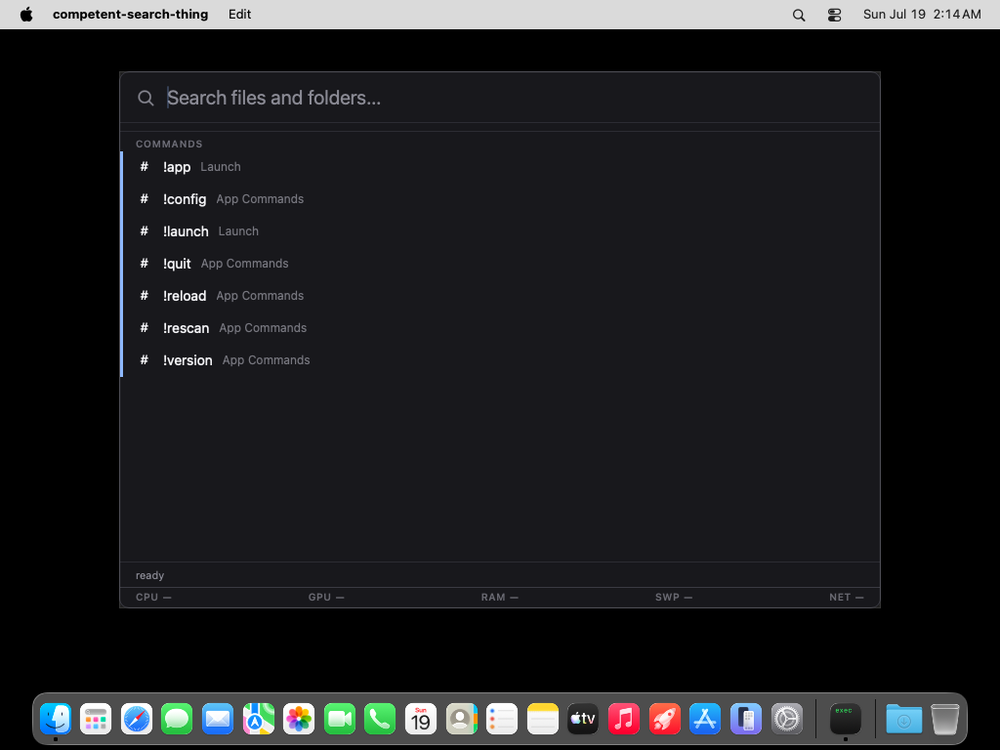

# competent-search-thing

A cross-platform desktop searchbar: press a global hotkey, a small
frameless bar pops up on the display your cursor is on, and every
keystroke instantly filters an in-memory index of your file names --
Spotlight-style presentation with voidtools-Everything-style speed.
An async [plugin system](#plugins) adds virtual results below the file
rows -- type `=2+2` and a calculator card answers, `#ff8800` previews a
color, `!ps fire` lists matching running apps -- without ever slowing
the file search down. Built with Go and [Wails v2](https://wails.io),
with a tiny vanilla TypeScript + Vite frontend.

## Screenshot


The real Linux webview, summoned with Alt+Space and captured under Xvfb
against the deterministic fixture tree CI uses (see `.github/scripts/`).
CI re-captures three screenshots like this on every push and uploads
them as run artifacts for visual comparison.

## Install

Every fully green CI run publishes one release carrying the binaries
for every platform CI builds -- linux/amd64, windows/amd64, and
darwin/arm64 -- to
[buildhost](https://github.com/wow-look-at-my/buildhost) (the org's
package registry at pazer.build). Downloads are anonymous; `latest`
(the URL without a version) serves the newest build of the default
branch (master).

The binary links the system GTK 3 and WebKitGTK **4.1** libraries at
runtime -- it does not bundle them. On a machine that never had them
installed it fails to start with
`error while loading shared libraries: libwebkit2gtk-4.1.so.0`.
Both install paths below handle that; the `.deb` does it automatically.

### Linux (x86_64), Debian/Ubuntu -- recommended

CI builds a `.deb` whose `Depends` pulls the runtime libraries through
apt. Verified in clean (never-had-the-build-deps) Ubuntu 24.04 and
22.04 environments:

```
curl -fL -o competent-search-thing.deb "https://dl.pazer.build/competent-search-thing/deb?os=linux&arch=amd64"
sudo apt install -y ./competent-search-thing.deb
competent-search-thing
```

On Ubuntu 22.04 the WebKitGTK 4.1 packages live in the `universe`
component (enabled by default on stock installs).

### Linux (x86_64), raw binary

```
curl -fL --compressed "https://dl.pazer.build/competent-search-thing?os=linux&arch=amd64" \
  -o competent-search-thing && chmod +x competent-search-thing
```

Then install the runtime libraries yourself:

| Distro | Command | Status |
|--------|---------|--------|
| Ubuntu 24.04 / 22.04 | `sudo apt-get install -y libwebkit2gtk-4.1-0 libgtk-3-0` | tested (clean-env) |
| Debian 12+ | `sudo apt-get install -y libwebkit2gtk-4.1-0 libgtk-3-0` | untested |
| Fedora | `sudo dnf install -y webkit2gtk4.1 gtk3` | untested |
| Arch | `sudo pacman -S --needed webkit2gtk-4.1 gtk3` | untested |

(On Ubuntu 24.04 the real package names are `libgtk-3-0t64` etc.; the
t64 packages `Provide` the unsuffixed names, so the one line above
resolves on both 22.04 and 24.04.) The binary needs glibc >= 2.34.
The global hotkey needs an X11 session -- see
[Known caveats](#known-caveats) below.

**WebKitGTK 4.0-only distros are not supported.** The published binary
is built with Wails' `webkit2_41` tag and hard-links
`libwebkit2gtk-4.1.so.0`; distros that only ship WebKitGTK 4.0 (Ubuntu
20.04, Debian 11) cannot run it. CI does not build a second 4.0-flavored
binary -- every current Debian/Ubuntu LTS ships 4.1. On a 4.0-only
distro, build from source without the `webkit2_41` tag (see
[Building](#building)).

### Windows (x86_64)

```
curl -fL --compressed "https://dl.pazer.build/competent-search-thing?os=windows&arch=amd64" -o competent-search-thing.exe
```

The Windows binary is cross-compiled in CI (pure Go, WebView2-based)
but untested on real Windows -- CI only *runs* the Linux build (the
screenshot tests). WebView2 is preinstalled on Windows 11 and current
Windows 10.

### macOS (Apple Silicon)

```
sudo curl -fL --compressed "https://dl.pazer.build/competent-search-thing?os=darwin&arch=arm64" \
  -o /usr/local/bin/competent-search-thing
sudo chmod +x /usr/local/bin/competent-search-thing
```

macOS-specific notes:

- If Gatekeeper blocks the binary (typical when it was downloaded with
  a browser, which sets the quarantine attribute -- curl does not),
  clear it: `xattr -d com.apple.quarantine /usr/local/bin/competent-search-thing`.
- The global hotkey needs NO permission: it registers through Carbon
  RegisterEventHotKey, the same mechanism Spotlight-style launchers
  use -- no Accessibility/TCC prompt, nothing to add in System
  Settings. The default hotkey is Option+Space -- Cmd+Space belongs
  to Spotlight.
- **Dock and Cmd-Tab icon**: the raw-binary distribution ships no
  `.app` bundle, so there is no `Info.plist` or `.icns` for macOS to
  read -- a bare executable would normally show the generic app icon.
  The app therefore sets its Dock/Cmd-Tab icon at runtime, from the
  same in-code magnifier rasterizer the tray icon uses, the moment
  its window exists. That covers the RUNNING app; a proper `.app`
  bundle (Info.plist + iconset, CI packaging, and how it coexists
  with the raw-binary download URLs) is a known limitation that is
  deliberately not built yet.
- **Space switches dismiss the bar**: like Spotlight, switching
  Spaces (or entering a fullscreen app's Space) hides an open bar
  instead of dragging it along -- the window joins all Spaces to
  summon on the active one, and without the dismiss the transition
  animation could briefly ghost a stale frame of it.
- The darwin/arm64 binary is CI-built and passes the full unit-test
  suite on macOS runners, but it has not yet had human acceptance
  testing on real hardware.



The real macOS WebKit window on the CI runner's WindowServer session,
captured by the hard-gated darwin GUI smoke on every push (see
`.github/scripts/darwin-smoke.ts`).

Other URL forms: `?v=N` pins a release permanently, `?branch=<name>`
follows a branch (URL-encode slashes), and `&fmt=tar.gz`/`zip`
repackages on the fly. These work on the `/deb` project too. See
<https://pazer.build/llms.txt> for the full download and
package-manager (APT, Homebrew, npm, OCI) reference. Avoid the
`apt.pazer.build` APT-repo route and `&fmt=deb` for this app: those
debs are generated server-side without `Depends`, which is exactly the
missing-libraries trap the CI-built `.deb` exists to fix.

## Indexing scope

By default the app indexes your **whole filesystem**, Everything-style:
`/` on Linux and macOS, the system drive (usually `C:\`) on Windows.
Every file and directory name is searchable instantly; nothing else is
read -- no contents, no metadata beyond the name and kind.

A whole-system walk needs guardrails, and they are on by default:

- **System excludes.** Fresh configs exclude the virtual and volatile
  trees `/proc`, `/sys`, `/dev`, `/run`, `/tmp`, `/var/tmp` (full-path
  patterns) and `lost+found` (by name), on top of the long-standing
  `.git`, `node_modules`, `.cache` name patterns and the high-churn
  noise directories (`.hg`, `.svn`, `__pycache__`, `.mypy_cache`,
  `.pytest_cache`, `.ruff_cache`, `.tox`, `.nox`, `.venv` -- see
  [File watching and freshness](#file-watching-and-freshness)). On
  Windows only the name patterns apply (it has no such virtual
  trees).
- **macOS firmlink dedup.** Since Catalina, macOS mounts the writable
  APFS Data volume at `/System/Volumes/Data` and *also* exposes its
  content at the canonical paths (`/Users`, `/Applications`,
  `/usr/local`, ...) through firmlinks. Both spellings name the same
  files, so a whole-filesystem walk from `/` without a guard indexes
  roughly 45% of the disk twice -- double the entries, double the RAM,
  double the build time, duplicate search results. Fresh macOS
  configs therefore exclude `/System/Volumes/Data` (a full-path
  pattern); everything stays searchable under its canonical spelling.
  If you truly want the raw Data-volume view indexed too, delete that
  pattern from `excludes` in config.json -- it is an ordinary exclude,
  not hardcoded.
- **Mount skipping.** At every index build and rescan the app reads
  `/proc/self/mounts` (Linux) and skips mountpoints under the roots
  whose filesystem type is kernel-virtual (`proc`, `sysfs`, `tmpfs`,
  `cgroup2`, `devtmpfs`, ...) or remote (`nfs`, `cifs`/SMB, `9p`,
  `sshfs`, `glusterfs`, `ceph`, `davfs`, ...). **All FUSE mounts**
  (`fuse` and every `fuse.*` type) are skipped as well -- the common
  FUSE mounts are network-backed (sshfs, rclone, gvfs), and a hung
  server must never hang your index. `overlay` is deliberately NOT
  skipped (container roots are overlay mounts). The skip list is
  recomputed on every rebuild, so mounts that come and go are handled;
  each rebuild logs what it skipped.
- **Indexing a skipped mount anyway:** add the mountpoint to `roots`
  in config.json. A mountpoint that is itself a configured root is
  never auto-skipped -- that is the escape hatch for local FUSE
  filesystems or a NAS you genuinely want indexed.

To narrow the scope, edit `roots` in config.json (see
[Configuration](#configuration)):

```json
{
  "roots": ["/home/me", "/etc"],
  "rootsVersion": 7
}
```

**Upgrading from an older version:** the `rootsVersion` stamp records
which defaults generation wrote the config, and on first load the app
migrates older files once, loudly. Configs from before
whole-filesystem indexing (no stamp) get the v2 step: if `roots` is
still the old default (your home directory) it becomes the
whole-filesystem default and the missing system excludes are appended;
customized `roots` are never touched. Configs stamped below 3
additionally get the v3 step: if your `excludes` still contain all
three stock patterns (`.git`, `node_modules`, `.cache`), the missing
high-churn noise patterns are appended (see
[File watching and freshness](#file-watching-and-freshness)); a
curated or emptied list is left exactly as you wrote it. On macOS,
configs stamped below 4 get the v4 step under the same rule: the
firmlink-dedup exclude `/System/Volumes/Data` (see above) is appended
to default-shaped lists, while curated lists only get an
informational note; below 5 the macOS noise excludes follow the same
rule. Configs stamped below 6 get the ranking-defaults flip (the
always-on ranking log and the on-by-default learned layers -- see
[Ranking log](#ranking-log)), and below 7 every negative boolean
switch is renamed to its affirmative `enabled` spelling with the
value inverted -- a pure rename with zero behavior change: an old key
explicitly in your file lands as the inverted new key (e.g.
`"tray": { "disabled": true }` becomes `"tray": { "enabled": false }`),
an absent key stays absent-and-on, and a file already carrying both
spellings keeps the new one. Either way the current `rootsVersion` is
written back so the checks never re-run. Watch for these startup log
lines:

```
config: index roots upgraded to the whole-filesystem default (/); edit roots in config.json to revert -- the first rescan will re-walk everything
config: system exclude patterns added for whole-filesystem indexing: /proc, /sys, /dev, /run, /tmp, /var/tmp, lost+found
config: high-churn exclude patterns added for the watch layer: .hg, .svn, __pycache__, .mypy_cache, .pytest_cache, .ruff_cache, .tox, .nox, .venv; remove any of them in config.json to index those trees
config: macOS firmlink exclude added: /System/Volumes/Data (macOS shows the same files at /Users, /Applications, ...; indexing both nearly doubles the index and its RAM); remove it in config.json to index the Data volume twice
config: migrated tray.disabled=true -> tray.enabled=false
```

To revert, set `roots` back to what you want (e.g. `["/home/me"]`) and
keep the `rootsVersion` stamp; customized roots are yours forever.

**Outside-roots hint.** If you narrowed `roots` and then search for an
absolute path that exists but is not covered -- say `/etc/hosts` with
`roots: ["/home/me"]` -- the bar does not show a silent empty list: it
returns that one real file with a hint in place of the parent-dir line
(`outside indexed roots -- add /etc to roots in config.json`). Enter
opens it like any other row. Paths that exist *inside* your roots
never get the hint (that is an indexing gap -- typically the initial
build still running -- not a scope gap).

**Startup progress.** The initial build reports itself without
flooding the logs. Run from a terminal, one progress line updates in
place (plain carriage returns, no ANSI escapes; ordinary log lines
print above it without tearing the display):

```
index: indexing... 12449259 entries, 384.2MB ram
```

With logs piped or redirected (a service manager, `2>file`) the same
line is appended at most once every ~5 seconds instead. When the
build *and* the file-watch setup both finish, one summary line
reports the whole time-to-ready:

```
index: startup complete: 12449259 entries in 41.3s, 384.2MB ram
```

The `ram` figure is the process's **current** memory footprint: on
Linux the resident set from `/proc/self/statm`, on macOS the mach
`phys_footprint` -- the same number Activity Monitor's "Memory"
column shows (older builds reported `getrusage` `ru_maxrss` there,
the peak high-water mark, which could only ever grow). While the
initial build runs the app also lowers the Go garbage collector's
growth target (`GOGC` 40 for just that window, restored right after)
so the walk's transient allocations cannot balloon the peak to ~2x
the live index; steady-state behavior is untouched.

## File watching and freshness

After the initial walk, three cooperating tiers keep the index live.
They share one contract: **every tier converges to the same final
index state** -- they differ only in how quickly a change shows up.

| Tier | Coverage | Change latency | When active |
|------|----------|----------------|-------------|
| fanotify whole-filesystem marks | every directory on the roots' filesystems, one kernel mark per filesystem, no per-directory watches | ~1 second (debounced) | Linux, automatic, when the binary holds `CAP_SYS_ADMIN` (see below) |
| FSEvents stream | every directory under the roots, one recursive kernel stream, a handful of file descriptors total | ~1 second (debounced; 0.3s stream latency) | macOS, automatic, no privileges needed |
| per-directory hot set (inotify on Linux, kqueue on macOS, ReadDirectoryChangesW on Windows) | a bounded budget of per-directory watches: the roots first, then your home subtree, then the rest, rotated LRU-style toward recently active directories | ~1 second (debounced) for watched directories | whenever no whole-filesystem backend is available; the only live tier on Windows |
| reconcile sweeps | every indexed directory, every pass | one sweep interval (default 20 minutes) | always (unless `watcher.sweepEnabled` is `false`) |

On macOS the per-directory fallback deserves a warning: kqueue (what
fsnotify uses there) opens one file descriptor per watched directory
PLUS one per direct child file, so the automatic budget is a
conservative sixteenth of the process fd limit (capped at 8192) --
and an explicit `"maxWatches": -1` can exhaust the fd limit and break
the whole process (folders refusing to open, every later `open()`
failing with "too many open files"). The FSEvents backend makes all
of that moot: `auto` selects it on macOS, it needs no watch set, no
budget, and no privileges.

### Enable full-filesystem watching (recommended)

A whole-filesystem tier is the one you want to be on: registration is
near-instant, per-directory watch limits stop mattering, and
freshness no longer depends on which directories happen to be in a
watch budget. **macOS needs no setup at all** -- the FSEvents backend
is whole-filesystem out of the box and `auto` selects it. On Linux,
fanotify covers every directory of the roots' filesystems with a
handful of kernel marks, but Linux gates it behind capabilities --
`CAP_SYS_ADMIN` for the marks, `CAP_DAC_READ_SEARCH` for resolving
event paths -- so an unprivileged launch physically cannot use it.
Grant both on the installed binary:

```
sudo setcap cap_sys_admin,cap_dac_read_search+ep /usr/local/bin/competent-search-thing
```

The app logs this exact command at every startup that runs without
fanotify, with the RESOLVED real path filled in -- setcap refuses
symlinks, so symlinked installs (Homebrew's `bin/` shim, Nix, stow)
get the actual target printed. Re-run it after any upgrade that
replaces the file (file capabilities live on the inode); the log says
so right below the command.

With the grant, a change anywhere under your roots reaches search
results in about a second. Without it, the watcher falls back to the
bounded per-directory hot set: the final index state is identical,
but only hot-set directories get ~1s latency -- everything else waits
for a sweep (see the tier table above). Running without a
whole-filesystem backend is never silent:

- the status bar keeps a persistent **"Partial file watching"** chip
  up (hover it for what that means), or **"File watching off"** when
  strict mode disabled the fallback (next paragraph);
- the startup log names the effective backend honestly (`inotify` on
  Linux, `kqueue` on macOS, `windows` on Windows) and, on Linux,
  prints the setcap command above.

If a quiet per-directory fallback is not acceptable, pin the backend:
`"watcher": { "backend": "fanotify" }` (Linux) or
`"watcher": { "backend": "fsevents" }` (macOS) in config.json is
STRICT -- when the named backend cannot start (including on the wrong
OS), live watching is disabled outright rather than falling back (the
index still converges through sweeps), the log announces it loudly,
and the bar shows "File watching off". `"backend": "inotify"` skips
the whole-filesystem probe entirely and pins the per-directory model
on every OS (debugging); the default `"auto"` tries the
whole-filesystem backend and falls back.

**Understand what the grant means before running it.** File
capabilities apply process-wide to every run of that binary:
`CAP_SYS_ADMIN` is root-equivalent for most practical purposes, and
`CAP_DAC_READ_SEARCH` bypasses file permission checks when reading --
anyone who can execute the binary gets both. Only do this on a
single-user machine whose binary you trust.

**Crash-visibility tradeoff.** A file-capability binary runs
secure-exec (`AT_SECURE`): the Go runtime forces `GOTRACEBACK=none`
(not overridable) and the process is non-dumpable -- a crash reports
one line, with no traceback and no core file.
When chasing a crash, drop the file caps for that session and grant
AMBIENT capabilities instead -- full crash reports return while
fanotify still marks (verified in
[issue #58](https://github.com/wow-look-at-my/competent-search-thing/issues/58)):

```
sudo -E capsh --user=$USER --inh=cap_sys_admin,cap_dac_read_search --addamb=cap_sys_admin,cap_dac_read_search -- -c 'exec competent-search-thing'
```

### How changes converge

The consistency model in practice:

- A change under live coverage (a fanotify mark or a hot-set watch)
  reaches search results about a second after it happens: events are
  debounced (~250ms quiet / 1s max) and applied by re-checking the
  disk, so duplicated, merged, or reordered events all converge.
- Changes during the initial startup index build are covered too: the
  backend is armed BEFORE the walk starts, events queue while it runs,
  and they apply the moment the fresh index is live (a queue overflow
  converges via an immediately requested sweep).
- A change anywhere else -- a directory outside the hot-set budget, a
  watch the OS refused, events lost to a kernel queue overflow --
  appears within one sweep interval: each pass walks every indexed
  directory, `lstat`s it, and re-lists the ones whose mtime moved
  past the previous pass. A queue overflow requests an immediate
  sweep instead of waiting for the cadence.
- The one documented blind spot: mtime-BACKDATED changes (e.g.
  `tar --preserve` into an existing directory) hide from the sweep's
  mtime check and converge at the next full rescan (`!rescan`, or the
  `rescanIntervalMinutes` timer if you set one).

Startup arms the backend before the index walk (the `armed` line),
then announces the active tier and its numbers -- the fsevents form
means a whole-filesystem backend is on (`fanotify` on Linux,
`fsevents` on macOS); the per-directory form is always followed, on
Linux, by the ready-to-paste grant command plus its re-run caveat. An
unlimited budget prints as `unlimited`, never as a raw MaxInt:

```
watch: backend inotify armed before the initial index build; changes during indexing are queued and applied when it completes
watch: backend inotify: 41230/612009 dirs live-watched (budget 65536); sweep interval 20m0s; full rescan interval off
watch: enable full-filesystem watching with: sudo setcap cap_sys_admin,cap_dac_read_search+ep /home/linuxbrew/.linuxbrew/Cellar/competent-search-thing/0.412.0/bin/competent-search-thing
watch: file capabilities stick to that exact file -- re-run the setcap command after any upgrade that replaces the binary (e.g. brew upgrade)
watch: note: file capabilities force secure-exec (GOTRACEBACK=none, non-dumpable) -- crashes report as one line; ambient caps keep full crash reports (see README / issue #58)
watch: backend fsevents: whole-filesystem coverage active; per-directory watches not needed
watch: backend fsevents: 0/0 dirs live-watched (budget 3840); sweep interval 20m0s; full rescan interval off
```

The same state is visible in the app itself: whenever the backend is
not a whole-filesystem one, the status bar keeps the "Partial file
watching" / "File watching off" chip up (see
[Enable full-filesystem watching](#enable-full-filesystem-watching-recommended)).

### Watcher configuration

The `watcher` section of config.json tunes the layer (see
[Configuration](#configuration) for the file itself):

| Key | Default | Meaning |
|-----|---------|---------|
| `watcher.backend` | `"auto"` | Backend selection. `"auto"` uses a whole-filesystem backend where one exists -- fanotify on Linux (see [Enable full-filesystem watching](#enable-full-filesystem-watching-recommended)), FSEvents on macOS (automatic, no privileges) -- and falls back to the per-directory hot set. `"fanotify"` and `"fsevents"` are STRICT: when the named backend cannot start (including on the wrong OS), live watching is disabled outright -- no per-directory fallback; sweeps keep the index converging -- announced loudly in-app and in the log. `"inotify"` skips the whole-filesystem probe and pins the per-directory model on every OS (debugging; the runtime label stays honest: `kqueue` on macOS). `kqueue` is a runtime label, not a config value. Empty or unknown values are repaired to `"auto"`. |
| `watcher.maxWatches` | `0` | The hot-set budget for the per-directory fallback. `0` = automatic: on Linux half of `fs.inotify.max_user_watches`, capped at 65536; on macOS a sixteenth of the process fd limit, capped at 8192 (kqueue costs one fd per watched dir PLUS one per direct child file, so the budget must leave fds for the app itself). Any negative value = explicitly unlimited (watch every indexed directory; on macOS this can exhaust the fd limit and break the process -- prefer the fsevents backend). Positive = exactly that many. Irrelevant while a whole-filesystem backend is active. |
| `watcher.sweepMinutes` | `0` | Minutes between reconcile sweeps; `0` = the built-in 20 minutes. |
| `watcher.sweepEnabled` | `true` | `false` turns the sweep tier off. Directories without a live watch then converge only at full rescans, and the app logs a loud warning at startup saying exactly that. Absent means enabled. |
| `watcher.watchExcludes` | `[]` | Patterns (same syntax as `excludes`) applied to live watching ONLY: a matching directory -- and everything beneath it -- never holds a watch but stays fully indexed and swept, so its freshness bound becomes the sweep interval. Use it to keep high-churn trees you still want searchable from consuming watch budget. |

### Default excludes for high-churn directories

Some directory names are almost pure event noise: version-control
internals and tool caches that churn constantly and are rarely worth
searching. Fresh configs exclude these from indexing altogether, on
top of the long-standing `.git`, `node_modules`, `.cache`:

```
.hg .svn __pycache__ .mypy_cache .pytest_cache .ruff_cache .tox .nox .venv
```

macOS additionally defaults to its own noise set:

```
Caches DerivedData _CodeSignature CodeResources /private/var/folders
```

`Caches` covers `~/Library/Caches` and every app's cache dir,
`DerivedData` is Xcode's build-product tree, `_CodeSignature` /
`CodeResources` are per-bundle code-signature manifests (thousands of
identically named entries with zero search value), and
`/private/var/folders` is macOS's real per-user temp tree -- the
`/tmp` and `/var/tmp` system excludes only cover the symlinked
spellings. Deliberately NOT excluded: `.app`/`.framework` bundle
internals as a whole and `Application Support` -- those would make
real files unfindable and await an explicit decision.

They are ordinary `excludes` entries -- delete any of them from
config.json to index (and watch) those trees again. Existing configs
are migrated once, loudly: a list still carrying all three of the
stock patterns gets the missing ones appended (each addition logged at
startup), while a curated or emptied list is left exactly as you wrote
it, with one informational log line instead. If you only want such a
tree out of the WATCH layer but still searchable, use
`watcher.watchExcludes` instead of `excludes`.

## Status

Feature-complete for v1; every CI run publishes installable builds to
buildhost (see [Install](#install)):

- [x] Window shell (frameless, always-on-top, hidden until summoned) + CI
- [x] Index engine: compact in-memory store, parallel walker, parallel
      ranked substring search, JSON config
- [x] Path-aware search: a separator in the query switches to
      full-path matching (`/etc/hosts`, `etc/ho`; see
      [Search by path](#search-by-path))
- [x] Live index updates: fanotify whole-filesystem marks where
      granted on Linux, an FSEvents stream on macOS, a bounded
      per-directory hot set elsewhere, always-on reconcile sweeps,
      event debouncing, graceful watch-limit/overflow degradation,
      optional periodic rescans
      (see [File watching and freshness](#file-watching-and-freshness))
- [x] Global hotkey (default Alt+Space) to summon/dismiss the bar
      (XGrabKey on Linux/X11; on Wayland a portal global shortcut,
      an automatic GNOME keybinding, or one manual binding -- see
      [Wayland](#wayland); RegisterHotKey on Windows; Carbon
      RegisterEventHotKey on macOS, no Accessibility permission
      needed)
- [x] Single instance + CLI: a second launch shows the running bar;
      `toggle`/`show`/`hide` subcommands drive it over a unix socket
      (the summon path for any external keybinding mechanism)
- [x] Bar positions itself on the display the cursor is on (falls back
      to centering when the platform cannot say, e.g. Wayland)
- [x] Open / Reveal: Enter opens the selection with the OS default
      handler, Ctrl+Enter (Cmd+Enter on macOS) reveals it in the file
      manager; both hide the bar on success, and on Linux the target
      application's window ends focused and raised (see
      [Focus and raise on launch](#focus-and-raise-on-launch))
- [x] Search UI: as-you-type results with match highlighting, dimmed
      parent paths, per-file-type icons, keyboard + mouse selection,
      live index status bar and a staleness warning chip
- [x] File-type icons: recognizable coloured glyphs per extension and
      special filename from the
      [file-icons](https://github.com/file-icons/atom) pack (fonts
      vendored under ISC / OFL 1.1 / MIT, receipts in
      `frontend/src/fileicons/LICENSES.md`; the mapping ships as a
      compact [binpazer](https://github.com/wow-look-at-my/bin-file-fmt)
      binary artifact); variants follow the theme's light/dark
      background
- [x] Plugin system: async virtual results from external command/HTTP
      plugins (file search never waits on them), bang targeting and
      completion (`!calc 2+2`; a bare `!` lists every command),
      opt-in app-context awareness (focused/running/installed apps),
      built-in commands (`!rescan`, `!reload`, `!config`, `!version`,
      `!quit`, `!app`) and three documented example plugins
- [x] Installed apps in normal results: strongly matching apps show
      up as an async Apps section ABOVE the file results for plain
      queries (word-start tier or better earns the promotion; weak
      substring/fuzzy matches render below the files), ordered by
      your actual launch counts within a match class; capped at 6;
      see [Apps in normal results](#apps-in-normal-results)
- [x] Empty-query cheat sheet: an empty bar lists the available
      commands (the same list a bare `!` shows) with no row
      pre-selected; it disappears the moment you type, and no plugin
      processes run for an empty query
- [x] Clear on dismiss + history recall: the bar always summons empty
      -- the pre-hide text is deliberately dropped. Up recalls older
      history entries when the query is blank or still exactly what a
      previous Up/Down recall filled in (you have not typed since);
      Down then moves forward, and moving forward past the newest
      entry clears the bar back to the empty state (the cheat sheet).
      The moment you type or pick a completion, Up/Down go back to
      navigating the result list. Only queries whose activation
      actually ran are recorded (capped at 100, newest kept), persisted
      to `<configDir>/history.json` -- or memory-only with
      `"history": { "persistEnabled": false }` (see
      [Configuration](#configuration))
- [x] Theming: design tokens as CSS custom properties, builtin dark +
      light themes, validated user JSON themes with live reload, and a
      custom.css escape hatch (see [Theming](#theming))

## Search by path

A query without a path separator searches names, as always. The moment
the query contains a separator it matches case-insensitively against
the full path instead (Everything-style):

- `/etc/hosts` finds the file at exactly that path first, then paths
  ending in `/etc/hosts` (say `/backup/etc/hosts`), then paths
  starting with it (`/etc/hosts.d/...`), then any path containing it.
- Partial components work anywhere in the query: `etc/ho` or `tc/hos`
  find `/etc/hosts` and friends.
- A trailing separator scopes to directory contents: `etc/` matches
  everything under any `etc` directory at any depth, but not the
  `etc` directories themselves.
- Within a rank class the usual tie-breaks apply: directories first,
  then shorter paths, then alphabetical -- with numbers newest-first
  (next bullet).
- Alphabetical order is numeric-aware, always on: when two otherwise
  tied paths differ at aligned digit runs, the HIGHER number ranks
  first, so datestamped and versioned families deliver newest first
  -- `Screenshot 2026-07-18...png` above `Screenshot 2024-02-01...png`,
  `invoice_v2.pdf` above `invoice_v1.pdf` (previously plain byte
  order put the oldest first). Names without such aligned numbers
  order exactly as before, and the earlier tie-breaks still win --
  a shorter `v9` still precedes a longer `v10`.

## Fuzzy matching and multi-term queries

Matching is ONE shared engine (`internal/match`) used by every result
section: files, installed apps, open windows, Firefox frequent sites,
open tabs, and (for gating and ranking) external plugin results. Two
behaviors compose:

**Multi-term**: whitespace splits a query into terms; ALL terms must
match, **in any order**, each anywhere in the row's match fields:

- `fire fox` (and `fox fire`) finds **Firefox** -- the app AND files
- `my backup` finds `My Documents Backup`
- `data report` finds `report_data_2.txt`

**Fuzzy**: a term also matches text containing its characters **in
order with gaps** -- a subsequence, the fzf/VS-Code-style fuzzy UX:

- `fbar` finds `foo_bar.txt`
- `firefx` finds Firefox (everywhere, not just files)
- `drpt12` finds `data_report_12.txt`

The ranking guarantee: exact, prefix, word-start, and substring
matches ALWAYS rank above every fuzzy match -- fuzzy is a strictly
lower tier. A multi-term match ranks at its WORST term's tier (every
term a substring = the substring tier; any term subsequence-only = the
fuzzy tier). Within the fuzzy tier, matches rank by a position-aware
score: hits at the text start, after word boundaries (`-`, `_`, `.`,
space, letter/digit transitions) and at camelCase steps score higher,
consecutive runs score higher, and large gaps are penalized (with a
cap, so one long gap does not drown an otherwise good match). For the
query `fb` that means `foo_bar` > `FooBar` > `fxxbyyy`.

The characters that matched **light up** in every result row --
per-character letter coloring through the `highlight` theme token
(never a background rectangle), including the exact characters a
fuzzy alignment picked.

There is no typo tolerance: a character that never occurs in the text
is a miss (subsequence fuzz is also how fzf and VS Code's quick-open
behave; Everything's matching is not typo-based either). Queries with
a path separator ([path mode](#search-by-path)) stay literal
single-pattern -- paths legitimately contain spaces, so no term
splitting and no fuzzy tier there; space-named files are still found
in name mode because each term matches on its own.

Common queries cost nothing extra: whenever the substring tiers alone
already fill the result limit, the fuzzy pass is skipped outright
(every substring match outranks every fuzzy one, so it could not
change the list). Turn the fuzzy tier off EVERYWHERE (files and all
builtin sections) with `"search": { "fuzzyEnabled": false }` in
[the configuration](#configuration); term splitting applies regardless
of the toggle.

## Ranking: frecency, recency and noise

Text matching decides WHICH files surface; four additional signals
decide how the matches ORDER, so the `log.txt` you just downloaded or
keep opening beats the one buried 300 directories deep in `~/.cache`:

- **Frecency (learned)**: every file you actually open through the bar
  (Enter, Ctrl+Enter reveal, or a plugin `open_path` action) counts.
  Counts decay with a 14-day half-life -- last month's habit still
  matters, last quarter's does not. A file whose decayed count passes
  `tierJumpCount` (default 3) competes one match tier up: the file you
  always open as a substring match can outrank an untouched
  prefix match, though never an exact match two tiers above.
- **Recency (cold start)**: files with NO open history are ranked by
  how recently the disk saw them touched -- `max(atime, mtime)`, so a
  file just downloaded or just written floats up before the bar has
  learned anything. The score is log-scaled (about 1.0 within the
  hour, 0.5 after a day, 0.2 after a week, 0 past 30 days). Honesty
  caveat: most modern Linux mounts use `relatime`, which updates atime
  at most once a day (and only when older than mtime), so atime is a
  COARSE signal; mtime still catches the important "just downloaded /
  just written" cases. The stats run only over the few dozen
  already-matched top candidates, budgeted at ~15ms and cached ~5
  minutes -- never over the index.
- **Working-directory proximity**: summoning the bar over a terminal
  or editor boosts results in and under that app's working directory
  (derived best-effort from the focused window's process tree:
  `/proc` cwd links, with the terminal's foreground process
  preferred). Linux-only today, and only where the focused window
  yields a PID (X11 `_NET_WM_PID`; on Wayland the compositor decides
  what is visible). Where no working directory can be derived, the
  boost simply stays off -- never stale.
- **Noise demotion**: paths under cache/temp/vcs directories
  (`.cache`, `.git`, `node_modules`, `tmp`, ...), hidden directories,
  and very deep nesting rank a little lower. A NUDGE, not a filter:
  noisy paths still match and still surface when nothing cleaner
  does, and opening one enough times outweighs the penalty.

Signals only reorder the top candidates the text match already
selected -- keystroke latency does not change (see
[Performance](#performance) for the measured numbers). Everything is
tunable under `search.frecency` in
[the configuration](#configuration): `enabled: false` turns the whole
blend off (exact pre-blend ordering), each `weight*` scales one
signal, and
a NEGATIVE weight (or `tierJumpCount`) turns just that signal off --
`0` means "use the default", the config-wide zero-value convention.

Privacy: the learned open counts live in
`<configDir>/frecency.json` (next to `config.json`), capped at 4096
paths (the lowest decayed counts are pruned), created with mode 0600.
Delete the file to reset the learning; set
`"search": { "frecency": { "enabled": false } }` to never record
anything.

### Pick-memory priors

`search.priors` (on by default) adds one more learned layer on top
of the blend: priors derived from which results you actually PICK.

```json
"search": { "priors": { "enabled": false } }
```

turns it off -- a debug escape hatch for reproducing the
deterministic ranking baseline (or a kill switch if the learned
layer ever misbehaves), not a privacy option: everything involved
is local to this machine either way.

How priors learn: the layer only READS two local files that already
exist for other features --

- `<configDir>/telemetry.jsonl` (+ its rotated `.1` generation), the
  local [ranking log](#ranking-log) (always on). Each
  logged pick teaches three small tables: an exact-query pick memory
  (picked `report_q3.md` for the query `rep` before, and `rep` pins
  that row near the top of its match class -- decaying with a 14-day
  half-life so stale habits fade), a per-extension pick rate, and a
  per-folder-prefix pick rate (the first three path components).
  The rates are smoothed and applied as small nudges on the same
  scale as the recency/noise signals; the exact-query memory is the
  strong signal and outweighs them.
- `<configDir>/frecency.json` as the BOOTSTRAP: while the ranking
  log holds few picks, the extension/folder tables are seeded from
  the decayed open counts instead ("this user opens `.md` files
  under `~/notes` a lot"), so the layer nudges from day one and
  keeps learning from ordinary opens too.

The tables rebuild asynchronously at startup and after successful
activations (no timers, no background polling while idle), are
hard-capped well under 1 MiB of memory, and only ever REORDER
results within their match class -- exact matches still beat prefix
matches, recall is untouched, and the escape hatch restores the
pre-learning ordering exactly. Everything stays on this machine: the
priors layer writes nothing and sends nothing.

### Learned arbitration

`search.arbiter` (on by default) adds the cross-SOURCE learned
layer: when the same name matches a file, a browser tab, and an
app, which did YOU mean? Type `jira` and the bar shows a file named
`jira-notes.md`, the open "JIRA - Sprint 12" Firefox tab, and maybe
an app -- out of the box the files always render first. If you keep
picking the tab, the arbiter learns that and floats the tabs section
above the file results for queries shaped like that; if you keep
picking `.md` files over their `.txt` siblings, file rows get a
small learned nudge too.

```json
"search": { "arbiter": { "enabled": false } }
```

turns it off -- the same debug escape hatch / kill switch stance as
`search.priors.enabled`, and equally not a privacy option.

What it is: a small pairwise model (a single weight vector -- class,
alignment, frecency/recency/noise signals, extension and depth
buckets, result source, engine score, and query-shape features like
length/spaces/time-of-day) trained ONLY on your own recorded picks
in the local ranking log. It re-orders and places exactly what the
deterministic engine already delivered, before anything paints:

- Within the file list it adds a clamped nudge -- strictly less than
  one match-class band, so an exact match can never lose to a fuzzy
  one and strong engine decisions stand.
- Across sources it may re-order a plugin section's rows and float a
  section (tabs, apps, sites) above the file results when its best
  row outscores the best file row for that query.

The ACTIVATION GATE is what makes default-on safe: the model
participates only once **at least 200 picks** exist in the ranking
log AND it demonstrably predicts your newest picks better than the
current result order does (a time-split holdout check -- the oldest
80% of picks train, the newest 20% validate). Until both hold --
and whenever they stop holding -- the arbiter is completely inert
and ordering is byte-identical to the feature being off. It retrains
in the background at startup and after every 50 new picks; nothing
runs on the keystroke path beyond a few microseconds of arithmetic.

The model learns from `<configDir>/telemetry.jsonl`, so with both
defaults untouched picks accrue from day one and the gate typically
opens after a week or two of normal use. Everything is local -- the
arbiter only READS the ranking log, writes nothing, and sends
nothing anywhere; the escape hatch (or deleting the log) restores
the deterministic ordering exactly.

## Ranking log

The ranking log (`search.telemetry`, always on) records which
results were shown and which one you activated -- the query text,
the delivered rows, and the ranking signals behind each row -- to a
size-capped log at `<configDir>/telemetry.jsonl` (mode 0600).

It is a LOG, not telemetry in the phone-home sense: it never leaves
this machine -- nothing is ever uploaded, and the only place it goes
is a debugging chat if you paste it there. It exists so the learned
ranking layers ([priors](#pick-memory-priors) and the
[arbiter](#learned-arbitration)) can learn from your own picks, and
so ranking bugs can be diagnosed from what the bar actually did.
Deleting the file erases everything at any time.

What one record holds (one JSON line per *activated* result -- plain
keystrokes, abandoned queries, and zero-result queries are never
logged), everything in full:

- the query text,
- every delivered row in order: file rows with their path and the
  ranking components at impression time (match class, fuzzy
  alignment, frecency boost, recency, working-directory proximity,
  noise penalty, depth, extension); plugin rows with the provider
  id, engine score, and the row title as rendered,
- which row was activated and the action kind (open, reveal,
  copy_text, ...).

Size is bounded: when the log would cross `maxSizeKB` (default
65536 KiB = 64 MiB) it rotates once to `telemetry.jsonl.1`, so at
most two generations (~128 MiB) ever exist. Bounded disk is
engineering, not redaction -- the cap decides when old records age
out, never what gets recorded. The log is behaviorally invisible:
result ordering is byte-identical with it on or off; it only
observes.

There is deliberately NO off switch. The log is private by staying
on the machine: if you value your privacy, don't manually upload
your log files onto the internet -- otherwise they stay on your
computer, private. The honest escape hatch is the file itself:
deleting `telemetry.jsonl` (and `.jsonl.1`) is always safe --
everything recorded so far is erased and recording simply starts
fresh. `maxSizeKB` is the one knob, and it applies live.

Reading the log (its audience is debugging sessions -- paste the
interesting lines into the chat). It lives next to `config.json`:
`~/.config/competent-search-thing/telemetry.jsonl` on Linux (or
under `$COMPETENT_SEARCH_CONFIG_DIR` when set), the platform config
dir elsewhere:

```sh
LOG=~/.config/competent-search-thing/telemetry.jsonl
tail -n 5 "$LOG" | jq .                # the last five records, pretty
jq -c '{ts, query, picked: (.picked.path // .picked.plugin)}' "$LOG" | tail -n 20
```

## Rewrite rules

`rewrites` in [the configuration](#configuration) defines regex ->
URL rules: paste `XY-12345` into the bar and the top result instantly
opens your tracker.

```json
"rewrites": [
  {
    "name": "jira",
    "pattern": "[A-Z]+-\\d+",
    "replacement": "https://my.jira.com/$0"
  }
]
```

- Patterns are Go regexp (RE2: linear time, no backtracking; a handful
  of compiled rules per keystroke is negligible). They FULL-MATCH the
  trimmed query by default -- the pattern is compiled as
  `^(?:pattern)$` unless you anchor it yourself (a leading `^` or
  trailing `$` keeps it verbatim); write looser rules with explicit
  `.*`.
- `replacement` (and the optional `title`) expand capture groups with
  the stdlib syntax: `$0`, `$1`, `${name}`, `$$` for a literal `$`.
- The expansion must produce an absolute `http(s)` URL -- rewrites can
  ONLY open URLs (no command execution; that power class stays in
  plugins, behind their manifest permission). Anything else (a
  `javascript:` scheme, a relative path) is dropped and logged.
- Every matching rule emits one result, in config order, at the
  triggered tier (above all text-matched rows). Invalid patterns are
  logged once at startup and skipped. `title` defaults to the URL,
  `icon` to `link`; `"enabled": false` turns a rule off.

## Building

The frontend must be built before the Go binary: `frontend/dist` is
embedded into the binary via `go:embed` and is not checked in.

### Linux prerequisites

```
sudo apt-get install -y libgtk-3-dev libwebkit2gtk-4.1-dev libx11-dev
```

Note on webkit: modern distros (Ubuntu >= 24.04, Debian >= 13) ship
only webkit2gtk **4.1**; Wails v2 defaults to 4.0, so builds need the
`webkit2_41` build tag (see below). On older distros that still have
`libwebkit2gtk-4.0-dev` you can drop the tag.

### With the Wails CLI

```
wails doctor   # verify your environment
wails dev      # live-reload development
wails build -tags webkit2_41   # production build (tag needed on webkit-4.1 distros)
```

### Without the Wails CLI (the path CI uses)

```
cd frontend && npm install && npm run build && cd ..
GOFLAGS=-tags=webkit2_41,desktop,production go-toolchain --cgo
```

`go-toolchain` (this org's build tool) tidies modules, runs tests with
coverage, and builds into `build/`. CGO must be enabled (`--cgo`)
because the Linux webview binds gtk3/webkit via cgo. `desktop` and
`production` are Wails v2's standard manual-build tags -- without them
the binary compiles but exits immediately with "Wails applications
will not build without the correct build tags". On macOS and Windows
the `webkit2_41` tag is unnecessary (but `desktop,production` still
apply).

### macOS

Xcode command line tools are required. CI builds darwin/arm64 and runs
the full unit-test suite on a macOS runner (no GUI run there).

### Windows

WebView2 runtime is required (preinstalled on Windows 11).

## Configuration

### Config editor

The app carries a built-in config editor: run
`competent-search-thing config`, type `!config` into the bar, or pick
"Open config" from the tray icon, and the bar switches into editor
mode (the same single window -- no second window, no dialog).

The editor is rendered ENTIRELY from the shipped JSON Schema
(`schemas/config.schema.json`), so every setting appears with its
real type and its full documentation.

Navigation works like VS Code's settings page: a table-of-contents
sidebar on the left lists every section in order -- one entry per
top-level section (`search`, `watcher`, `window`, ...), indented
sub-entries for nested groups (`search.frecency`, `preview.kagi`,
...), and a "General" entry collecting the top-level settings that
belong to no section (`roots`, `excludes`, `hotkey`, `theme`, ...).
Clicking an entry (or Tab to it and Enter) jumps the settings column
to that section, and scrolling the column highlights the entry whose
section is at the top. While you type in the filter box, entries
with no matching settings dim and the rest show a match count;
clicking a dimmed entry clears the filter and jumps there.

- booleans are toggles, enums dropdowns, numbers spinners carrying
  the schema's bounds, strings text fields; every control shows the
  schema description as help text, and a filter box at the top
  narrows the ~50 settings by name or description;
- the two API keys (`preview.kagi.apiKey`, `preview.openai.apiKey`)
  render as password fields with a show/hide toggle and are never
  echoed anywhere else;
- string lists (`roots`, `excludes`, `watcher.watchExcludes`,
  `bangs.sigils`) are one-entry-per-line editors; `bangs.aliases` is
  a key/value row editor with add/remove;
- everything without a dedicated control -- `plugins.entries` (with
  its opaque per-plugin `settings`), `rewrites`, and any shape the
  schema grows later -- falls back to a raw-JSON sub-editor that must
  parse before a save is allowed.

Saving (the button or Ctrl+S) round-trips through the Go side: a
strict decode (typos are named with a line number), atomic write,
then the live-apply pass -- and the editor reports exactly what
happened: the applied sections, any per-knob "takes effect at next
launch" note (see below), and any apply errors, then re-fetches so
the app-repaired values are what you see. Esc (or Close) leaves the
editor; with unsaved edits the first press warns and a second within
two seconds discards them. Hiding the bar mid-edit (hotkey, tray,
`hide`) does NOT lose your place: the next summon restores the
editor exactly as you left it -- same scroll position, same focused
setting, unsaved edits intact with the unsaved-changes note showing
-- so you can close with the hotkey, look something up, and summon
straight back into the setting you were on (in memory for the app
run; leaving via Esc/Close instead makes the next summon a normal
search bar, and reopening the editor then still restores unsaved
edits). While the
editor is up, alt-tabbing away does NOT hide the window (the normal
focus-loss auto-hide is suspended so you can check things mid-edit).

`config.json` itself stays reachable as an escape hatch via the
"Open config.json" button: unknown keys a hand edit added are listed
in a warning strip -- a GUI save would drop them, so make those edits
in the file. If the file changes on disk while the editor is open
(the app hot-applies external edits), a clean editor reloads
silently; one with unsaved edits keeps them and offers a Reload
button instead.

EVERY setting applies LIVE -- no restarts, no "restart required"
badges:

- `theme`, `maxResults`, `search.fuzzyEnabled`, and everything the
  plugin registry serves (`plugins`, `bangs`, `rewrites`, `firefox`)
  as before;
- `roots` / `excludes` / `watcher.*` / `rescanIntervalMinutes`: the
  watch layer is rebuilt with the new knobs and a background rescan
  converges the index to the new scope while queries keep answering
  from the previous one (fixing a broken exclude pattern even revives
  a failed startup index build);
- `hotkey`: the old registration is released and the new combination
  registered through the same backend chain (X11 grab, portal,
  GNOME keybinding). On the GNOME-keybinding backend a config change
  rewrites the installed accelerator -- the one case that overrides
  the usual stickiness, because the setting you just changed must
  win; a GNOME-Settings edit still survives restarts as before. The
  portal backend may show its approval dialog again;
- `search.frecency`: the ranking blend is rebuilt with the new
  weights (the learned open counts in `frecency.json` are kept, and
  an enabled priors layer survives the rebuild);
- `search.priors`: the pick-memory layer starts or stops on the spot
  (its tables rebuild from the local files it already reads);
- `search.telemetry.maxSizeKB`: the ranking log's size bound
  applies on the spot (the log file itself is kept; delete it to
  erase);
- `stats.enabled` / `tray.enabled`: the sampler/icon stops or
  starts on the spot;
- `history.persistEnabled`: the store flips persistence without
  losing in-session recall;
- `preview.*`: the pane's engine is rebuilt (keys, base URLs, caps)
  and the window follows `preview.enabled`'s size;
- `window.width` / `window.height`: the bar window resizes live (on
  Linux via a native GTK path that also moves the fixed-size floor,
  so shrinking below the boot size works). These two (and the preview
  pair) are normally set by DRAGGING the bar's edges (next section)
  and are therefore hidden from the settings editor; hand edits in
  `config.json` still hot-apply.

ONE deliberate exception: `window.translucent` takes effect at the
next launch -- the per-pixel-alpha window visual can only be chosen
when the window is created -- and the save/apply report says exactly
that, by name (a `nextLaunch` list carrying `window.translucent`),
rather than pretending a live path exists.

Hand edits to `config.json` hot-apply through the same engine: the
app watches the file (the theme hot-reload watcher) and re-applies
external changes on save, so editing the file by hand is just as
live as the GUI.

### Resizing the bar (drag the edges)

The window is resized by dragging its edges, frameless as it is:
grab the LEFT, RIGHT, or BOTTOM edge (or a bottom corner) -- the
cursor changes when you are on one -- and drag. One deliberate
yield: where a scrollbar hugs the right edge (a long results list,
the settings editor), the scrollbar wins that strip -- scrolling is
never hijacked -- so grab the left or bottom edge there instead. Horizontal drags
resize ABOUT CENTER: the bar stays horizontally centered on its
display while the dragged edge follows the pointer (the opposite
edge mirrors it). Vertical drags grow downward from the bar's
anchored top. The top edge is not a handle -- it hosts the query row
and is the bar's anchor. There is deliberately no width/height row
in the settings editor; the drag IS the setting.

Releasing the drag persists the final size to `config.json` in one
atomic write: `window.width`/`window.height` normally, or
`preview.windowWidth`/`preview.windowHeight` while the preview pane
is mounted -- the dragged size describes the layout you are looking
at. Nothing is written per frame.

On Wayland the compositor owns window placement, so drags resize
without the centering shift (the window grows in place); everything
else works the same.

### Clamp to screen

Whatever size is configured -- or produced by enabling the preview
pane -- the window as SHOWN never exceeds the usable area of the
display it appears on (the work area: screen minus panels/taskbars,
via the platform display info, or the toolkit's own monitor probe on
Wayland). The clamp is re-evaluated on every summon, so moving
between monitors re-fits -- and re-grows -- the window per display.
Only the display is clamped: a hand-set `window.width: 5000` stays
in `config.json` (it will win on a monitor that fits it); dragging
an edge, by contrast, persists the size you actually dragged. With
the preview pane mounted on a small screen, the layout shrinks to
fit: the results column keeps its configured width while it fits and
the pane takes the remainder.

Config lives at the platform config dir (set the
`COMPETENT_SEARCH_CONFIG_DIR` environment variable to point at a
different directory):

- Linux: `~/.config/competent-search-thing/config.json`
- macOS: `~/Library/Application Support/competent-search-thing/config.json`
- Windows: `%APPDATA%\competent-search-thing\config.json`

The file is created with defaults on first run, and next to it the
app maintains a `config.schema.json` sidecar: the JSON Schema for
the config, refreshed at every startup so it version-matches the
running binary. The config's first key, `"$schema":
"./config.schema.json"`, points editors at it -- VS Code and friends
then validate and complete `config.json` out of the box. The key is
reserved (never validated, hand-set values kept verbatim; existing
configs gain it on their next save):

```json
{
  "$schema": "./config.schema.json",
  "roots": ["/"],
  "rootsVersion": 7,
  "excludes": [".git", "node_modules", ".cache", ".hg", ".svn", "__pycache__", ".mypy_cache", ".pytest_cache", ".ruff_cache", ".tox", ".nox", ".venv", "/proc", "/sys", "/dev", "/run", "/tmp", "/var/tmp", "lost+found"],
  "hotkey": "alt+space",
  "rescanIntervalMinutes": 0,
  "maxResults": 50,
  "search": {
    "fuzzyEnabled": true,
    "frecency": {
      "enabled": true,
      "halfLifeDays": 14,
      "weightFrecency": 1,
      "weightRecency": 1,
      "weightCwd": 1,
      "weightNoise": 1,
      "tierJumpCount": 3
    },
    "priors": { "enabled": true },
    "telemetry": { "maxSizeKB": 65536 },
    "arbiter": { "enabled": true }
  },
  "watcher": { "maxWatches": 0, "sweepMinutes": 0, "sweepEnabled": true, "watchExcludes": [] },
  "theme": "dark",
  "plugins": { "enabled": true, "entries": {} },
  "bangs": { "sigils": ["!", "/", "@"], "aliases": {} },
  "tray": { "enabled": true },
  "history": { "persistEnabled": true },
  "stats": { "enabled": true },
  "window": { "translucent": false, "width": 780, "height": 550 },
  "firefox": {
    "frequentSites": {
      "minVisitsMonth": 11,
      "minVisitsWeek": 1,
      "refreshMinutes": 10,
      "maxResults": 6,
      "profileDir": ""
    },
    "openTabs": {
      "maxResults": 6,
      "profileDir": ""
    }
  },
  "preview": {
    "enabled": false,
    "windowWidth": 1600,
    "windowHeight": 800,
    "textMaxKB": 256,
    "imageMaxEdge": 800,
    "dirMaxEntries": 200,
    "kagi": { "apiKey": "", "baseUrl": "", "maxResults": 8 },
    "openai": { "apiKey": "", "baseUrl": "", "model": "gpt-5-mini", "maxOutputTokens": 1024 }
  },
  "rewrites": [
    {
      "name": "jira",
      "pattern": "[A-Z]+-\\d+",
      "replacement": "https://my.jira.com/$0"
    }
  ]
}
```

Field reference:

- `roots` -- the directories to index (default: the whole filesystem,
  `/` on Linux/macOS and the system drive on Windows -- see
  [Indexing scope](#indexing-scope)). Relative paths are made
  absolute; an empty list falls back to the default. Symlinks are
  indexed as entries but never descended. Network and virtual
  filesystem mountpoints under a root are skipped automatically; list
  such a mountpoint here explicitly to index it anyway.
- `rootsVersion` -- the config-defaults version stamp the app writes
  (currently `7`). Older stamps trigger the one-time migrations
  described under [Indexing scope](#indexing-scope): the roots and
  exclude upgrades, below 6 the ranking-defaults flip (the always-on
  ranking log and the on-by-default learned layers -- see
  [Ranking log](#ranking-log)), and below 7 the boolean-polarity
  rename (every negative `disabled`-style switch becomes the
  affirmative `enabled` with its value inverted; pure rename, zero
  behavior change). Not a knob -- leave it alone unless you want the
  migration to run again.
- `excludes` -- patterns pruned from indexing (default `.git`,
  `node_modules`, `.cache`, the high-churn noise directories `.hg`,
  `.svn`, `__pycache__`, `.mypy_cache`, `.pytest_cache`,
  `.ruff_cache`, `.tox`, `.nox`, `.venv`, plus, on Linux/macOS, the
  system entries `/proc`, `/sys`, `/dev`, `/run`, `/tmp`, `/var/tmp`
  and `lost+found`). A pattern without a path separator is
  matched against each entry's base name (`node_modules`, `*.tmp`):
  matching directories are pruned, matching files skipped. A pattern
  containing a separator is matched against the full path
  (`/home/*/secret`). `*` never crosses a separator and there is no
  `**`. An explicitly empty list means "exclude nothing". The same
  exclude semantics apply to the initial walk, to live filesystem
  events, to sweeps, and to rescans.
- `hotkey` -- the global summon shortcut (default `alt+space`):
  "+"-separated, case- and whitespace-insensitive; modifiers
  `ctrl`/`control`, `shift`, `alt`/`option`, `super`/`win`/`cmd`/`meta`;
  key `space`, `tab`, `enter`/`return`, `esc`/`escape`, `a`-`z`,
  `0`-`9`, `f1`-`f12`, or an arrow (`up`/`down`/`left`/`right`).
  Examples: `alt+space`, `ctrl+shift+k`, `super+space`. An invalid or
  unregistrable hotkey is logged and the app runs on without one.
  Holding the hotkey down does not flicker the bar: OS key autorepeat
  re-fires the shortcut, so toggles are rate-limited to one per ~250ms.
- `rescanIntervalMinutes` -- optional periodic full re-index, a safety
  net on top of the live watch layer and the reconcile sweeps; `0`
  (the default) disables the timer. It is the convergence path for
  the sweep's one blind spot (mtime-backdated writes) and -- with
  `watcher.sweepEnabled` -- for everything the hot set misses; see
  [File watching and freshness](#file-watching-and-freshness).
- `maxResults` -- the maximum number of results one query returns
  (default 50; zero or negative values are reset to the default).
- `search` -- search engine behavior. `fuzzyEnabled` (default
  `true`; absent means enabled) set to `false` turns the fuzzy
  (subsequence) name-match tier off, leaving
  exact/prefix/substring matching only -- see
  [Fuzzy matching](#fuzzy-matching). Exact, prefix, and substring
  matches always rank above fuzzy ones either way. `frecency`
  configures the ranking blend described under
  [Ranking](#ranking-frecency-recency-and-noise): `enabled` (default
  `true`) set to `false` turns the whole blend off; `halfLifeDays` (default 14) is
  the open-count decay; `weightFrecency`, `weightRecency`,
  `weightCwd`, `weightNoise` (default 1 each) scale the four signals;
  `tierJumpCount` (default 3) is the decayed-open-count threshold for
  competing one match tier up. For every frecency number, `0` means
  "use the default" and a NEGATIVE value turns that one signal off.
  `priors.enabled` and `arbiter.enabled` (default `true` -- both
  learned layers are on) set to `false` are debug escape hatches /
  kill switches,
  not privacy options -- see [Pick-memory priors](#pick-memory-priors)
  and [Learned arbitration](#learned-arbitration). `telemetry`
  bounds the always-on local [ranking log](#ranking-log):
  `maxSizeKB` (default 65536 = 64 MiB) is the rotation threshold and
  the section's only knob -- there is deliberately no off switch
  (the log never leaves this machine; delete the file to erase it).
- `watcher` -- the live-watch layer: `backend` (`auto` | `fanotify` =
  strict, Linux | `fsevents` = strict, macOS | `inotify` = the
  per-directory model on every OS; unset means `auto`),
  `maxWatches` (hot-set budget for the per-directory fallback; 0 =
  auto, per-OS), `sweepMinutes` (sweep cadence; 0 = 20 minutes),
  `sweepEnabled: false` (kills the sweep tier, loudly) and `watchExcludes`
  (patterns never live-watched but still indexed and swept). The full
  table lives under
  [File watching and freshness](#file-watching-and-freshness).
- `theme` -- the UI theme (default `dark`): a builtin (`dark`,
  `light`) or the name of a user theme file at
  `<configDir>/themes/<name>.json`. An unknown or invalid theme is
  logged and falls back to `dark`. Theme changes apply live -- see
  [Theming](#theming).
- `plugins` -- the [plugin system](#plugins). `enabled` (default
  `true`) set to `false` turns the whole system off, built-in
  providers included.
  `entries` maps a provider id to per-plugin config:
  `{ "entries": { "calc": { "enabled": true, "settings": { } } } }`.
  `enabled: false` turns that one provider off (the built-in ids `bangs`,
  `app`, `apps`, `apps-search`, `windows`, `firefox-frequent` and
  `firefox-tabs` work here too);
  `settings` is an opaque JSON object passed verbatim to that plugin
  in every request (its `settings` field), so plugins can be
  configured without editing their manifest.
- `bangs` -- bang parsing. `sigils` lists the characters that may start
  a bang query (default `["!", "/", "@"]`; each must be exactly one
  character and not a letter, digit, or space -- invalid sigils are
  logged and skipped, and an empty/all-invalid list falls back to the
  defaults). `aliases` maps extra names onto registered bangs, e.g.
  `{ "aliases": { "math": "calc" } }` makes `!math` target the plugin
  that registered `calc`.
- `tray` -- the [tray icon](#tray-icon). `enabled` (default `true`)
  set to `false` turns it off. Leaving it on costs nothing on desktops without a
  status-icon host: the app just never shows one.
- `history` -- the query history behind the bar's Up/Down recall.
  A query is recorded only when its activation actually runs (a file
  is opened or revealed, a plugin action executes); the newest 100
  entries are kept (exact repeats move to the newest slot instead of
  duplicating) and stored at `<configDir>/history.json`, created with
  `0600` permissions. `persistEnabled` (default `true`) set to `false`
  keeps the
  history in memory only: nothing is read from or written to
  `history.json`, while in-session Up/Down recall keeps working.
  Delete `history.json` to forget previously saved entries.
- `stats` -- the [system stats row](#system-stats-row). `enabled`
  (default `true`) set to `false` turns the feature off entirely: no sampler runs
  and the row disappears from the bar. Leaving it on costs nothing
  while the bar is hidden: sampling only ever happens while the bar
  is on screen.
- `window` -- the native window layer. `translucent` (default `false`)
  requests a per-pixel-alpha (RGBA) window so the area outside the
  bar's rounded corners is truly see-through instead of a squared-off
  opaque fill. It needs a running compositor -- every Wayland session
  has one, but on a compositor-less X11 setup the corners render
  solid black, which is why the flag is opt-in. Evidence and
  per-desktop status: [Translucent window](#translucent-window).
  `width` and `height` (defaults `780` and `550`) set the bar
  window's size in pixels; the size is fixed at startup (the bar is
  not resizable), so changes take effect on the next launch. Zero,
  negative, or missing values get the defaults, and positive values
  below the 320x240 floors are raised to them. A taller window shows
  more result rows before scrolling kicks in -- how many results a
  query returns is still governed by `maxResults` above (there is
  deliberately no separate max-rows knob).
- `firefox` -- the Firefox-backed sections. `frequentSites` configures
  [Frequent sites (Firefox)](#frequent-sites-firefox): the visit
  thresholds (`minVisitsMonth`, `minVisitsWeek`), the cache refresh
  interval (`refreshMinutes`), the section's result cap
  (`maxResults`), and the optional `profileDir` discovery override.
  `openTabs` configures [Open tabs (Firefox)](#open-tabs-firefox): its
  result cap (`maxResults`) and its own optional `profileDir`
  override (empty = the same discovery `frequentSites` uses).
  Everything is read locally from your own profile and never
  transmitted; disable the sections via
  `plugins.entries["firefox-frequent"].enabled` and
  `plugins.entries["firefox-tabs"].enabled` to `false`.
- `rewrites` -- regex -> URL rewrite rules; see
  [Rewrite rules](#rewrite-rules). Empty by default; disable all at
  once via `plugins.entries["rewrites"].enabled` = `false`.
- `preview` -- the preview pane (opt-in). `enabled` (default `false`)
  turns on a right-hand pane showing the selected result and widens
  the window to `windowWidth` x `windowHeight` (defaults 1600 x 800;
  read once at startup). `textMaxKB` (default 256) caps how much of a
  text file one preview reads; `imageMaxEdge` (default 800) caps a
  thumbnail's longest edge; `dirMaxEntries` (default 200) caps a
  directory listing. `kagi.apiKey` / `openai.apiKey` are SECRETS
  (passed through verbatim, never logged; the `KAGI_API_KEY` /
  `OPENAI_API_KEY` environment variables work too) enabling the
  explicit-trigger web-search and answer previews; `kagi.maxResults`
  (default 8), `openai.model` (default `gpt-5-mini`) and
  `openai.maxOutputTokens` (default 1024) tune them. `kagi.baseUrl` /
  `openai.baseUrl` point either provider at a compatible server
  (empty = the official endpoint; an empty `openai.baseUrl` also
  honors `OPENAI_BASE_URL`); both pass through verbatim and are never
  logged. Zero or negative
  numbers and an empty model are repaired to the defaults. See
  [Preview pane](#preview-pane).

The full format is formally described by
[`schemas/config.schema.json`](schemas/config.schema.json) -- add a
`"$schema"` key to your `config.json` for editor validation and
completion (see [JSON Schemas](#json-schemas)).

## Theming

Every color, size, and effect in the UI flows through a fixed set of
design tokens, exposed to the frontend as CSS custom properties
(`--sb-<token>`). Pick a theme in `config.json`:

```json
{
  "theme": "light"
}
```

`dark` (the default) and `light` are builtin. Anything else is looked
up at `<configDir>/themes/<name>.json` (the app creates the `themes/`
directory on first run, next to `config.json`).

### Theme files

```json
{
  "name": "midnight",
  "extends": "dark",
  "tokens": {
    "bg": "#0b0b12",
    "accent": "#7fffd4",
    "radius": "6px"
  }
}
```

- The file's base name (without `.json`) is the theme's name -- the
  `name` field is informational. Builtins cannot be shadowed: a user
  `dark.json` is ignored in favor of the embedded dark.
- `extends` is optional and names a builtin or another user theme.
  Chains are capped at 4 themes and cycles are rejected. Tokens the
  chain leaves unset fall back to the dark builtin's values, so a
  theme only has to list what it changes.
- Values are strictly validated: hex colors (`#rgb`, `#rgba`,
  `#rrggbb`, `#rrggbbaa`), `rgb()`/`rgba()`/`hsl()`/`hsla()` with
  numeric arguments, lengths in `px`/`em`/`rem`/`%`, and bare numbers.
  `font-family` instead takes a comma-separated font list (letters,
  digits, spaces, quotes, hyphens). Named colors, `url(...)`,
  gradients, `var()` references, and anything containing `;`, `{`,
  `}`, `@import`, or `expression(` are rejected.
- Errors never break the app: an unknown theme name, a corrupt file,
  an unknown token key, or an invalid value is logged (once per
  distinct problem) and the bar falls back to the builtin dark theme.
- The file format is formally described by
  [`schemas/theme.schema.json`](schemas/theme.schema.json) -- add a
  `"$schema"` key to your theme file for editor validation (see
  [JSON Schemas](#json-schemas)).

### Token reference

Token names are a STABLE public contract (the plugin system styles
plugin accents and result badges against these variables). Light
inherits every metric it does not override from dark via `extends`.

| Token | CSS variable | Purpose | Dark | Light |
|-------|--------------|---------|------|-------|
| `bg` | `--sb-bg` | Bar background color (composed with `bg-opacity`) | `#18181c` | `#f7f7f9` |
| `bg-elevated` | `--sb-bg-elevated` | Elevated surfaces / inner separator lines | `#2c2c33` | `#e4e4ea` |
| `fg` | `--sb-fg` | Primary text (query input, result names) | `#f2f2f5` | `#1b1b22` |
| `fg-dim` | `--sb-fg-dim` | Secondary text (icons, parent dirs, placeholder, status) | `#8a8a94` | `#6b6b76` |
| `accent` | `--sb-accent` | Primary accent (input caret and input text selection; the main plugin-facing knob) | `#8db8ff` | `#2f6fdb` |
| `accent-fg` | `--sb-accent-fg` | Text on accent-filled surfaces (input text selection; plugin-facing) | `#101018` | `#ffffff` |
| `selection-bg` | `--sb-selection-bg` | Selected result row background | `#2b3f66` | `#d8e4fb` |
| `selection-fg` | `--sb-selection-fg` | Text on the selected result row | `#f2f2f5` | `#14213d` |
| `border` | `--sb-border` | The bar's outer border | `#3a3a42` | `#cfcfd8` |
| `highlight` | `--sb-highlight` | Per-character match highlight (letter color) in result names and plugin titles | `#8db8ff` | `#1a56c0` |
| `warning` | `--sb-warning` | Warning accents (the staleness chip) | `#d9a13d` | `#9a6b12` |
| `badge-bg` | `--sb-badge-bg` | Reserved: plugin result badge background | `#2b3f66` | `#dbe7ff` |
| `badge-fg` | `--sb-badge-fg` | Reserved: plugin result badge text | `#b8c6e8` | `#1d3a6e` |
| `scrollbar` | `--sb-scrollbar` | Results scrollbar thumb | `rgba(255, 255, 255, 0.14)` | `rgba(0, 0, 0, 0.2)` |
| `font-family` | `--sb-font-family` | UI font stack | `system-ui, -apple-system, "Segoe UI", sans-serif` | (= dark) |
| `font-size` | `--sb-font-size` | Base text size; the query input and empty/status text derive from it by fixed offsets | `14px` | (= dark) |
| `font-size-small` | `--sb-font-size-small` | Secondary text size (parent dirs; status/chip derive from it) | `12px` | (= dark) |
| `radius` | `--sb-radius` | Bar corner radius (chip and scrollbar radii scale from it) | `10px` | (= dark) |
| `gap` | `--sb-gap` | Gap between icon/name/dir in a row | `10px` | (= dark) |
| `padding` | `--sb-padding` | Horizontal edge padding | `16px` | (= dark) |
| `bg-opacity` | `--sb-bg-opacity` | Bar background opacity, 0..1 (applied via `color-mix`) | `0.97` | `0.98` |
| `blur` | `--sb-blur` | Backdrop blur radius behind the bar (best-effort: needs compositor + webview support) | `0px` | (= dark) |

The dark column doubles as the hard-coded fallback: `style.css`
declares exactly these values in its `:root` block, and a Go test
(`internal/theme/sync_test.go`) fails the build if the two ever drift.

### custom.css escape hatch

`<configDir>/themes/custom.css` (up to 64KB), when present, is
injected verbatim into the page after the token variables -- rule
anything you want, e.g. `#bar { border-width: 2px; }`. Unlike theme
JSON files it is NOT validated or sandboxed in any way: broken CSS can
garble the bar (delete the file to recover), so treat it as
use-at-your-own-risk. Prefer theme tokens where they suffice.

### Live reload

Theme changes apply without a restart: the app watches `config.json`
and the `themes/` directory and re-applies the theme ~300ms after the
last write. Note that only the `theme` field of `config.json` is
re-read live -- roots, excludes, hotkey, and the other fields still
require a restart.

Per-theme CI screenshots are active: every push captures the full
summoned/results/selection shot set once per builtin theme into
`screenshots/dark/` and `screenshots/light/`, uploaded as the
`screenshots-<sha>` artifact and asserted against per-theme
brightness bands and size floors (see `.github/scripts/screenshots.ts`).

## Plugins

The bar can show **virtual results** -- a calculator answer, a color
swatch, anything a small external program computes -- in sections below
the file results. Plugins are asynchronous by design: file search stays
instant and never waits on a plugin; each plugin's section appears
under the file rows whenever its answer arrives, and a slow or broken
plugin simply contributes nothing.

A plugin is a directory containing a `manifest.json` that tells the app
what the plugin reacts to and how to reach it, over one of two
transports:

- **command** -- the app runs your program once per query: the request
  JSON arrives on stdin (which is then closed), the response JSON is
  read from stdout, and the process exits. No shell is involved -- the
  manifest's `argv` is executed directly.
- **http** -- the app POSTs the request JSON
  (`Content-Type: application/json`) to a URL you configure and reads
  the response JSON from a 2xx reply.

### Installing a plugin

Copy the plugin's directory into `plugins/` inside the config
directory (next to `config.json`, see [Configuration](#configuration)),
so the manifest sits at `<config dir>/plugins/<name>/manifest.json`:

- Linux: `~/.config/competent-search-thing/plugins/`
- macOS: `~/Library/Application Support/competent-search-thing/plugins/`
- Windows: `%APPDATA%\competent-search-thing\plugins\`

If `COMPETENT_SEARCH_CONFIG_DIR` is set it replaces the config
directory; the plugin directory is always `<config dir>/plugins/`.

Plugins load at startup; run the built-in `!reload` command to pick up
new or edited plugins without restarting. A missing `plugins/`
directory is fine (you just have no plugins). A broken manifest is
skipped and logged -- all plugin problems land in the app's log on
standard error with a `plugin:` prefix (visible when the app is
launched from a terminal; a desktop session usually routes it to the
journal). When two manifests declare the same id, the
alphabetically-first directory wins and the duplicate is logged.

### Writing a plugin: the 60-second version

```
mkdir -p ~/.config/competent-search-thing/plugins/hello
cd ~/.config/competent-search-thing/plugins/hello
```

`manifest.json`:

```json
{
  "id": "hello",
  "type": "command",
  "trigger": { "prefix": "hi " },
  "command": { "argv": ["python3", "hello.py"] }
}
```

`hello.py`:

```python
import json, sys

req = json.load(sys.stdin)
who = req["stripped"] or "world"
json.dump({
    "v": 1,
    "results": [{
        "title": "Hello, " + who,
        "subtitle": "from your first plugin",
        "icon": "star",
        "action": {"type": "copy_text", "value": who},
    }],
}, sys.stdout)
```

Summon the bar, run `!reload`, then type `hi there`. A "Hello, there"
card appears below the file results; Enter copies "there" to the
clipboard. Because `bangs` defaults to the plugin id, `!hello there`
works too, bypassing the prefix trigger.

### The manifest

A complete command manifest (the shipped calc example) and a fuller
HTTP one showing the optional knobs:

```json
{
  "v": 1,
  "id": "calc",
  "name": "Calculator",
  "type": "command",
  "trigger": { "prefix": "=" },
  "bangs": ["calc", "c"],
  "timeout_ms": 1500,
  "command": { "argv": ["python3", "calc.py"] }
}
```

```json
{
  "v": 1,
  "id": "tickets",
  "name": "Ticket lookup",
  "type": "http",
  "trigger": {
    "regex": "^[a-z]{2,5}-[0-9]+$",
    "min_query_len": 4,
    "debounce_ms": 150,
    "focused_app": { "name_regex": "firefox|chrome" },
    "focused_boost": 20
  },
  "bangs": ["ticket", "t"],
  "context": ["focused"],
  "timeout_ms": 3000,
  "http": {
    "url": "http://127.0.0.1:9800/query",
    "headers": { "X-Api-Key": "swordfish" }
  },
  "allow_run_command": false
}
```

Top-level fields:

| field | type | default | rules |
|-------|------|---------|-------|
| `v` | int | 1 | manifest version; must be 1 |
| `id` | string | (required) | `^[a-z0-9][a-z0-9_-]{0,31}$`; unique -- the built-in ids `bangs`, `app`, `apps` are taken |
| `name` | string | the id | display name, shown as the section header and in the bang chip |
| `type` | string | (required) | `"command"` or `"http"` |
| `trigger` | object | none | when the plugin sees untargeted queries (table below); omit it to make the plugin bang-only |
| `bangs` | string[] | `[<id>]` | bang names targeting this plugin; same syntax as `id`, lowercased and deduped. An explicit `[]` means no bangs (then `trigger` is required -- a plugin with neither is rejected as unreachable) |
| `context` | string[] | `[]` | app-context parts sent with every request: any of `"focused"`, `"running"`, `"installed"`. Undeclared parts are never sent |
| `timeout_ms` | int | 1500 | per-query time budget, clamped to 100..10000 |
| `command` | object | -- | required for `type:"command"`: `{ "argv": [...] }` with at least one entry, none empty |
| `http` | object | -- | required for `type:"http"`: `{ "url": "...", "headers": {...} }` |
| `allow_run_command` | bool | `false` | must be `true` for this plugin's results to carry `run_command` actions; otherwise any result with one is dropped |

`trigger` fields (a plugin matches when ANY of the text paths --
`prefix`, `regex`, `all_queries`, tried in that order, first match
decides the stripped query -- matches AND the `focused_app` gate, when
present, matches):

| field | type | default | meaning |
|-------|------|---------|---------|
| `prefix` | string | "" | case-insensitive prefix match on the typed query; the remainder, trimmed, becomes the request's `stripped` |
| `regex` | string | "" | case-insensitive RE2 matched against the RAW query; on match `stripped` is the trimmed raw query |
| `all_queries` | bool | `false` | match every query |
| `min_query_len` | int | 0 | minimum `stripped` length in runes, gating ALL paths; when 0 and `all_queries` is set, the effective minimum is 2 (so an all-queries plugin does not fire on single keystrokes) |
| `debounce_ms` | int | 0 | extra delay before dispatch, clamped to 0..2000; a newer keystroke cancels the wait, so a debounced plugin only sees queries the user paused on |
| `focused_app` | object | none | `{ "name_regex": "...", "exe_regex": "..." }` -- the trigger only matches when the app focused at hotkey press matches (case-insensitive RE2; at least one pattern required, an empty one is a wildcard). When no focused app is known (Wayland, degraded platforms) the gate never matches |
| `focused_boost` | int | 0 | 0..100, added to every result score (clamped at 100) when the focused gate matches -- lets app-specific plugins outrank generic ones |

`command.argv` resolution: an absolute `argv[0]` runs as-is; one
containing a path separator resolves relative to the manifest's
directory; a bare name goes through the normal `PATH` lookup. The
working directory is always the manifest's directory, which is why
`["python3", "calc.py"]` just works.

`http.url` must be an absolute `http`/`https` URL with a host.
`headers` are set on every request (e.g. an API key). Redirects are
followed at most 3 hops and only to `http`/`https` targets.

### The wire protocol

One request per query. Command plugins read it from stdin; HTTP
plugins receive it as the POST body:

```json
{
  "v": 1,
  "query": "!calc 2+2",
  "stripped": "2+2",
  "gen": 42,
  "targeted": true,
  "bang": "calc",
  "settings": {},
  "context": {
    "focused_app": { "name": "firefox", "exe": "/usr/lib/firefox/firefox", "title": "Mozilla Firefox", "pid": 1234 },
    "running_apps": [ { "name": "kitty", "exe": "/usr/bin/kitty", "title": "~/src", "pid": 4321 } ],
    "installed_apps": [ { "name": "Firefox", "exec": "firefox %u", "id": "firefox.desktop" } ]
  }
}
```

- `v` -- protocol version, always 1. Reject anything else.
- `query` -- the raw text as typed.
- `stripped` -- the query with the trigger prefix or bang removed and
  trimmed; usually what you want to parse.
- `gen` -- monotonically increasing query generation. Purely
  informational for one-shot plugins.
- `targeted` / `bang` -- set when the query was bang-dispatched
  (`!calc 2+2`); `bang` is the canonical bang name used.
- `settings` -- this plugin's `settings` object from `config.json`,
  always at least `{}`.
- `context` -- only the parts declared in the manifest's `context`,
  and only when data is available; parts with nothing to report are
  omitted, and the whole field is absent when nothing remains. Privacy
  note: a plugin that declares nothing never sees any of it.

What the context parts contain, per platform:

| part | Linux/X11 | Linux/Wayland | Windows | macOS |
|------|-----------|---------------|---------|-------|
| `focused_app` | yes | absent | best-effort | best-effort (`title` always empty) |
| `running_apps` | yes | X11/XWayland clients only, else absent | best-effort | best-effort (`title` always empty) |
| `installed_apps` | `.desktop` entries | `.desktop` entries | uninstall-registry entries | `/Applications` scan |

The focused app is captured **at hotkey press, before the bar window
takes focus**, so it is the app the user was actually using. The
running list refreshes in the background at each summon; the installed
list refreshes at startup and then at most every 5 minutes at summon --
requests never block on any of it. The Windows and macOS paths compile
but are not exercised by CI (linux/amd64); treat them as best-effort.

The response, on stdout (command) or as the 2xx body (http):

```json
{
  "v": 1,
  "results": [
    {
      "title": "4",
      "subtitle": "2 + 2",
      "icon": "calculator",
      "badge": "CALC",
      "accent_color": "#a6e3a1",
      "score": 100,
      "fields": [
        { "label": "Hex", "value": "0x4" },
        { "label": "Binary", "value": "0b100" }
      ],
      "action": { "type": "copy_text", "value": "4" }
    }
  ]
}
```

A missing `"v"` means 1; any other value rejects the whole response.
`{"v":1,"results":[]}` is the correct "nothing to show" answer (it
renders nothing and is not an error).

### Results: fields, caps, styling

Everything a plugin returns is validated and clamped before it can
reach the UI. Oversized strings are truncated, invalid values cleared,
and anything dropped is logged with a reason.

| field | required | limit | notes |
|-------|----------|-------|-------|
| `title` | yes | 200 runes | trimmed; a result with an empty title is dropped |
| `subtitle` | no | 300 runes | dim second line |
| `icon` | no | see below | built-in icon name, or a literal glyph/emoji up to 32 bytes |
| `badge` | no | 24 runes | small accent-colored tag on the row's right edge |
| `accent_color` | no | `#rgb` / `#rrggbb` | must match `^#([0-9a-fA-F]{3}\|[0-9a-fA-F]{6})$`; anything else is cleared |
| `score` | no | 0..100 | a HINT, not the wire score -- see the ranking engine below |
| `fields` | no | 8 fields; label 40 / value 200 runes | rendered as dim `label: value` pairs under the title |
| `action` | no | -- | what Enter/click does; see [Actions](#actions) |
| `keywords` | no | 8 entries, 64 runes each | extra match texts for the ranking engine (see below) |
| `matchRanges` | no | 32 pairs | per-character highlight ranges on `title`: half-open `[start, end)` RUNE index pairs; clamped/sorted/merged |

Response-wide caps: at most 20 results per response and 1 MiB of
response body (both transports); control characters in any string are
replaced with spaces. The real-image icons on builtin app rows (see
[App icons](#app-icons)) ride an internal-only resolution key that is
stripped from every external response: a plugin's `icon` is always a
builtin name or a short glyph, never an image.

**Ordering**: file results always come first. Plugin sections sort by
their best result's score (then plugin id); results within a section
sort by score (then response order). Scores are engine-minted (below),
so the triggered tier -- not a self-declared 100 -- is what puts a
section on top.

### The ranking engine (how plugin scores really work)

Every result in the app -- files, builtin sections, and plugin
responses -- is ranked by ONE shared engine. For plugins that means:

- **Text-matched plugins** (an `all_queries` trigger): the engine
  matches the query terms against each result's `title` PLUS its
  `keywords`. Results that match no term are DROPPED (with a logged
  reason). Fill `keywords` with whatever a result should be findable
  by. The wire score becomes the engine's tier band (exact 83, prefix
  73, word-start 63, substring 53, fuzzy below all of those); your
  self-declared `score` is demoted to an intra-tier HINT that can
  nudge a result up to +/-2 within its band -- it can never lift a row
  across tiers, and it is never the emitted score.
- **Triggered plugins** (a `prefix`/`regex` trigger that matched, or a
  bang target): your plugin CLAIMED the query, so its results skip
  text matching entirely and enter at the `triggered` tier (86..100,
  scaled by your self-score hint) -- ABOVE every text-matched tier.
  That is the sanctioned home for results that answer the query
  rather than contain it: a calculator's `42` for `=6*7` can never
  text-match and does not have to. Response order is preserved on
  hint ties.
- **Highlighting**: for text-matched results the engine computes
  per-character `matchRanges` on the title; supply your own only when
  your plugin did its own matching (they win). Triggered-tier results
  get no engine highlight (provide `matchRanges` if you want one).

**Migration notes for plugin authors** (pre-engine plugins keep
working, with two behavior changes):

1. If your plugin uses `all_queries` and returns results whose titles
   do not literally contain the query, they used to render and now get
   dropped -- either add `keywords`, or (better) claim your queries
   with a `prefix`/`regex` trigger or a bang, which puts you on the
   triggered tier with no text gating.
2. `score` no longer sets the emitted score directly; it is the
   intra-tier hint described above. On the triggered tier a self-score
   of 100 still maps to an emitted 100.

**Icons**: the built-in names are `calculator`, `globe`, `clock`,
`star`, `info`, `warning`, `link`, `terminal`, `text`, `hash`, `bolt`,
`app`, and `puzzle`. An unknown or absent name falls back to the
puzzle piece. A value that is not a lowercase name is rendered
literally, so a plugin may ship its own emoji (up to 32 bytes) as the
icon. Remote icon URLs are not supported.

**Styling**: `accent_color` is the only styling channel a plugin has.
It sets exactly one CSS custom property, `--plugin-accent`, on that
row; the stylesheet consumes it as
`var(--plugin-accent, var(--accent, #89b4fa))` (row left edge and
badge). A `:root` bridge defines `--accent: var(--sb-accent, #89b4fa)`,
so the app-wide theme accent token applies when present and the
standalone default otherwise. Plugins cannot inject HTML, CSS, or
inline styles -- every string is rendered as a text node.

### Actions

A result's `action` decides what Enter (or a click) does. Rows without
an action are inert display rows.

| type | payload | validation | on activation |
|------|---------|------------|---------------|
| `open_path` | `value` | non-empty absolute path, <= 2048 bytes | opens with the OS default handler; the bar hides |
| `open_url` | `value` | `http`/`https` URL with a host, <= 2048 bytes | opens in the browser; the bar hides |
| `copy_text` | `value` | non-empty, <= 8192 bytes | copies to the clipboard; the bar STAYS OPEN and flashes "Copied" |
| `run_command` | `argv` | 1..16 entries, each non-empty and <= 1024 bytes | launches the argv detached (no shell); the bar hides |

`run_command` is additionally gated by the manifest: unless it sets
`"allow_run_command": true`, any result carrying a `run_command`
action is dropped entirely (and logged). Because the manifest lives on
the user's disk, a plugin response can never grant itself local
execution.

More action types exist -- `set_query` (replace the search input),
`run_builtin` (app commands), `activate_window` (focus an open
window) and `activate_tab` (switch to a live Firefox tab) -- but they
are **internal-only**, produced by the built-in providers; the
sanitizer strips them from external plugin responses. Every action is
re-validated in Go when it is executed, so a malformed action is
rejected, never run.

### Bangs

Bangs target a query at one specific plugin, bypassing every trigger
condition (prefix, regex, `all_queries`, `min_query_len`, the focused
gate). The default sigils are `!`, `/` and `@` -- all equivalent --
and are configurable (`bangs.sigils` in `config.json`).

- `!calc 2+2` -- sigil + bang name + a space + the rest. Only the
  plugin that registered `calc` is dispatched, with `targeted: true`,
  `bang: "calc"` and `stripped: "2+2"`. File search still runs on the
  raw text, and a chip in the query row names the targeted plugin.
- Resolution order: exact bang match, then a configured alias, then --
  when exactly one registered bang starts with what you typed -- that
  unique prefix (`!ca 2+2` resolves to `calc`).
- A bare sigil (`!`), a partial or ambiguous name (`!ca`), or a
  resolved name still missing its space: the built-in Commands
  provider suggests matching bangs (up to 12) as results; Enter on a
  suggestion completes the input in place, keeping your sigil and
  whatever followed the name.
- An empty query shows the same cheat sheet (everything a bare `!`
  lists) before you type anything. It renders with no row selected --
  Enter on an empty bar does nothing until you arrow into or click the
  list -- vanishes the instant the query is non-empty, and involves no
  plugin dispatch (an empty query never runs plugin processes).
- Sigil text that matches no bang at all falls through to the normal
  trigger path as a plain query.

A manifest with `bangs` but no `trigger` is a **bang-only plugin**: it
never sees untargeted queries at all (the shipped `ps` example). Note
that bang names come from plugin manifests, so installing a plugin is
also trusting its bang names; built-ins register first and can never
be shadowed.

### Built-in commands

Seven built-in providers ship inside the app and go through the same
pipeline (disable them like any plugin via `plugins.entries` with ids
`bangs`, `app`, `apps`, `apps-search`, `windows` -- the last is the
bang-less [Open windows](#open-windows) search, listed here only for
its disable knob -- `firefox-frequent`, `firefox-tabs`):

| bang | does |
|------|------|
| `!rescan` | rebuild the file index from disk now (errors while the initial build is still running) |
| `!reload` | re-read `config.json` and the plugin manifests, restart providers |
| `!config` | open the in-app config editor (see "Config editor"; `config.json` itself stays reachable from there) |
| `!version` | copy the app version to the clipboard |
| `!quit` | exit the app |
| `!app <text>` / `!launch <text>` | search installed applications and launch the selection |

Type a bare `!` (or `/` or `@`) to list every available command; an
empty query shows the same list before you type anything.

`!app` searches the installed-apps snapshot: an empty query (`!app `,
note the space) lists the first 15 alphabetically; otherwise name
prefix matches score 100 and substring matches 80, capped at 15.
Selecting a row launches the app via its parsed `.desktop` `Exec`
line (freedesktop field codes like `%u` stripped), detached from the
searchbar. This is `.desktop`-based and therefore Linux-first; Windows
and macOS enumeration is best-effort.

### Apps in normal results

Installed apps also surface in plain queries -- no bang needed. Typing
`fire` shows an **Apps** section ABOVE the file results with Firefox
in it, auto-selected as row 0 (Spotlight-style: Enter launches the
app) unless you have already arrowed into the list, in which case
your selection stays put. (Mouse hover only paints a faint
highlight -- it never moves the selection Enter acts on; clicking a
row activates that row.) Enter launches the selection
exactly like `!app` does. This is the fourth built-in provider,
`apps-search`:

- It fires on every query of 2+ characters and matches app names
  case-insensitively. Ranking: exact name match, then name prefix,
  then word start (`code` matches `Visual Studio Code`), then
  substring; equal classes order by your decayed launch counts (the
  apps you actually open first), then name. The section caps at 6
  results to stay out of the way -- use `!app` / `!launch` for the
  full list of 15.
- "Above the files" must be EARNED: the section is promoted only
  when its best row matched at the word-start tier or better, and a
  promoted section carries only those strong rows. Weak matches
  (substring, fuzzy) render below the file results instead -- a
  scattered-subsequence app hit never outranks a directory literally
  named like your query.
- The placement is a SOURCE PRIORITY, not a score: the promoted
  emission carries priority 1 (everything else is 0 and renders
  below the file results), the UI places priority > 0 sections in
  the zone above the file rows, and the engine's scoring bands are
  untouched. The priority is stamped by the app for its built-in
  sources; external plugins cannot set it.
- Launch counts come from the frecency store: every successful app
  launch through the bar counts, decaying with the same 14-day
  half-life as file opens (under namespaced `app:` keys in
  `frecency.json`, invisible to file ranking). Cold start -- or
  `search.frecency.enabled` = `false` -- keeps the honest name order.
- Bang routing keeps the two paths mutually exclusive: a `!app ...` /
  `!launch ...` query dispatches only the targeted launcher (in the
  classic below zone -- there are no file results to outrank on a
  bang query), so apps never render twice.
- To turn the untargeted section off (the targeted `!app` / `!launch`
  bangs are unaffected):

```json
{ "plugins": { "entries": { "apps-search": { "enabled": false } } } }
```

The remaining built-ins, `firefox-frequent` and `firefox-tabs`, have
no bangs: they answer plain queries with a "Frequent Sites" and an
"Open Tabs" section -- see the next two sections.

### Frequent sites (Firefox)

When the machine has a Firefox profile, plain queries (two or more
characters) also search the pages you visit frequently. Matches appear
as a "Frequent Sites" section below the file results, each row showing
the page title (or its host when untitled), the full URL, and a globe
icon; activating a row opens the page in your default browser.

**"Frequent" means: visited more than 10 times in the past 30 days AND
at least once in the past 7 days.** Both thresholds are configurable
(the defaults encode that exact rule as `minVisitsMonth: 11`,
`minVisitsWeek: 1`).

**Privacy**: the history is read locally, from your own Firefox
profile, by the app running on your machine -- the same data the
awesome bar uses. Nothing is transmitted anywhere, no browser
extension is involved, and the only network traffic ever caused by
this feature is you opening a result in your browser.

How it works:

- **Profile discovery** probes the `profiles.ini` base directories in
  order: the classic `~/.mozilla/firefox`, the snap install
  `~/snap/firefox/common/.mozilla/firefox` (Ubuntu 22.04's default
  Firefox), and the flatpak install
  `~/.var/app/org.mozilla.firefox/.mozilla/firefox`; on Windows,
  `%APPDATA%\Mozilla\Firefox`. Within a base, an `[Install...]`
  section's `Default=` entry names the profile (that is the one the
  last-used Firefox install actually opens), falling back to the
  `[Profile]` section marked `Default=1`, then to a lone `[Profile]`
  section. When more than one base yields a profile, the one whose
  `places.sqlite` was modified most recently -- the profile actually
  in use -- wins. No profile anywhere: one quiet log line, and the
  section simply never exists.
- **The history database is never opened in place.** Firefox keeps
  `places.sqlite` locked (WAL mode) while running, so the file and its
  `-wal` sidecar are copied to a private temp directory, the copy is
  queried read-only, and the copy is deleted. Your profile is never
  written, and the app cannot corrupt it.
- **Counting**: only normal `http(s)` page loads count. Redirect
  bookkeeping entries (`hidden=1`) and embedded-frame transitions
  (visit types 4 and 8) are excluded, so ad iframes cannot make a site
  "frequent".
- **Caching**: the site list is read in the background and cached; a
  query never waits on the database. The list refreshes at most every
  `refreshMinutes`, failures keep the previous list, and the first
  query after startup may show the section one keystroke late while
  the initial read runs.

Configuration (`config.json`, all fields optional; shown with
defaults):

```json
{
  "firefox": {
    "frequentSites": {
      "minVisitsMonth": 11,
      "minVisitsWeek": 1,
      "refreshMinutes": 10,
      "maxResults": 6,
      "profileDir": ""
    }
  }
}
```

- `minVisitsMonth` -- minimum visits in the past 30 days (default 11,
  i.e. "more than 10 times").
- `minVisitsWeek` -- minimum visits in the past 7 days (default 1).
- `refreshMinutes` -- how old the cached list may get before a query
  kicks a background re-read (default 10).
- `maxResults` -- cap on one Frequent Sites section (default 6).
- `profileDir` -- absolute path of a Firefox profile directory; when
  set, discovery is skipped and that profile's `places.sqlite` is
  used. Set this if you use multiple profiles or a portable install.

Ranking within the section: a query matching the start of the host
(`git` -> `github.com`; a leading `www.` is ignored) scores highest,
then a word start in the title, then a substring of the host, then a
substring anywhere in the title or URL; ties go to the more-visited
page. To turn the section off entirely:

```json
{ "plugins": { "entries": { "firefox-frequent": { "enabled": false } } } }
```

Zero or negative numbers are repaired to the defaults on load. The
snap-location discovery order matches Ubuntu 22.04's stock Firefox
packaging; other browsers (Chromium, and Firefox forks using different
profile paths) are not read -- `profileDir` accepts any directory that
contains a Firefox-format `places.sqlite`.

### Open tabs (Firefox)

Plain queries (two or more characters) also search the tabs currently
open in Firefox. Matches appear as an "Open Tabs" section, each row
showing the tab title (or its host when untitled), the full URL, a
link icon, and a `pinned` badge on pinned tabs.

**How activation behaves.** With the companion extension connected
(next subsection), picking a row SWITCHES to that exact tab: Firefox
selects it and raises its window -- no duplicate. Without it (or when
the tab vanished before the switch), the app falls back to handing
the URL to your default browser, which in a running Firefox means a
NEW tab of the same page; switching from the outside is impossible
(Firefox exposes no such command to other processes), which is
exactly why the extension exists.

**Privacy**: everything stays on your machine either way. Without the
extension the list is read from your profile's crash-recovery
snapshot (`<profile>/sessionstore-backups/recovery.jsonlz4`); with it,
the extension reports the live list over a local user-only socket.
Private windows never appear: Firefox does not persist them into the
snapshot, and extensions do not see them unless you explicitly allow
that in `about:addons`.

#### Tab switching (companion extension)

The repo ships a tiny WebExtension (`webextension/`) that holds a
native-messaging port to a relay process (`competent-search-thing
firefox-host`, spawned by Firefox through a wrapper script) and
performs the switch inside Firefox. The app installs the
native-messaging manifest and wrapper automatically at startup
whenever a Firefox profile exists -- no configuration, no knob.

Install the extension once:

- **Try it now (dev)**: `about:debugging` > This Firefox > Load
  Temporary Add-on > pick `webextension/manifest.json`. Lasts until
  Firefox restarts.
- **Durable install**: release Firefox only runs signed extensions;
  `web-ext sign --channel unlisted` (free
  [AMO API keys](https://addons.mozilla.org/developers/addon/api/key/),
  usually minutes) yields an installable `.xpi`.
- **Verify**: the app log prints `ffext: extension host connected`;
  tab picks now switch instead of re-opening.

Honest limits:

- **Snap/flatpak Firefox**: the sandbox blocks native messaging.
  Ubuntu's snap works through its patched WebExtensions portal
  (22.04+); flatpak needs manual overrides. Picks fall back to
  open-the-URL.
- **Wayland**: the tab always switches, but focus-stealing prevention
  (GNOME, newer KDE) may flash Firefox's taskbar entry instead of
  raising the window.
- **Firefox or app restarts** reconnect automatically; while
  disconnected, picks open the URL (one log line says so).

How the FALLBACK list works, and what "current" means there:

- **The snapshot is Firefox's own crash-recovery file**, rewritten
  roughly every 15 seconds while the browser runs. The app decodes its
  `mozLz4` container with a small built-in LZ4 block decoder (pure Go,
  bounds-checked, 64 MiB cap) and keeps only visible tabs' current
  pages with `http(s)` URLs -- hidden tabs and `about:`/extension/file
  pages are dropped.
- **Freshness**: queries never parse the file directly; a cached list
  is served and refreshed in the background when the snapshot's mtime
  changes or after ~15 seconds, whichever comes first (the mtime is
  probed at most once a second while you type). A just-opened tab can
  therefore take up to ~30 seconds to appear, and a just-closed one to
  disappear. Read failures keep the previous list and log once.
- **A closed Firefox means an empty section** -- deliberately. Without
  a running browser there IS no recovery snapshot, only the last
  closed session (`sessionstore.jsonlz4`), and showing those tabs as
  "open" would lie. The section reappears within seconds of Firefox
  starting.

Configuration (`config.json`, all fields optional; shown with
defaults):

```json
{
  "firefox": {
    "openTabs": {
      "maxResults": 6,
      "profileDir": ""
    }
  }
}
```

- `maxResults` -- cap on one Open Tabs section (default 6; zero or
  negative values are repaired on load).
- `profileDir` -- absolute path of a Firefox profile directory; when
  set, discovery is skipped for this section. Empty means the same
  profile discovery Frequent Sites uses (the two sections share one
  discovery pass).

Ranking within the section: a query starting a word in the tab title
(`pull` -> "Pull requests") scores highest -- an open tab is usually
recalled by what it shows, so the title outranks the host here --
then a host prefix (`git` -> `github.com`, a leading `www.` ignored),
then a title substring, then a substring anywhere in the URL; ties go
to the most recently used tab. To turn the section off entirely:

```json
{ "plugins": { "entries": { "firefox-tabs": { "enabled": false } } } }
```

### Trust model

Plain words about what installing a plugin means:

- **Command plugins run programs with your privileges.** The app
  executes the manifest's `argv` as you, once per matching keystroke
  batch. Only install plugins whose code you trust (or have read --
  the shipped examples are a few dozen lines each).
- **HTTP plugins call endpoints you configured.** The app only ever
  POSTs query JSON to the manifest's URL and renders the reply; your
  query text (and any declared context) is sent to that endpoint, so
  point it only at services you trust.
- **Responses are data, never capability.** A response cannot execute
  anything by itself: `run_command` results are dropped unless the
  on-disk manifest opts in via `allow_run_command`; the internal
  action types (`set_query`, `run_builtin`, `activate_window`,
  `activate_tab`) are stripped from external responses; `open_url` is
  restricted to `http`/`https`; every action is re-validated at
  execution time.
- **No markup, no remote fetches.** Plugins cannot inject HTML or CSS;
  all text renders as text nodes; icons are built-in names or literal
  glyphs, never URLs; styling is limited to the whitelisted knobs
  (icon, badge, accent color, fields). Control characters are stripped
  from every string, including clipboard payloads.
- **Context is opt-in per plugin.** The focused/running/installed app
  lists are only sent to plugins that declare them in their manifest;
  everything else never leaves the app.

### The shipped examples

Three documented, tested examples live in
[`examples/plugins/`](examples/plugins/) (each has its own README with
install steps):

| plugin | transport | trigger | bangs | context | demonstrates |
|--------|-----------|---------|-------|---------|--------------|
| `calc` | command (python3) | prefix `=` | `!calc`, `!c` | -- | arithmetic evaluation, Hex/Binary fields, `copy_text`, accent + badge |
| `color-http` | http (Go server) | prefix `#` | `!color` | -- | the HTTP transport end to end, `accent_color` as the parsed color, R/G/B + H/S/L fields |
| `ps` | command (python3) | none (bang-only) | `!ps` | `running` | bang-only targeting and the `context` declaration |

`calc` and `ps` need `python3` on `PATH` (on Windows change the argv
to `python`). `color-http`'s endpoint runs with
`go run ./examples/plugins/color-http/server`; its handler is a good
HTTP-plugin reference: POST-only (405 otherwise), 400 for a malformed
body -- the recommended answers, since the searchbar logs any non-2xx
as a plugin error.

### JSON Schemas

Every JSON format the app reads or speaks is formally described by a
JSON Schema (draft 2020-12) under [`schemas/`](schemas/):

- [`schemas/config.schema.json`](schemas/config.schema.json) --
  `config.json` (see [Configuration](#configuration))
- [`schemas/plugin-manifest.schema.json`](schemas/plugin-manifest.schema.json) --
  a plugin's `manifest.json` (see [The manifest](#the-manifest))
- [`schemas/theme.schema.json`](schemas/theme.schema.json) -- theme
  files (see [Theming](#theming))
- [`schemas/plugin-request.schema.json`](schemas/plugin-request.schema.json) --
  the wire request a plugin receives
- [`schemas/plugin-response.schema.json`](schemas/plugin-response.schema.json) --
  the wire response a plugin returns

For editor validation and completion, add a `"$schema"` key to the
file (the app ignores unknown keys, so this is always safe; the
shipped example manifests do it):

```json
{
  "$schema": "https://raw.githubusercontent.com/wow-look-at-my/competent-search-thing/master/schemas/plugin-manifest.schema.json"
}
```

Or map the schemas by file name in VS Code's `settings.json`:

```json
{
  "json.schemas": [
    {
      "fileMatch": ["competent-search-thing/config.json"],
      "url": "https://raw.githubusercontent.com/wow-look-at-my/competent-search-thing/master/schemas/config.schema.json"
    },
    {
      "fileMatch": ["competent-search-thing/plugins/*/manifest.json"],
      "url": "https://raw.githubusercontent.com/wow-look-at-my/competent-search-thing/master/schemas/plugin-manifest.schema.json"
    },
    {
      "fileMatch": ["competent-search-thing/themes/*.json"],
      "url": "https://raw.githubusercontent.com/wow-look-at-my/competent-search-thing/master/schemas/theme.schema.json"
    }
  ]
}
```

Two things to know about strictness:

- The schemas set `additionalProperties: false` so editors flag typos
  (`"maxResluts"`), while the app itself IGNORES unknown keys -- a
  file that fails schema validation may still load fine.
- The response schema REJECTS what the app's sanitizer would merely
  clamp or drop (a score of 101, a 21st result, a 201-rune title), so
  authors notice instead of silently losing data. Staying inside the
  schema guarantees the app shows exactly what you sent.

The schemas are kept in lockstep with the Go validators by tests
(`internal/*/schema*_test.go`): the shipped example manifests, the
builtin themes, the default config, and canned wire payloads are
validated on every build, and reflection guards fail the build when a
struct field and its schema drift apart.

### Limits and troubleshooting

- **Timeouts kill.** A command plugin still running at `timeout_ms` is
  hard-killed (the kill waits at most ~250ms extra for the process to
  let go of its pipes); an HTTP request is aborted. The same happens
  the moment a newer keystroke supersedes the query.
- **Logs are throttled.** Plugin errors and sanitizer drops are logged
  at most once per 5 seconds per plugin, so a broken plugin cannot
  flood the log. Logs go to the app's standard error with a `plugin:`
  prefix.
- **Common failures**: response is not valid JSON; `"v"` is neither
  absent nor 1; response body over 1 MiB (the command transport keeps
  draining stdout so the child still exits); a command exiting
  non-zero (its stderr, up to 8 KiB, is captured and quoted in the log
  line); an HTTP status outside 2xx.
- **Isolation**: a failing plugin never affects file search or other
  plugins -- its section just does not appear. A panic-level failure
  inside the dispatch pipeline is recovered and logged.

Not in v1, flagged as future work: HTTP GET mode (POST is the single
HTTP mode), a persistent JSON-Lines command mode (one process per
query is the only command mode), remote icons, plugin-supplied
HTML/CSS, Wayland focused-window support, and untargeted installed-app
results.

## App icons

App results show the application's real icon where the platform can
produce one, with the built-in glyph as the always-available fallback:

- **Linux**: the `.desktop` entry's `Icon=` value is resolved through
  the freedesktop icon-theme machinery -- your detected GTK theme, its
  `Inherits` chain, Adwaita/hicolor, then unthemed and pixmap
  fallbacks -- to a PNG or SVG data URI.
- **macOS**: the `.app` bundle's `Contents/Info.plist` (both the XML
  and the binary serialization Xcode writes) names its
  `CFBundleIconFile`; the referenced `.icns` container's best modern
  PNG entry is served directly, no image decoding involved. Apps whose
  icon lives ONLY in an `Assets.car` asset catalog
  (`CFBundleIconName` without `CFBundleIconFile` -- an estimated
  5-15% of a typical `/Applications` scan, mostly Mac App Store /
  Catalyst-era bundles) keep the glyph, as do icns files carrying
  only legacy RLE or JPEG 2000 entries. The darwin CI job measures
  the real ratio against the runner's `/Applications` on every push.
- **Windows**: no `.ico` extraction yet; app rows keep the glyph.

Resolution is lazy and never blocks a query: rows render with the
glyph instantly, the frontend batches the visible rows' icon keys to
the Go resolver, and icons fill in when the answer lands (cached both
sides -- misses too -- so a repeat query costs nothing). Oversized
sources are skipped (icon files over 1 MiB, icns entries over 512 KB)
rather than shipped into the UI.

External plugins deliberately do NOT get image-icon powers: their
`icon` field stays the sanitized builtin-name/glyph contract, and the
internal resolution key is stripped from every external response --
image icons are a trusted-builtin-source capability.

## Open windows

On X11 sessions, typing two or more characters also searches the
titles of the windows currently open on your desktop. Matches appear
as an "Open Windows" section below the file results (subtitle = the
owning application), and pressing Enter on one ACTIVATES that window
-- raises and focuses it -- instead of opening anything. Think
"window switcher you can type at".

Details:

- The window list is refreshed in the background every time the bar is
  summoned, so it is current per summon and typing never waits on the
  window system.
- Ranking: a query matching the start of a word in the title scores
  85, an application-name prefix 80, a title substring 65, an
  application-name substring 60; ties sort alphabetically, capped at 8
  rows. The scores sit below exact file-name hits on purpose.
- Untitled windows and the searchbar's own window are skipped; the
  list is capped at 100 windows.
- Disable it like any plugin section:
  `"plugins": { "entries": { "windows": { "enabled": false } } }`.
- Window titles are read locally over X11/EWMH and are fed ONLY to
  this built-in section -- they are never sent to external plugins
  (the plugin request context remains focused/running/installed).

Per-desktop support:

| Desktop | Open-window search |
|---------|--------------------|
| Linux X11 | full (list + Enter activates) |
| Linux Wayland | not available (see below) |
| Windows | not yet (enumeration exists in the OS; not implemented) |
| macOS | not yet (titles need the Accessibility AX API) |

**Why not on Wayland**: Wayland's security model deliberately
prevents a regular application from enumerating other applications'
windows -- there is no sanctioned protocol for it on GNOME (the
`org.gnome.Shell.Introspect` D-Bus interface is allowlisted /
unsafe-mode-gated, no XDG portal exposes a window list, and the
wlr-foreign-toplevel protocol is wlroots-only). The app deliberately
does NOT fall back to reading the XWayland client list even though
`DISPLAY` is usually set on GNOME Wayland: that connection would
succeed and list ONLY the XWayland windows, a misleading partial view.
So on a Wayland session the section simply never appears, and one log
line says why. A future option is a GNOME Shell extension that exports
the window list over D-Bus (for example "Window Calls"), which the app
could consume opt-in; nothing like that ships today.

## System stats row

The bar's bottom edge -- below the status bar -- carries a compact
system-stats row with five tiny readouts: CPU busy % (`CPU 12%`), GPU
busy % (`GPU 4%`), memory used/total (`RAM 6.2/15.9G`), swap
used/total (`SWP 0.5/8.0G`), and network throughput received/sent
(`NET` with down/up arrows, e.g. `1.2M 5.6K` bytes/second, summed
over the real interfaces -- loopback, container veths, bridges,
tunnels, and VPN interfaces are excluded). Sizes use binary units
(`G`/`M`) with one decimal below 10.

Every metric sits in a fixed-width slot sized for its worst-case
string, with tabular figures -- so a value changing width (`9.9` to
`10`, `26K` to `1.2M`) never shifts the neighboring metrics around.
The labels and the NET down/up arrows carry a subtle tint derived
from the theme's accent and warning colors (no new theme tokens;
legible in both builtin themes); the values stay the regular dim
foreground.

The design guarantee is that the stats can never slow the search
experience down:

- Sampling happens ONLY while the bar is visible, on a background
  goroutine, every ~1.5s. A hidden app reads nothing at all.
- Summoning the bar triggers one immediate sample plus a quick (~300ms)
  follow-up so the delta-based rates (CPU, network) turn fresh right
  away; everything the frontend touches is a cached snapshot, so
  nothing on the search, render, or summon path ever waits on IO.
- Rates come from counter deltas between two reads. Right at summon
  the row briefly shows the previous values (or dashes on the first
  ever summon) until the follow-up lands.

Per metric honesty, on Linux:

- **CPU, memory, swap, network** are read from `/proc/stat`,
  `/proc/meminfo`, and `/proc/net/dev`. A swap total of zero (no swap
  configured) renders as `0M` -- a live zero is a value; only a
  failed source shows a dash.
- **GPU** is best-effort per hardware: AMD exposes a cheap sysfs busy
  file (`gpu_busy_percent`), read on the fast path; NVIDIA has no
  sysfs equivalent, so `nvidia-smi` is polled on a separate slow loop
  (every ~5s, bounded by a ~1s timeout that kills a hung child) --
  the number can lag a few seconds behind. Intel exposes no cheap
  busy-percent file, so Intel GPUs show a dash (running a whole
  `intel_gpu_top` pipeline is not worth it here).

On macOS the row is live too, from spawn-free system calls:

- **CPU** comes from the mach host tick counters (`host_statistics`
  `HOST_CPU_LOAD_INFO`), through the same delta/staleness/wrap
  machinery as Linux.
- **Memory** is `hw.memsize` for the total, and the used figure is
  computed from the `host_statistics64` page counts the way Activity
  Monitor computes "Memory Used": App Memory (anonymous pages minus
  purgeable) + wired + compressed. That is the number macOS users
  will diff the row against -- "total - free" would overstate wildly,
  because macOS keeps `free_count` tiny by design (file cache).
- **Swap** is the `vm.swapusage` sysctl. macOS swap is dynamic: while
  it is empty the total reports 0 and the row shows `0M`, exactly
  like a swapless Linux box.
- **Network** sums the 64-bit per-interface byte counters from the
  `NET_RT_IFLIST2` routing sysctl. Loopback and Apple's
  pseudo-interfaces are excluded (`awdl`/`llw` wireless links, `utun`
  VPNs incl. iCloud Private Relay, the `ap` hotspot, `bridge`
  Internet Sharing -- member traffic would double-count -- plus
  `gif`/`stf`/`anpi`/`pktap`/`feth`/`vmnet`); `en*` (Wi-Fi is `en0`
  on Macs, Thunderbolt/USB ethernet are `enN`) and `bond*` count.
- **GPU** is IOKit's IOAccelerator `PerformanceStatistics` registry
  read (`Device Utilization %`, `Renderer Utilization %` fallback;
  busiest accelerator wins): in-process, spawn-free, no special
  entitlements, works on Apple Silicon. The probe log says
  `gpu=ioaccelerator`. Hardware publishing no utilization figures
  (VM paravirtual GPUs) keeps the honest dash, logged once.

Any metric whose source is missing or failing shows a dash instead of
a stale or fake number, and the failure is logged once, not per
sample. On Windows there are no sources wired up yet, so the whole
row shows dashes there for now.

`"stats": { "enabled": false }` in `config.json` turns the feature off entirely: no
sampler is built and the row is removed from the bar (not dashes --
gone), taking effect on the next launch.

## Focus and raise on launch

Everything launched from the bar -- Enter on a file or URL, Ctrl+Enter
reveal, an app from the Apps sections -- ends with the target
application's window focused and raised wherever the platform allows
it, instead of GNOME's "<App> is ready" notification. macOS `open` and
Windows ShellExecute activate the target natively, so the machinery
below is Linux-only.

How a launch runs:

1. **Resolve** the default handler through gio (by content type for
   files, by URI scheme for URLs, `inode/directory` for reveal) and
   read its capabilities: `DBusActivatable`, `StartupNotify`,
   `StartupWMClass`, `Terminal`.
2. **Mint an activation credential** while the bar still holds focus:
   an X11 startup-notification id (carrying the user time of the
   Enter press), GDK's Wayland launch id (a `gtk_shell1.notify_launch`
   uuid on GTK 3.24.33/GNOME, a real xdg-activation token on GTK >=
   3.24.35), or a hand-rolled `xdg_activation_v1` token authenticated
   by our own keyboard serial + surface (non-GNOME compositors).
   Minting follows GLib's gating: a handler that declares neither
   `StartupNotify=true` nor `DBusActivatable=true` gets no credential
   -- it could never redeem one, and an unredeemed X11 sequence would
   pin a busy cursor.
3. **Dispatch** through the first transport that works, every tier
   carrying the same credential:
   - `dbus` -- `org.freedesktop.Application` Open/Activate with
     `desktop-startup-id` AND `activation-token` in platform-data
     (what raises an existing GApplication window);
   - `exec` -- the handler's own Exec line, field codes expanded, with
     `DESKTOP_STARTUP_ID` and `XDG_ACTIVATION_TOKEN` in the child's
     environment;
   - `xdg-open` -- the pre-existing candidate table, same environment
     attached (reveal uses its ShowItems candidates with the minted
     id in the startup-id argument).
   A tier falling through changes HOW the launch is transported,
   never what opens.
4. **Watch and raise (X11 and XWayland)**: whenever an X display is
   reachable, a bounded watcher (~6s, 200ms polls) looks for the
   launched window -- by spawned pid, by the minted id in
   `_NET_STARTUP_ID`, or by WM_CLASS -- and activates it with a
   `_NET_ACTIVE_WINDOW` client message carrying a FRESH X server
   timestamp: byte-identical in form to what a taskbar click sends
   (libwnck's activate), so it passes mutter's focus-stealing checks
   and may switch workspaces (a zero timestamp cannot). A target that
   already took focus by itself is left alone. If no new window ever
   appears -- the launch handed off to an already-running instance,
   e.g. a tab into an open editor -- the most-recently-used existing
   window matching the handler's WM_CLASS is raised at the deadline:
   mechanically the taskbar click you would have made. When the watch
   ends, the X11 startup sequence is reaped (the libsn `remove:`
   broadcast), so launchees that never complete startup notification
   (chromium-family apps) cannot pin the busy cursor for mutter's 15s
   timeout. Wayland sequences have no remove API; for non-redeeming
   apps they time out server-side exactly like GNOME Shell's own
   app-grid launches do.

There is no config knob for any of this, by design: every fallback
level is a transport downgrade, never a behavior change.

Every launch logs exactly one line naming what it did:

    launch: open /home/u/report.pdf handler=org.gnome.Evince.desktop credential=wayland-gdk:1b9ac0ff transport=dbus watcher=off

(`handler=-` means no default handler resolved; `credential=none`
means minting was skipped or unavailable; `transport` is
`dbus`/`exec`/`xdg-open` -- reveal logs `showitems`; `watcher=on`
means the X raise watcher armed.) At startup, one
`launch: activation credentials enabled (session=...)` line announces
the machinery.

### Capability matrix

| Situation | Mechanism | Result |
|-----------|-----------|--------|
| X11 -- new window | credential carries the Enter press's user time; mutter focuses new windows with fresh (or absent) credentials; watcher verifies | focused + raised |
| X11 -- existing instance takes the target (editor tab, running browser) | Firefox >= 108 forwards the credential itself (`STARTUP_TOKEN` in its remoting) and presents; everything else: the watcher's MRU WM_CLASS match + fresh-timestamp `_NET_ACTIVE_WINDOW` | focused + raised |
| Wayland GNOME -- new window | credential redeemed on first activation: GTK3 consumes `DESKTOP_STARTUP_ID` (`gtk_surface1.request_focus`), GTK4/Qt6/Electron >= 31.5 consume `XDG_ACTIVATION_TOKEN` (mutter 42 accepts a notify_launch uuid on that path with only a recency check) | focused + raised |
| Wayland GNOME -- existing GTK/GApplication instance (gedit, nautilus opening a file) | `dbus` transport: Open() with the credential in platform-data; `gtk_window_present` redeems it | focused + raised |
| Wayland GNOME -- existing XWayland instance (VS Code <= 1.106, the VS Code snap, anything forced to `--ozone-platform=x11`) | the X raise watcher over XWayland: MRU WM_CLASS match, fresh timestamp | focused + raised |
| Wayland GNOME -- existing native-Wayland instance that forwards the token (Firefox >= 121 is native Wayland and does since 108) | the app serializes our `XDG_ACTIVATION_TOKEN` through its own single-instance remoting and redeems it on the existing surface (this is why BOTH env variables carry the id) | focused + raised |
| Wayland GNOME -- existing native-Wayland instance that drops the token (stock VS Code >= 1.107: Electron consumes and unsets both variables before any JS runs, and its own singleton does not forward them) | none exists: no compositor channel can raise a foreign Wayland window, and xdg-activation redemption requires the TARGET's own surface | "<App> is ready" notification (honest limitation; a GNOME shell-extension companion could close it some day) |
| Wayland non-GNOME (sway, KDE Plasma, ...) | hand-rolled `xdg_activation_v1` token (serial + surface authenticated); XWayland apps additionally watcher-covered when DISPLAY is set | compositor/app dependent: honored where xdg-activation is respected |
| Reveal on X11/XWayland | ShowItems with the minted startup id + the watcher on the file manager's WM_CLASS | focused + raised |
| Reveal on Wayland with a RUNNING nautilus | nautilus 42 accepts the ShowItems startup-id argument and discards it (a bare `gtk_window_present` with no credential) | notification (upstream nautilus behavior; a freshly started nautilus still gets focus) |
| macOS / Windows | `open` / ShellExecute | focused + raised (native OS behavior; none of this machinery runs) |

### Launch caveats

- **Reveal into a running nautilus on Wayland** stays a notification
  until nautilus honors the startup id it is handed (it is passed
  anyway -- fixing it upstream fixes this app for free). On X11 and
  XWayland the raise watcher already compensates.
- **Native-Wayland apps that drop activation tokens** (stock VS Code
  >= 1.107 handing a file to a running instance) cannot be raised by
  any launcher on GNOME. The XWayland builds (snap, `--ozone-platform
  =x11`) do not have this limitation.
- The bar's window now has a proper `WM_CLASS` / Wayland `app_id`
  (`competent-search-thing`): wails never set a program name, which
  also broke the startup-notification id prefix.

## Preview pane

An opt-in right-hand pane that previews the selected result as you
move through the list, plus explicit web-search and AI-answer lookups.
Off by default; enable it in `config.json`:

```json
{ "preview": { "enabled": true } }
```

With the pane enabled the window opens at `preview.windowWidth` x
`preview.windowHeight` (defaults 1600 x 800, read once at startup):
the results column stays on the left at the flag-off bar width -- it
follows `window.width` (default 780), so it renders exactly as the
bar would without the pane -- and the pane fills the remaining width
behind a divider. With
the pane disabled the window is the configured `window.width` x
`window.height` (defaults 780 x 550 -- see
[Configuration](#configuration)) and none of this exists -- no pane
markup is active and no preview code runs.

What the pane shows for the selected row:

- **Text files** -- the first `textMaxKB` KiB (default 256) with
  syntax highlighting (highlight.js, bundled grammars: Go, JS/TS,
  Python, Rust, C/C++, C#, Java, Kotlin, Swift, Ruby, PHP, Lua,
  bash/shell, JSON, YAML, TOML/INI, XML/HTML, CSS/SCSS, Markdown,
  SQL, Dockerfile, Makefile, diff, Vim script, plain text). The
  backend hints the language from the file name; small unhinted files
  are auto-detected, and anything past the cap notes the truncation.
- **Images** (png/jpg/gif/webp/bmp) -- a downscaled thumbnail
  (longest edge `imageMaxEdge`, default 800) with pixel dimensions
  and file size.
- **Directories** -- the first `dirMaxEntries` entries (default 200),
  directories first, with sizes.
- **Everything else** -- a metadata card (size, modified time, mode,
  kind). Binary files are sniffed and described, never dumped;
  symlinks are described, never followed. Plugin rows get a card from
  their own title/subtitle/source.

A fast metadata card appears immediately while the content preview
computes, and repeat visits are served from an in-memory cache that
invalidates when the file's size or mtime changes. Browsing stays
free: the pane paints an instant header from data already in memory,
the disk-touching dispatch is debounced (~90ms) so a held arrow key
never queues work, stale answers are dropped by generation, and a
spinner appears only when a preview takes longer than ~150ms.

Web search (Kagi) and AI answers (OpenAI) run ONLY on an explicit
trigger: the two buttons at the bottom of the pane or their
shortcuts, `Ctrl+K` (search the web for the current query) and
`Ctrl+I` (ask AI). No keystroke, selection, or render path ever
calls out to the network by itself. Each provider needs its API key:

- Kagi: `preview.kagi.apiKey`, or the `KAGI_API_KEY` environment
  variable; `preview.kagi.maxResults` (default 8) caps the hits.
- OpenAI: `preview.openai.apiKey`, or `OPENAI_API_KEY`;
  `preview.openai.model` (default `gpt-5-mini`) and
  `preview.openai.maxOutputTokens` (default 1024) shape the answer.

Both endpoints are configurable for self-hosted or compatible
servers -- empty (the default) means the official endpoint:

- `preview.kagi.baseUrl` (config only, no environment fallback):
  replaces the whole default base (`https://kagi.com/api/v1`);
  searches go to `<baseUrl>/search`, so the target must speak the
  Kagi Search API.
- `preview.openai.baseUrl`, or the `OPENAI_BASE_URL` environment
  variable (the SDK convention; the config value wins): answers go to
  `<baseUrl>/v1/responses`, so the target must implement the OpenAI
  RESPONSES API -- pointing it at a server that only offers
  `/v1/chat/completions` will not work.

One trailing `/` on a base URL is trimmed. A value that is not
`http(s)` with a host is rejected: the provider stays unavailable and
the fetch answers with a terse error naming the knob
(`kagi: invalid baseUrl (preview.kagi.baseUrl)` / `openai: invalid
baseUrl (preview.openai.baseUrl / OPENAI_BASE_URL)`) -- never the
configured value, which may carry credentials.

The keys are passed through verbatim and NEVER logged or exposed to
the page -- the frontend only learns "configured or not", and an
unconfigured provider's button renders disabled with a hint naming
the config key.

Web searches go to the Kagi Search API (`POST <baseUrl>/search` with
a JSON body, default base `https://kagi.com/api/v1`,
`Authorization: Bearer <key>`). A failed search logs one line with
the Kagi trace id (quote it to Kagi support). Repeat
queries are served from a 15-minute in-memory cache (marked `cached`
in the pane, zero network), and a client-side courtesy rate limit --
a burst of 3 requests refilling at 1 per second -- fails fast with
"rate limited, retry shortly" instead of dialing. Searches time out
hard at 10 seconds.

AI answers go to the OpenAI Responses API (`POST
<baseUrl>/v1/responses`, default base `https://api.openai.com`, with
your `model` and `maxOutputTokens`; answers cut off by the token cap
end with a `[truncated by max_output_tokens]` marker line). Answers
are cached PERSISTENTLY in `<configDir>/aicache.json` -- up to 128
entries, least-recently-used evicted, file mode 0600 -- so asking the
same question again (even across restarts) answers instantly with a
`cached` badge and zero network; delete the file to clear the cache.
Answers time out hard at 90 seconds.

Both fetches share the preview pane's generation counter: answers
that arrive after you moved on -- or after a newer fetch -- are
dropped like any other stale preview, and provider failures render as
a terse error card (HTTP status plus the provider's short message;
never your key, never a raw response dump).

## Tray icon

The app puts a small magnifier icon in the system tray -- on Ubuntu's
GNOME desktop that is the top-right status area -- with a menu:

- **Show/Hide** -- toggle the searchbar (same path as the hotkey)
- **Rescan now** -- request a full re-index
- **Open config** -- summon the bar into the in-app config editor
  (see "Config editor"; `config.json` stays reachable from there)
- **Quit** -- exit the app

The bar itself stays hidden until summoned, so the tray icon is the
one always-visible handle on the running app. Under GNOME's
AppIndicator extension a left click opens the menu; a double or
middle click toggles the bar directly.

Implementation notes and requirements:

- The icon is a **StatusNotifierItem** (the AppIndicator protocol)
  spoken directly over D-Bus -- no GTK tray library involved. It
  needs an SNI host on the session bus. **Ubuntu ships one enabled by
  default** on every GNOME release (the
  `ubuntu-appindicators@ubuntu.com` shell extension); KDE Plasma,
  Cinnamon, Xfce (with the ayatana plugin), and waybar (`tray`
  module) work out of the box too. Stock Fedora GNOME needs the
  [AppIndicator extension](https://extensions.gnome.org/extension/615/appindicator-support/)
  installed.
- If the extension loads after the app (session autostart) or GNOME
  Shell restarts, the icon (re-)registers automatically.
- Without any SNI host the app logs one line
  (`tray: no StatusNotifierItem host ...`) and runs on exactly as
  before -- the tray is an extra, never a requirement.
- Linux-only for now (the user-facing ask was GNOME); windows/darwin
  builds simply skip it.
- Turn it off with `"tray": { "enabled": false }` in
  [`config.json`](#configuration).

If the icon does not appear on Ubuntu, check that the extension is
enabled: `gnome-extensions info ubuntu-appindicators@ubuntu.com`
(enable with `gnome-extensions enable ubuntu-appindicators@ubuntu.com`).

## Wails v2 vs v3

This project uses **Wails v2** (latest stable, v2.13.0 at scaffold
time). Wails v3 was still in alpha as of 2026-07 (v3.0.0-alpha2.114,
daily alpha releases); v1 of this app wants a stable, documented base,
so v2 it is. Revisit once v3 ships a stable release.

## Performance

Benchmarks live in `internal/index/bench_test.go` and run on every
`go-toolchain` build. Reference numbers from a 4-CPU (GOMAXPROCS=4)
CI-class container (16 GB RAM, Go 1.25), query limit 50, fuzzy
matching on (the default) -- "hits" is how many indexed entries
match; a query still returns only the top 50:

| store | query shape | query    | hits    | ms/query |
|-------|-------------|----------|---------|----------|
| 100k  | rare        | `zzqx`   | 3       | 0.33     |
| 100k  | common      | `data`   | 5,236   | 0.66     |
| 100k  | prefix      | `re`     | 20,209  | 0.89     |
| 100k  | single char | `a`      | 45,771  | 1.01     |
| 100k  | no match    | `qqqqzz` | 0       | 0.37     |
| 1M    | rare        | `zzqx`   | 26      | 2.8      |
| 1M    | common      | `data`   | 52,950  | 6.2      |
| 1M    | prefix      | `re`     | 202,719 | 11.7     |
| 1M    | single char | `a`      | 459,658 | 16.8     |
| 1M    | no match    | `qqqqzz` | 0       | 3.0      |

Queries with 50+ substring hits (common/prefix/single) skip the fuzzy
pass entirely and cost what they always did; sparse queries (rare, no
match) now include the fuzzy subsequence sweep -- that is the rare/no
match delta vs the pre-fuzzy numbers (0.74 and 0.69 at 1M), and
`search.fuzzyEnabled` = `false` restores those exactly. The fuzzy scenarios
themselves (`BenchmarkSearchFuzzy`):

| store | scenario                        | query  | ms/query |
|-------|---------------------------------|--------|----------|
| 100k  | fuzzy-selective (0 sub, 3 fuzzy hits)  | `zqxr` | 0.36 |
| 100k  | fuzzy skipped (5,236 sub hits)  | `data` | 0.68     |
| 100k  | disabled, selective query       | `zqxr` | 0.12     |
| 1M    | fuzzy-selective (0 sub, 26 fuzzy hits) | `zqxr` | 2.9  |
| 1M    | fuzzy skipped (52,950 sub hits) | `data` | 6.2      |
| 1M    | disabled, common query          | `data` | 6.3      |
| 1M    | disabled, selective query       | `zqxr` | 0.95     |

The worst case measured -- a single-character query matching ~46% of
1,000,000 names -- is 16.8 ms, well inside the 50 ms/keystroke budget;
typical substring queries run sub-millisecond to ~6 ms. The parallel
walker indexes a freshly written ~50k-entry on-disk tree at ~4.6M
entries/s (4 workers, warm page cache -- this measures walker overhead
rather than cold-disk latency). Numbers wobble up to ~2x with
container load; the shape holds.

### Frame pacing on macOS

Three things decide how smooth the bar feels on a Mac:

- **ProMotion (120Hz) panels**: WebKit caps web content at 60fps by
  default. The app switches that cap off at startup (a guarded
  private WebKit toggle -- it degrades to one log line if a macOS
  update removes it; `COMPETENT_SEARCH_KEEP_NEAR60=1` opts out), so
  animation and scrolling follow the display's real refresh rate.
- **Low Power Mode**: macOS makes WebKit halve ALL web rendering to
  30fps while Low Power Mode is on (System Settings > Battery; often
  configured as "only on battery"). That is OS design -- no app-level
  override exists. On a 120Hz panel the uncap above softens the halving
  to 60fps; on a 60Hz panel expect 30fps until Low Power Mode is off.
- **Scrolling** uses macOS-native asynchronous scrolling (momentum
  included), which stays at display rate even when the two throttles
  above cap the page's animation clock.

To see what your machine is actually doing, run the meter from a
terminal and read the `fps:` lines:

    COMPETENT_SEARCH_FPS=1 competent-search-thing

1. The startup line names the hardware and the active throttles:
   `fps: meter on; display 120Hz max, lowPowerMode=off,
   thermalState=nominal`.
2. Summon the bar and hold arrow-key or wheel scrolling ~15s; a
   summary prints every ~5s while the bar is visible:
   `fps: 59.8 avg, 118.9 max, 2% frames >20ms over 5.0s (rAF ~120Hz)`.
3. Repeat on battery with Low Power Mode as configured, with it set
   to Never, and on AC. `~30 avg` with `lowPowerMode=on` is the Low
   Power Mode throttle (it lifts within a second of turning it off --
   the meter logs the flip); `rAF ~60Hz` on `display 120Hz max` means
   the near-60 uncap did not take -- report that log pair.
4. `thermalState=serious` or worse: thermal throttling; retest cool.

The meter costs nothing when the variable is unset.

## Wayland

Wayland compositors do not let ordinary clients grab global hotkeys
(XGrabKey is an X11 concept), so summoning works differently per
desktop. The app detects the session at startup and picks the first
mechanism that works:

| Environment | How the bar is summoned |
|-------------|-------------------------|
| X11 (any desktop or WM, i3 included) | the built-in global hotkey, exactly as before |
| Wayland: KDE Plasma 5.27+, GNOME 48+, Hyprland | XDG desktop portal global shortcut; the first run shows the system's approval dialog, and the approval is remembered across restarts |
| Wayland: GNOME 47 and older (Ubuntu 24.04 = GNOME 46) | an automatic GNOME custom keybinding that runs `competent-search-thing toggle` |
| Wayland: sway, river, labwc, Wayfire, other compositors | one manual keybinding -- see below |

On Wayland the portal is always tried first; when it is missing or has
no GlobalShortcuts backend the app falls through (GNOME: to the
keybinding backend; everything else: to a logged manual-binding hint).
Declining the portal's approval dialog is respected -- the app logs it
and stops, it does not go on to write a keybinding after you said no.

### The CLI: toggle, show, hide, config

The binary doubles as its own remote control. The app runs as a
single instance around one unix socket (in `$XDG_RUNTIME_DIR`):

- `competent-search-thing` -- starts the app; a second plain launch
  asks the running instance to show its bar and reports what actually
  happened: `already running; showing it` on a confirmed
  acknowledgement (exit 0), or `already running (still starting up)`
  while the instance is still booting (exit 0). An instance that
  cannot answer at all -- crashed mid-launch, wedged, or killed with
  its socket file left behind -- is detected and replaced
  automatically (see "Self-healing single instance" below); the old
  `already running but did not respond` dead end is gone.
- `competent-search-thing toggle` -- what the global hotkey does:
  hide when visible, summon when hidden. Starts the app when it is
  not running (the bar shows once the frontend is ready). Sent to an
  instance that is still booting, it prints `still starting up; it
  may take a moment to respond` and exits 0. A toggle
  landing moments after the bar was dismissed counts as that
  dismissal instead of a re-summon: pressing a grabbed summon combo
  on an open bar unfocuses it first (which already hides it, exactly
  like clicking elsewhere), and the toggle -- on GNOME delivered
  through a freshly spawned `competent-search-thing toggle` process
  -- must not bounce the bar back open.
- `competent-search-thing show` -- like toggle but never hides a
  visible bar (idempotent; also starts the app when needed).
- `competent-search-thing hide` -- hides the running instance's bar;
  unlike the others it never starts the app (prints a notice and
  exits 1 when nothing is running).
- `competent-search-thing config` -- opens the running instance's
  in-app config editor (see "Config editor"); starts the app when it
  is not running, opening the editor once the frontend is ready. A
  running instance too old to know the command is replaced
  automatically (new instance wins) and the editor opens in the new
  one.
- `competent-search-thing --version` -- prints the app version.

The running instance acknowledges each `toggle`/`show`/`hide`/
`config` immediately and executes the action right after the reply, so an
instance busy with the initial index build can no longer time the
client out -- the command is accepted instantly and acts as soon as
the app gets to it.

Any keybinding mechanism that can run a command can therefore summon
the bar. That is the whole Wayland story in one line: bind a key to
`competent-search-thing toggle`.

### Self-healing single instance

The single-instance socket recovers from every unhealthy state on its
own -- you never need to hunt down a wedged process or delete the
socket file by hand:

- A **crashed instance's leftover socket file** is detected (connects
  are refused) and removed automatically at the next launch.
- An instance that is **wedged or dying** -- it accepts connections
  but never answers, or resets them mid-exchange (the "connection
  reset by peer" symptom of launching while a crashing instance is
  going down) -- fails a bounded liveness probe and is replaced: the
  new launch asks it to quit, sends SIGTERM to the exact process
  holding the socket (verified by its socket credentials; never a
  name-pattern kill), waits briefly for the socket to clear, and
  takes over regardless, logging every step.
- After an **upgrade**, a summon or launch that finds an older build
  still running replaces it too ("new instance wins" -- the version
  reply carries a per-build stamp): `brew upgrade` then relaunch just
  works, pre-JSON builds included.

Everything the recovery does is logged with an `ipc:` prefix, so the
paper trail of any takeover is in the app output.

### The IPC protocol (for scripts)

The socket speaks newline-delimited JSON, one request per
connection: write one object like `{"cmd":"toggle"}` (commands
`toggle`, `show`, `hide`, `config`, `quit`, `version`, `ping`) and
read one
object back -- `{"ok":true,"accepted":"toggle"}` for an accepted command
(written before the action runs: "ok" means accepted, not
completed), `{"ok":true,"version":"...","build":"..."}` for `version`
(`build` is the binary's VCS revision stamp, the version-skew
discriminator; omitted on unstamped dev builds),
`{"ok":true}` for `ping`, and `{"ok":false,"error":"not ready"}` /
`{"ok":false,"error":"unknown command"}` otherwise. `quit` asks the
instance to exit gracefully (how a newer launch replaces an older
one). Unknown JSON
fields are ignored in requests, and scripts should extend the same
tolerance to responses. For example:

    printf '{"cmd":"toggle"}\n' | nc -U "$XDG_RUNTIME_DIR/competent-search-thing.sock"

JSON is the only wire format: a request line that does not parse as
JSON -- including the bare command words of the old pre-JSON line
protocol -- is answered with `{"ok":false,"error":"invalid request"}`
and nothing runs. A still-running pre-JSON build is replaced
automatically the next time anything summons the bar (see
"Self-healing single instance").

### GNOME (Wayland)

On GNOME Wayland sessions whose portal lacks GlobalShortcuts (GNOME
47 and older, including Ubuntu 24.04's GNOME 46 and Ubuntu 22.04's
GNOME 42), the app installs a regular GNOME custom keybinding that
runs `competent-search-thing toggle`. Two GNOME defaults matter here:
GNOME itself owns Alt+Space (the window menu) and Super+Space
(input-source switching), and GNOME/mutter silently ignores a
conflicting custom binding rather than reporting it. The app
therefore checks the standard GNOME keybinding schemas first and
falls back automatically, in order: the configured `hotkey`, then
Ctrl+Alt+Space, then Super+Space -- the first free combination wins.

After writing the keybinding the app re-reads everything from disk
and logs the evidence plus a verdict, e.g.:

    hotkey: GNOME keybinding entry /org/gnome/settings-daemon/plugins/media-keys/custom-keybindings/competent-search-thing/: binding "<Control><Alt>space", command "/home/you/Downloads/competent-search-thing toggle", in custom-keybindings list: true
    hotkey: GNOME keybinding active: <Control><Alt>space (requested <Alt>space is taken by GNOME; using fallback)

The "active" line only appears when the read-back confirmed the entry
AND GNOME's media-keys daemon (`org.gnome.SettingsDaemon.MediaKeys`)
is running -- otherwise the app logs a WARNING naming exactly what is
missing, because a keybinding GNOME never grabbed summons nothing.

The binding appears in GNOME Settings > Keyboard > Custom Shortcuts
as "Competent Search (summon)", and from then on the key is yours:
edit it there and the app respects the edit on every restart (it logs
`hotkey: using existing GNOME keybinding ...` and never rewrites it).
The stored command, though, is app-owned and self-heals: when it no
longer launches the running binary -- its executable is gone, or the
path now points at a different file -- the next launch rewrites just
the command (never the key) and logs the repair:

    hotkey: repaired the GNOME keybinding command: "/home/you/.linuxbrew/Cellar/competent-search-thing/1.0.0/bin/competent-search-thing toggle" -> "/home/you/.linuxbrew/bin/competent-search-thing toggle" (the stored command no longer launched this binary)

Symlinked install layouts (Homebrew's versioned Cellar, Nix, stow)
are why both rules exist: the app registers the upgrade-stable
spelling of its own path, never the resolved version-pinned one. For
a Homebrew install the stable spelling is derived structurally from
the Cellar path itself -- `<prefix>/Cellar/<formula>/<version>/bin/...`
maps to the linked `<prefix>/bin/...` (or `<prefix>/opt/<formula>/...`
when the formula is unlinked) -- independent of PATH, argv[0] and the
rest of the launch environment, and a candidate is only ever
substituted when it is proven to be the very binary that is running.
A stored command still pinned to a Cellar version self-heals to the
stable spelling at startup (that is the migration path for bindings
written by older builds), so after one launch of a build with this
mapping the binding survives arbitrary future upgrades with zero user
action and zero dead windows. (The flip side: a command you pointed
at some other program yourself is healed back to the app on the next
launch -- the repair line above is the paper trail. A working custom
spelling of this binary -- your own symlink, say -- is left
alone.) To
remove it, delete the shortcut in GNOME Settings, or -- if it is your
only custom shortcut -- reset the whole custom-keybindings list:

    gsettings reset org.gnome.settings-daemon.plugins.media-keys custom-keybindings

(GNOME 48 and newer take the portal path instead; none of this
section applies there.)

#### Troubleshooting: the key does nothing

The startup log said "active" but pressing the combination does
nothing? Work through these, in order:

1. **Dump what is on disk** (what the app wrote and GNOME reads):

       gsettings get org.gnome.settings-daemon.plugins.media-keys custom-keybindings
       gsettings list-recursively org.gnome.settings-daemon.plugins.media-keys.custom-keybinding:/org/gnome/settings-daemon/plugins/media-keys/custom-keybindings/competent-search-thing/

   The first must contain `.../competent-search-thing/`; the second
   must show your `binding` and a `command` whose path points at the
   binary's current absolute location.

2. **Check for a refused grab.** mutter refuses a combination that
   any other GNOME shortcut or app already holds, and only the
   settings daemon's journal says so. Look for the exact warning:

       journalctl --user -b -g "Failed to grab accelerator"

   A line like `Failed to grab accelerator for keybinding
   custom:/org/gnome/settings-daemon/plugins/media-keys/custom-keybindings/competent-search-thing/`
   means the key is taken: pick a different one in GNOME Settings >
   Keyboard > Custom Shortcuts (the app respects your edit). A
   `Failed to grab accelerators:` line instead means the settings
   daemon could not talk to the shell at all.

3. **Test the command itself.** Run the exact `command` value from
   step 1 in a terminal while the app is running -- the bar must
   toggle. If it does, the command is fine and the problem is the
   grab (step 2).

4. **Moved, upgraded or deleted the binary?** The keybinding stores
   the upgrade-stable spelling of the binary's absolute path (for a
   Homebrew install, derived structurally from the Cellar layout:
   the linked `<prefix>/bin` path first, `<prefix>/opt/<formula>` as
   the fallback), and a stored command that is dead, names a
   different binary, or is still pinned to a Cellar version
   self-heals at app startup -- the `hotkey: repaired the GNOME
   keybinding command: "..." -> "..."` line is the paper trail.

5. **Force a backend** for debugging with
   `COMPETENT_SEARCH_HOTKEY_BACKEND` (see
   [Environment overrides](#environment-overrides)); `gsettings`
   forces this keybinding path, `none` disables summoning to isolate
   IPC issues (`competent-search-thing toggle` keeps working).

### Manual bindings (sway and friends)

`xdg-desktop-portal-wlr` does not implement GlobalShortcuts, so on
sway, river, labwc, Wayfire and similar compositors the app logs a
hint and leaves the binding to you -- one line in the compositor
config. (i3 users: i3 is X11, the built-in hotkey just works.)

sway:

    bindsym Mod1+space exec competent-search-thing toggle

Hyprland (normally served by the portal via
`xdg-desktop-portal-hyprland`; the manual line is the fallback):

    bind = ALT, SPACE, exec, competent-search-thing toggle

Anything else: bind any key to `competent-search-thing toggle`.

### Environment overrides

For debugging and unusual setups:

- `COMPETENT_SEARCH_HOTKEY_BACKEND` -- force one summon backend:
  `auto` (default), `x11`, `portal`, `gsettings`, or `none` (no
  global hotkey; the CLI commands keep working).
- `COMPETENT_SEARCH_SOCKET` -- override the single-instance socket
  path (default `$XDG_RUNTIME_DIR/competent-search-thing.sock`).
- `COMPETENT_SEARCH_FFEXT_SOCKET` -- override the Firefox tab-bridge
  socket path (default
  `$XDG_RUNTIME_DIR/competent-search-thing-ffext.sock`).
- `COMPETENT_SEARCH_FPS=1` -- dev-only fps meter: logs periodic
  frame-rate summaries plus a display/power context line (see
  [Frame pacing on macOS](#frame-pacing-on-macos)). Off = zero cost.
- `COMPETENT_SEARCH_KEEP_NEAR60=1` -- macOS: skip the WebKit near-60
  uncap (keep WebKit's default 60fps cap on >60Hz panels).

### What Wayland does not allow

These are Wayland design constraints, not bugs:

- **Placement**: the compositor decides where windows go. The bar
  cannot position itself on the display the cursor is on (it asks to
  be centered, best-effort), and always-on-top is not enforced.
- **Portal requirements**: the portal path needs `xdg-desktop-portal`
  plus a desktop backend that implements GlobalShortcuts (KDE, GNOME
  48+, and Hyprland ship one; `xdg-desktop-portal-wlr` does not).
- **App context**: the plugin system's focused/running app context
  comes from X11/EWMH and is absent (or XWayland-only) on Wayland --
  see the per-platform table under
  [the wire protocol](#the-wire-protocol).
- **Open-window titles**: the [Open windows](#open-windows) search
  needs to enumerate other applications' windows, which Wayland does
  not allow a regular app to do; the section does not exist on
  Wayland sessions (an XWayland-only list would be misleading, so the
  app does not fall back to it).

## Known caveats

- **Wayland**: global summoning works -- via the portal, an automatic
  GNOME keybinding, or one manual bind to
  `competent-search-thing toggle`; see [Wayland](#wayland) for the
  per-desktop mechanisms. What Wayland's design still rules out: the
  compositor owns window placement, so the bar centers instead of
  following the cursor between displays, always-on-top is not
  enforced, and the plugin system's focused/running app context is
  X11/XWayland-only.
- **Linux HiDPI**: with a GDK scale factor > 1 the X11 pixel
  coordinates and GTK's logical coordinates disagree, which can offset
  the bar's position on scaled multi-monitor setups.
- **macOS**: positioning uses a best-effort native Cocoa move of the
  app's first window (Wails' WindowSetPosition is relative to the
  window's current screen and cannot target another display); it falls
  back to centering. The global hotkey (Carbon RegisterEventHotKey)
  needs no Accessibility permission. CI compiles darwin/arm64, runs
  the unit-test suite, and hard-gates on a GUI smoke (boot, IPC
  round-trips during a large index build, a real on-screen window)
  on a macOS runner, but the GUI has had no human acceptance testing
  on real hardware; treat it as best-effort until then.
- **Windows**: hotkey via RegisterHotKey and monitors via user32; the
  bar positions against the current monitor's work area. CI
  cross-compiles and publishes the Windows binary (pure Go) but never
  runs it -- only the Linux build is exercised (the screenshot tests);
  treat it as best-effort until exercised on a real Windows machine.
- **Watch limits / event overflow**: unless a whole-filesystem tier
  is active (fanotify on Linux when granted, FSEvents on macOS
  automatically -- see
  [File watching and freshness](#file-watching-and-freshness)), live
  watching runs on a bounded HOT SET of fsnotify watches (inotify on
  Linux, kqueue on macOS) -- by default half of
  `fs.inotify.max_user_watches` capped at 65536 on Linux, a sixteenth
  of the process fd limit capped at 8192 on macOS (kqueue opens one
  fd per watched dir plus one per direct child file), tunable via
  `watcher.maxWatches` -- filled with the roots
  first, then the home directory's subtree, then everything else, and
  rotated LRU-style toward recently active directories. Directories
  outside the hot set are NOT stale-forever: an always-on background
  sweep (every ~20 minutes; `watcher.sweepMinutes`) re-checks every
  indexed directory's mtime and reconciles the ones that changed, so
  cold directories converge within one sweep interval instead of
  never. Degradation is graceful and never fatal: a watch the OS
  refuses is counted, logged once, and skipped, and a kernel
  event-queue overflow (lost events) automatically requests a
  reconcile sweep (requests are coalesced and spaced apart, so an
  overflow storm cannot cause back-to-back passes). Either condition
  raises the staleness warning chip in the UI; hot-set evictions do
  not (they are normal operation). `rescanIntervalMinutes` remains
  the optional deep safety net -- it also covers the sweep's one
  documented blind spot, mtime-backdated writes (e.g.
  `tar --preserve` into an existing directory).
- **Reveal on Linux**: prefers the freedesktop `FileManager1` D-Bus
  interface (the call waits for the reply) and falls back to opening
  the parent directory with xdg-open when `dbus-send` is missing,
  cannot reach the session bus, or no file manager answers.
- **Open / Reveal diagnostics**: every open/reveal logs the exact
  command it runs (e.g. `open: exec ["xdg-open" "/path/MyFile.cpp"]`)
  and every failure -- including the handler's stderr -- to the app's
  standard error. A handler that fails within ~1.5 seconds (say,
  xdg-open with no application registered for the file type) is also
  shown as an error flash in the bar's status line instead of
  silently doing nothing. If Enter on a result appears to do nothing,
  run the app from a terminal and read the `open:`/`reveal:` lines.

### Translucent window

The bar's corners are rounded by CSS, but the window behind the page
is a plain opaque rectangle, so the desktop shows small squared-off
corner fills around the rounding (WebKitGTK's dark base color,
measured `rgb(30,30,30)`). Setting `"window": { "translucent": true }`
in `config.json` requests a per-pixel-alpha (RGBA) window with a fully
transparent background, so whatever the page does not paint -- the
corners -- is truly see-through.

Whether that alpha reaches the screen is decided by the compositor,
and the flag defaults to **off** (the opaque status quo) because a
compositor-less X11 session makes it worse, not better. Measured
behavior (the corner pixel of the composited screen, app shown over a
solid `#ff00ff` desktop):

| Session                                  | Flag off              | Flag on                              |
| ---------------------------------------- | --------------------- | ------------------------------------ |
| X11 without a compositor (Xvfb + openbox) | `rgb(30,30,30)` opaque | `rgb(0,0,0)` -- opaque, solid black  |
| X11 with a compositor (picom, xrender)    | `rgb(30,30,30)` opaque | `rgb(255,0,255)` -- see-through      |
| Wayland (sway headless, wlroots + pixman) | `rgb(30,30,30)` opaque | `rgb(255,0,255)` -- see-through      |
| GNOME (mutter), X11 session               | unverified here       | unverified here                      |
| GNOME (mutter), Wayland session           | unverified here       | unverified here                      |

Notes, all verified on this codebase (Wails v2.13.0, WebKitGTK 4.1):

- On X11 the compositor must already be running **when the app
  starts**: the RGBA visual is chosen at window construction and GTK
  gates it on `gdk_screen_is_composited()` at that moment. Starting a
  compositor later does not retrofit transparency -- restart the app.
- Without a compositor the flag turns the corner fills solid black
  (the zero-alpha background flattens against nothing), which is
  uglier than the default -- hence opt-in, default off.
- Only *fully* transparent page regions punch through on the stacks
  measured here. The bar's own background keeps its `bg-opacity`
  (default 97%) as an in-page effect: the bar interior measures the
  same flattened `rgb(23,23,27)` whatever is behind the window, i.e.
  the desktop does not bleed through the bar itself, and the `blur`
  token likewise stays an in-page backdrop-filter.
- The GNOME/mutter rows could not be exercised in this (headless CI)
  environment. mutter composites unconditionally on both session
  types, so the flag is *expected* to behave like the verified
  compositor rows -- if your GNOME session disagrees, file an issue
  with a screenshot.

On **macOS** the same flag means the Spotlight look: frosted glass,
not a hole in the screen.

- The window gains an `NSVisualEffectView` blurring whatever is
  behind it (that is also exactly what Spotlight is; wails v2.13.0
  has no raw see-through-window path, and vibrancy is the better
  look anyway).
- The material tracks the configured theme: vibrant dark for `dark`
  and custom themes, vibrant light for `light`.
- The bar's own background drops to `bg-opacity` 0.65 so the frost
  actually shows -- the stock values (dark 0.97, light 0.98) read
  opaque. Only a builtin default is swapped: set your own
  `bg-opacity` in a theme file and it wins verbatim -- unless it
  equals a builtin default, which is indistinguishable (the blur
  behind the window comes from macOS, not the CSS `blur` token).
- To verify on your Mac: set `"window": {"translucent": true}`,
  relaunch (this is the one next-launch knob), summon over a busy
  desktop -- the bar body should show the wallpaper frosted through
  it. Compare against Spotlight side by side.
