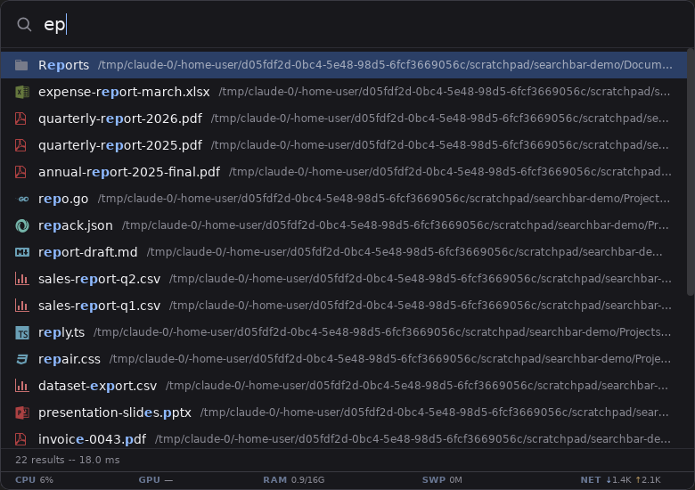

# competent-search-thing

A cross-platform desktop searchbar: press a global hotkey, a small
frameless bar pops up on the display your cursor is on, and every
keystroke instantly filters an in-memory index of your file names --
Spotlight-style presentation with voidtools-Everything-style speed.
An async [plugin system](#plugins) adds virtual results below the file
rows -- type `=2+2` and a calculator card answers, `#ff8800` previews a
color, `!ps fire` lists matching running apps -- without ever slowing
the file search down. Built with Go and [Wails v2](https://wails.io),
with a tiny vanilla TypeScript + Vite frontend.

## Screenshot



The real Linux webview, summoned with Alt+Space and captured under Xvfb
against the deterministic fixture tree CI uses (see `.github/scripts/`).
CI re-captures three screenshots like this on every push and uploads
them as run artifacts for visual comparison.

## Install

Every fully green CI run publishes one release carrying the binaries
for every platform CI builds -- linux/amd64, windows/amd64, and
darwin/arm64 -- to
[buildhost](https://github.com/wow-look-at-my/buildhost) (the org's
package registry at pazer.build). Downloads are anonymous; `latest`
(the URL without a version) serves the newest build of the default
branch (master).

The binary links the system GTK 3 and WebKitGTK **4.1** libraries at
runtime -- it does not bundle them. On a machine that never had them
installed it fails to start with
`error while loading shared libraries: libwebkit2gtk-4.1.so.0`.
Both install paths below handle that; the `.deb` does it automatically.

### Linux (x86_64), Debian/Ubuntu -- recommended

CI builds a `.deb` whose `Depends` pulls the runtime libraries through
apt. Verified in clean (never-had-the-build-deps) Ubuntu 24.04 and
22.04 environments:

```
curl -fL -o competent-search-thing.deb "https://dl.pazer.build/competent-search-thing/deb?os=linux&arch=amd64"
sudo apt install -y ./competent-search-thing.deb
competent-search-thing
```

On Ubuntu 22.04 the WebKitGTK 4.1 packages live in the `universe`
component (enabled by default on stock installs).

### Linux (x86_64), raw binary

```
curl -fL --compressed "https://dl.pazer.build/competent-search-thing?os=linux&arch=amd64" \
  -o competent-search-thing && chmod +x competent-search-thing
```

Then install the runtime libraries yourself:

| Distro | Command | Status |
|--------|---------|--------|
| Ubuntu 24.04 / 22.04 | `sudo apt-get install -y libwebkit2gtk-4.1-0 libgtk-3-0` | tested (clean-env) |
| Debian 12+ | `sudo apt-get install -y libwebkit2gtk-4.1-0 libgtk-3-0` | untested |
| Fedora | `sudo dnf install -y webkit2gtk4.1 gtk3` | untested |
| Arch | `sudo pacman -S --needed webkit2gtk-4.1 gtk3` | untested |

(On Ubuntu 24.04 the real package names are `libgtk-3-0t64` etc.; the
t64 packages `Provide` the unsuffixed names, so the one line above
resolves on both 22.04 and 24.04.) The binary needs glibc >= 2.34.
The global hotkey needs an X11 session -- see
[Known caveats](#known-caveats) below.

**WebKitGTK 4.0-only distros are not supported.** The published binary
is built with Wails' `webkit2_41` tag and hard-links
`libwebkit2gtk-4.1.so.0`; distros that only ship WebKitGTK 4.0 (Ubuntu
20.04, Debian 11) cannot run it. CI does not build a second 4.0-flavored
binary -- every current Debian/Ubuntu LTS ships 4.1. On a 4.0-only
distro, build from source without the `webkit2_41` tag (see
[Building](#building)).

### Windows (x86_64)

```
curl -fL --compressed "https://dl.pazer.build/competent-search-thing?os=windows&arch=amd64" -o competent-search-thing.exe
```

The Windows binary is cross-compiled in CI (pure Go, WebView2-based)
but untested on real Windows -- CI only *runs* the Linux build (the
screenshot tests). WebView2 is preinstalled on Windows 11 and current
Windows 10.

### macOS (Apple Silicon)

```
sudo curl -fL --compressed "https://dl.pazer.build/competent-search-thing?os=darwin&arch=arm64" \
  -o /usr/local/bin/competent-search-thing
sudo chmod +x /usr/local/bin/competent-search-thing
```

macOS-specific notes:

- If Gatekeeper blocks the binary (typical when it was downloaded with
  a browser, which sets the quarantine attribute -- curl does not),
  clear it: `xattr -d com.apple.quarantine /usr/local/bin/competent-search-thing`.
- The global hotkey uses a CGEventTap, which needs the Accessibility
  permission: System Settings > Privacy & Security > Accessibility,
  then add the binary. The default hotkey is Option+Space -- Cmd+Space
  belongs to Spotlight.
- The darwin/arm64 binary is CI-built and passes the full unit-test
  suite on macOS runners, but it has not yet had human acceptance
  testing on real hardware.

Other URL forms: `?v=N` pins a release permanently, `?branch=<name>`
follows a branch (URL-encode slashes), and `&fmt=tar.gz`/`zip`
repackages on the fly. These work on the `/deb` project too. See
<https://pazer.build/llms.txt> for the full download and
package-manager (APT, Homebrew, npm, OCI) reference. Avoid the
`apt.pazer.build` APT-repo route and `&fmt=deb` for this app: those
debs are generated server-side without `Depends`, which is exactly the
missing-libraries trap the CI-built `.deb` exists to fix.

## Indexing scope

By default the app indexes your **whole filesystem**, Everything-style:
`/` on Linux and macOS, the system drive (usually `C:\`) on Windows.
Every file and directory name is searchable instantly; nothing else is
read -- no contents, no metadata beyond the name and kind.

A whole-system walk needs guardrails, and they are on by default:

- **System excludes.** Fresh configs exclude the virtual and volatile
  trees `/proc`, `/sys`, `/dev`, `/run`, `/tmp`, `/var/tmp` (full-path
  patterns) and `lost+found` (by name), on top of the long-standing
  `.git`, `node_modules`, `.cache` name patterns. On Windows only the
  three name patterns apply (it has no such virtual trees).
- **Mount skipping.** At every index build and rescan the app reads
  `/proc/self/mounts` (Linux) and skips mountpoints under the roots
  whose filesystem type is kernel-virtual (`proc`, `sysfs`, `tmpfs`,
  `cgroup2`, `devtmpfs`, ...) or remote (`nfs`, `cifs`/SMB, `9p`,
  `sshfs`, `glusterfs`, `ceph`, `davfs`, ...). **All FUSE mounts**
  (`fuse` and every `fuse.*` type) are skipped as well -- the common
  FUSE mounts are network-backed (sshfs, rclone, gvfs), and a hung
  server must never hang your index. `overlay` is deliberately NOT
  skipped (container roots are overlay mounts). The skip list is
  recomputed on every rebuild, so mounts that come and go are handled;
  each rebuild logs what it skipped.
- **Indexing a skipped mount anyway:** add the mountpoint to `roots`
  in config.json. A mountpoint that is itself a configured root is
  never auto-skipped -- that is the escape hatch for local FUSE
  filesystems or a NAS you genuinely want indexed.

To narrow the scope, edit `roots` in config.json (see
[Configuration](#configuration)):

```json
{
  "roots": ["/home/me", "/etc"],
  "rootsVersion": 2
}
```

**Upgrading from an older version:** configs written before
whole-filesystem indexing carry no `rootsVersion` stamp. On first load
the app migrates them once -- if `roots` is still the old default
(your home directory), it becomes the whole-filesystem default and the
missing system excludes are appended (patterns you added yourself are
never touched); if you customized `roots`, nothing changes. Either way
`"rootsVersion": 2` is written back so the check never re-runs. The
migration is loud -- watch for these startup log lines:

```
config: index roots upgraded to the whole-filesystem default (/); edit roots in config.json to revert -- the first rescan will re-walk everything
config: system exclude patterns added for whole-filesystem indexing: /proc, /sys, /dev, /run, /tmp, /var/tmp, lost+found
```

To revert, set `roots` back to what you want (e.g. `["/home/me"]`) and
keep the `rootsVersion` stamp; customized roots are yours forever.

**Outside-roots hint.** If you narrowed `roots` and then search for an
absolute path that exists but is not covered -- say `/etc/hosts` with
`roots: ["/home/me"]` -- the bar does not show a silent empty list: it
returns that one real file with a hint in place of the parent-dir line
(`outside indexed roots -- add /etc to roots in config.json`). Enter
opens it like any other row. Paths that exist *inside* your roots
never get the hint (that is an indexing gap -- typically the initial
build still running -- not a scope gap).

## Status

Feature-complete for v1; every CI run publishes installable builds to
buildhost (see [Install](#install)):

- [x] Window shell (frameless, always-on-top, hidden until summoned) + CI
- [x] Index engine: compact in-memory store, parallel walker, parallel
      ranked substring search, JSON config
- [x] Path-aware search: a separator in the query switches to
      full-path matching (`/etc/hosts`, `etc/ho`; see
      [Search by path](#search-by-path))
- [x] Live index updates: per-directory fsnotify watchers, event
      debouncing, graceful watch-limit/overflow degradation, optional
      periodic rescans
- [x] Global hotkey (default Alt+Space) to summon/dismiss the bar
      (XGrabKey on Linux/X11; on Wayland a portal global shortcut,
      an automatic GNOME keybinding, or one manual binding -- see
      [Wayland](#wayland); RegisterHotKey on Windows; CGEventTap on
      macOS, needs the Accessibility permission)
- [x] Single instance + CLI: a second launch shows the running bar;
      `toggle`/`show`/`hide` subcommands drive it over a unix socket
      (the summon path for any external keybinding mechanism)
- [x] Bar positions itself on the display the cursor is on (falls back
      to centering when the platform cannot say, e.g. Wayland)
- [x] Open / Reveal: Enter opens the selection with the OS default
      handler, Ctrl+Enter (Cmd+Enter on macOS) reveals it in the file
      manager; both hide the bar on success
- [x] Search UI: as-you-type results with match highlighting, dimmed
      parent paths, folder/file glyphs, keyboard + mouse selection,
      live index status bar and a staleness warning chip
- [x] Plugin system: async virtual results from external command/HTTP
      plugins (file search never waits on them), bang targeting and
      completion (`!calc 2+2`; a bare `!` lists every command),
      opt-in app-context awareness (focused/running/installed apps),
      built-in commands (`!rescan`, `!reload`, `!config`, `!version`,
      `!quit`, `!app`) and three documented example plugins
- [x] Installed apps in normal results: matching apps show up as an
      async Apps section below the file results for plain queries
      (exact/prefix/word-start/substring ranking, capped at 6; see
      [Apps in normal results](#apps-in-normal-results))
- [x] Empty-query cheat sheet: an empty bar lists the available
      commands (the same list a bare `!` shows) with no row
      pre-selected; it disappears the moment you type, and no plugin
      processes run for an empty query
- [x] Clear on dismiss + history recall: the bar always summons empty
      -- the pre-hide text is deliberately dropped. Up recalls older
      history entries when the query is blank or still exactly what a
      previous Up/Down recall filled in (you have not typed since);
      Down then moves forward, and moving forward past the newest
      entry clears the bar back to the empty state (the cheat sheet).
      The moment you type or pick a completion, Up/Down go back to
      navigating the result list. Only queries whose activation
      actually ran are recorded (capped at 100, newest kept), persisted
      to `<configDir>/history.json` -- or memory-only with
      `history.persistDisabled` (see [Configuration](#configuration))
- [x] Theming: design tokens as CSS custom properties, builtin dark +
      light themes, validated user JSON themes with live reload, and a
      custom.css escape hatch (see [Theming](#theming))

## Search by path

A query without a path separator searches names, as always. The moment
the query contains a separator it matches case-insensitively against
the full path instead (Everything-style):

- `/etc/hosts` finds the file at exactly that path first, then paths
  ending in `/etc/hosts` (say `/backup/etc/hosts`), then paths
  starting with it (`/etc/hosts.d/...`), then any path containing it.
- Partial components work anywhere in the query: `etc/ho` or `tc/hos`
  find `/etc/hosts` and friends.
- A trailing separator scopes to directory contents: `etc/` matches
  everything under any `etc` directory at any depth, but not the
  `etc` directories themselves.
- Within a rank class the usual tie-breaks apply: directories first,
  then shorter paths, then alphabetical.

## Fuzzy matching

A name query also matches names that contain its characters **in
order with gaps** -- a subsequence, the fzf/VS-Code-style fuzzy UX:

- `fbar` finds `foo_bar.txt`
- `drpt12` finds `data_report_12.txt`
- `cst` finds `competent-search-thing`

The ranking guarantee: exact, prefix, and substring matches ALWAYS
rank above every fuzzy match -- fuzzy is a strictly lower tier and
the existing tiers behave exactly as before. Within the fuzzy tier,
matches rank by a position-aware score: hits at the name start, after
word boundaries (`-`, `_`, `.`, space, letter/digit transitions) and
at camelCase steps score higher, consecutive runs score higher, and
large gaps are penalized (with a cap, so one long gap does not drown
an otherwise good match). For the query `fb` that means `foo_bar` >
`FooBar` > `fxxbyyy`.

There is no typo tolerance: a character that never occurs in the name
is a miss (subsequence fuzz is also how fzf and VS Code's quick-open
behave; Everything's matching is not typo-based either). Queries with
a path separator ([path mode](#search-by-path)) have no fuzzy tier.

Common queries cost nothing extra: whenever the substring tiers alone
already fill the result limit, the fuzzy pass is skipped outright
(every substring match outranks every fuzzy one, so it could not
change the list). Turn the tier off entirely with
`"search": { "fuzzyDisabled": true }` in
[the configuration](#configuration); the engine then behaves exactly
like the pre-fuzzy versions.

## Building

The frontend must be built before the Go binary: `frontend/dist` is
embedded into the binary via `go:embed` and is not checked in.

### Linux prerequisites

```
sudo apt-get install -y libgtk-3-dev libwebkit2gtk-4.1-dev libx11-dev
```

Note on webkit: modern distros (Ubuntu >= 24.04, Debian >= 13) ship
only webkit2gtk **4.1**; Wails v2 defaults to 4.0, so builds need the
`webkit2_41` build tag (see below). On older distros that still have
`libwebkit2gtk-4.0-dev` you can drop the tag.

### With the Wails CLI

```
wails doctor   # verify your environment
wails dev      # live-reload development
wails build -tags webkit2_41   # production build (tag needed on webkit-4.1 distros)
```

### Without the Wails CLI (the path CI uses)

```
cd frontend && npm install && npm run build && cd ..
GOFLAGS=-tags=webkit2_41,desktop,production go-toolchain --cgo
```

`go-toolchain` (this org's build tool) tidies modules, runs tests with
coverage, and builds into `build/`. CGO must be enabled (`--cgo`)
because the Linux webview binds gtk3/webkit via cgo. `desktop` and
`production` are Wails v2's standard manual-build tags -- without them
the binary compiles but exits immediately with "Wails applications
will not build without the correct build tags". On macOS and Windows
the `webkit2_41` tag is unnecessary (but `desktop,production` still
apply).

### macOS

Xcode command line tools are required. CI builds darwin/arm64 and runs
the full unit-test suite on a macOS runner (no GUI run there).

### Windows

WebView2 runtime is required (preinstalled on Windows 11).

## Configuration

Config lives at the platform config dir (set the
`COMPETENT_SEARCH_CONFIG_DIR` environment variable to point at a
different directory):

- Linux: `~/.config/competent-search-thing/config.json`
- macOS: `~/Library/Application Support/competent-search-thing/config.json`
- Windows: `%APPDATA%\competent-search-thing\config.json`

The file is created with defaults on first run:

```json
{
  "roots": ["/"],
  "rootsVersion": 2,
  "excludes": [".git", "node_modules", ".cache", "/proc", "/sys", "/dev", "/run", "/tmp", "/var/tmp", "lost+found"],
  "hotkey": "alt+space",
  "rescanIntervalMinutes": 0,
  "maxResults": 50,
  "search": { "fuzzyDisabled": false },
  "theme": "dark",
  "plugins": { "disabled": false, "entries": {} },
  "bangs": { "sigils": ["!", "/", "@"], "aliases": {} },
  "tray": { "disabled": false },
  "history": { "persistDisabled": false },
  "window": { "translucent": false },
  "firefox": {
    "frequentSites": {
      "minVisitsMonth": 11,
      "minVisitsWeek": 1,
      "refreshMinutes": 10,
      "maxResults": 6,
      "profileDir": ""
    },
    "openTabs": {
      "maxResults": 6,
      "profileDir": ""
    }
  },
  "preview": {
    "enabled": false,
    "windowWidth": 1600,
    "windowHeight": 800,
    "textMaxKB": 256,
    "imageMaxEdge": 800,
    "dirMaxEntries": 200,
    "kagi": { "apiKey": "", "maxResults": 8 },
    "openai": { "apiKey": "", "model": "gpt-5-mini", "maxOutputTokens": 1024 }
  }
}
```

Field reference:

- `roots` -- the directories to index (default: the whole filesystem,
  `/` on Linux/macOS and the system drive on Windows -- see
  [Indexing scope](#indexing-scope)). Relative paths are made
  absolute; an empty list falls back to the default. Symlinks are
  indexed as entries but never descended. Network and virtual
  filesystem mountpoints under a root are skipped automatically; list
  such a mountpoint here explicitly to index it anyway.
- `rootsVersion` -- the roots-defaults version stamp the app writes
  (currently `2`). `0` or absent marks a config from before
  whole-filesystem indexing and triggers the one-time migration
  described under [Indexing scope](#indexing-scope). Not a knob --
  leave it alone unless you want the migration to run again.
- `excludes` -- patterns pruned from indexing (default `.git`,
  `node_modules`, `.cache` plus, on Linux/macOS, the system entries
  `/proc`, `/sys`, `/dev`, `/run`, `/tmp`, `/var/tmp` and
  `lost+found`). A pattern without a path separator is
  matched against each entry's base name (`node_modules`, `*.tmp`):
  matching directories are pruned, matching files skipped. A pattern
  containing a separator is matched against the full path
  (`/home/*/secret`). `*` never crosses a separator and there is no
  `**`. An explicitly empty list means "exclude nothing". The same
  exclude semantics apply to the initial walk, to live
  filesystem events, and to rescans.
- `hotkey` -- the global summon shortcut (default `alt+space`):
  "+"-separated, case- and whitespace-insensitive; modifiers
  `ctrl`/`control`, `shift`, `alt`/`option`, `super`/`win`/`cmd`/`meta`;
  key `space`, `tab`, `enter`/`return`, `esc`/`escape`, `a`-`z`,
  `0`-`9`, `f1`-`f12`, or an arrow (`up`/`down`/`left`/`right`).
  Examples: `alt+space`, `ctrl+shift+k`, `super+space`. An invalid or
  unregistrable hotkey is logged and the app runs on without one.
  Holding the hotkey down does not flicker the bar: OS key autorepeat
  re-fires the shortcut, so toggles are rate-limited to one per ~250ms.
- `rescanIntervalMinutes` -- optional periodic full re-index, a safety
  net on top of the live fsnotify updates; `0` (the default) disables
  the timer. Independent of this timer, a reconcile rescan runs
  automatically when the kernel event queue overflows (see the watcher
  degradation caveat below).
- `maxResults` -- the maximum number of results one query returns
  (default 50; zero or negative values are reset to the default).
- `search` -- search engine behavior. `fuzzyDisabled` (default
  `false`) turns the fuzzy (subsequence) name-match tier off, leaving
  exact/prefix/substring matching only -- see
  [Fuzzy matching](#fuzzy-matching). Exact, prefix, and substring
  matches always rank above fuzzy ones either way.
- `theme` -- the UI theme (default `dark`): a builtin (`dark`,
  `light`) or the name of a user theme file at
  `<configDir>/themes/<name>.json`. An unknown or invalid theme is
  logged and falls back to `dark`. Theme changes apply live -- see
  [Theming](#theming).
- `plugins` -- the [plugin system](#plugins). `disabled` (default
  `false`) turns the whole system off, built-in providers included.
  `entries` maps a provider id to per-plugin config:
  `{ "entries": { "calc": { "disabled": false, "settings": { } } } }`.
  `disabled` turns that one provider off (the built-in ids `bangs`,
  `app`, `apps`, `apps-search`, `windows`, `firefox-frequent` and
  `firefox-tabs` work here too);
  `settings` is an opaque JSON object passed verbatim to that plugin
  in every request (its `settings` field), so plugins can be
  configured without editing their manifest.
- `bangs` -- bang parsing. `sigils` lists the characters that may start
  a bang query (default `["!", "/", "@"]`; each must be exactly one
  character and not a letter, digit, or space -- invalid sigils are
  logged and skipped, and an empty/all-invalid list falls back to the
  defaults). `aliases` maps extra names onto registered bangs, e.g.
  `{ "aliases": { "math": "calc" } }` makes `!math` target the plugin
  that registered `calc`.
- `tray` -- the [tray icon](#tray-icon). `disabled` (default `false`)
  turns it off. Leaving it on costs nothing on desktops without a
  status-icon host: the app just never shows one.
- `history` -- the query history behind the bar's Up/Down recall.
  A query is recorded only when its activation actually runs (a file
  is opened or revealed, a plugin action executes); the newest 100
  entries are kept (exact repeats move to the newest slot instead of
  duplicating) and stored at `<configDir>/history.json`, created with
  `0600` permissions. `persistDisabled` (default `false`) keeps the
  history in memory only: nothing is read from or written to
  `history.json`, while in-session Up/Down recall keeps working.
  Delete `history.json` to forget previously saved entries.
- `window` -- the native window layer. `translucent` (default `false`)
  requests a per-pixel-alpha (RGBA) window so the area outside the
  bar's rounded corners is truly see-through instead of a squared-off
  opaque fill. It needs a running compositor -- every Wayland session
  has one, but on a compositor-less X11 setup the corners render
  solid black, which is why the flag is opt-in. Evidence and
  per-desktop status: [Translucent window](#translucent-window).
- `firefox` -- the Firefox-backed sections. `frequentSites` configures
  [Frequent sites (Firefox)](#frequent-sites-firefox): the visit
  thresholds (`minVisitsMonth`, `minVisitsWeek`), the cache refresh
  interval (`refreshMinutes`), the section's result cap
  (`maxResults`), and the optional `profileDir` discovery override.
  `openTabs` configures [Open tabs (Firefox)](#open-tabs-firefox): its
  result cap (`maxResults`) and its own optional `profileDir`
  override (empty = the same discovery `frequentSites` uses).
  Everything is read locally from your own profile and never
  transmitted; disable the sections via
  `plugins.entries["firefox-frequent"].disabled` and
  `plugins.entries["firefox-tabs"].disabled`.
- `preview` -- the preview pane (opt-in). `enabled` (default `false`)
  turns on a right-hand pane showing the selected result and widens
  the window to `windowWidth` x `windowHeight` (defaults 1600 x 800;
  read once at startup). `textMaxKB` (default 256) caps how much of a
  text file one preview reads; `imageMaxEdge` (default 800) caps a
  thumbnail's longest edge; `dirMaxEntries` (default 200) caps a
  directory listing. `kagi.apiKey` / `openai.apiKey` are SECRETS
  (passed through verbatim, never logged; the `KAGI_API_KEY` /
  `OPENAI_API_KEY` environment variables work too) enabling the
  explicit-trigger web-search and answer previews; `kagi.maxResults`
  (default 8), `openai.model` (default `gpt-5-mini`) and
  `openai.maxOutputTokens` (default 1024) tune them. Zero or negative
  numbers and an empty model are repaired to the defaults.

The full format is formally described by
[`schemas/config.schema.json`](schemas/config.schema.json) -- add a
`"$schema"` key to your `config.json` for editor validation and
completion (see [JSON Schemas](#json-schemas)).

## Theming

Every color, size, and effect in the UI flows through a fixed set of
design tokens, exposed to the frontend as CSS custom properties
(`--sb-<token>`). Pick a theme in `config.json`:

```json
{
  "theme": "light"
}
```

`dark` (the default) and `light` are builtin. Anything else is looked
up at `<configDir>/themes/<name>.json` (the app creates the `themes/`
directory on first run, next to `config.json`).

### Theme files

```json
{
  "name": "midnight",
  "extends": "dark",
  "tokens": {
    "bg": "#0b0b12",
    "accent": "#7fffd4",
    "radius": "6px"
  }
}
```

- The file's base name (without `.json`) is the theme's name -- the
  `name` field is informational. Builtins cannot be shadowed: a user
  `dark.json` is ignored in favor of the embedded dark.
- `extends` is optional and names a builtin or another user theme.
  Chains are capped at 4 themes and cycles are rejected. Tokens the
  chain leaves unset fall back to the dark builtin's values, so a
  theme only has to list what it changes.
- Values are strictly validated: hex colors (`#rgb`, `#rgba`,
  `#rrggbb`, `#rrggbbaa`), `rgb()`/`rgba()`/`hsl()`/`hsla()` with
  numeric arguments, lengths in `px`/`em`/`rem`/`%`, and bare numbers.
  `font-family` instead takes a comma-separated font list (letters,
  digits, spaces, quotes, hyphens). Named colors, `url(...)`,
  gradients, `var()` references, and anything containing `;`, `{`,
  `}`, `@import`, or `expression(` are rejected.
- Errors never break the app: an unknown theme name, a corrupt file,
  an unknown token key, or an invalid value is logged (once per
  distinct problem) and the bar falls back to the builtin dark theme.
- The file format is formally described by
  [`schemas/theme.schema.json`](schemas/theme.schema.json) -- add a
  `"$schema"` key to your theme file for editor validation (see
  [JSON Schemas](#json-schemas)).

### Token reference

Token names are a STABLE public contract (the plugin system styles
plugin accents and result badges against these variables). Light
inherits every metric it does not override from dark via `extends`.

| Token | CSS variable | Purpose | Dark | Light |
|-------|--------------|---------|------|-------|
| `bg` | `--sb-bg` | Bar background color (composed with `bg-opacity`) | `#18181c` | `#f7f7f9` |
| `bg-elevated` | `--sb-bg-elevated` | Elevated surfaces / inner separator lines | `#2c2c33` | `#e4e4ea` |
| `fg` | `--sb-fg` | Primary text (query input, result names) | `#f2f2f5` | `#1b1b22` |
| `fg-dim` | `--sb-fg-dim` | Secondary text (icons, parent dirs, placeholder, status) | `#8a8a94` | `#6b6b76` |
| `accent` | `--sb-accent` | Primary accent (input caret and input text selection; the main plugin-facing knob) | `#8db8ff` | `#2f6fdb` |
| `accent-fg` | `--sb-accent-fg` | Text on accent-filled surfaces (input text selection; plugin-facing) | `#101018` | `#ffffff` |
| `selection-bg` | `--sb-selection-bg` | Selected result row background | `#2b3f66` | `#d8e4fb` |
| `selection-fg` | `--sb-selection-fg` | Text on the selected result row | `#f2f2f5` | `#14213d` |
| `border` | `--sb-border` | The bar's outer border | `#3a3a42` | `#cfcfd8` |
| `highlight` | `--sb-highlight` | Matched-substring highlight in result names | `#8db8ff` | `#1a56c0` |
| `warning` | `--sb-warning` | Warning accents (the staleness chip) | `#d9a13d` | `#9a6b12` |
| `badge-bg` | `--sb-badge-bg` | Reserved: plugin result badge background | `#2b3f66` | `#dbe7ff` |
| `badge-fg` | `--sb-badge-fg` | Reserved: plugin result badge text | `#b8c6e8` | `#1d3a6e` |
| `scrollbar` | `--sb-scrollbar` | Results scrollbar thumb | `rgba(255, 255, 255, 0.14)` | `rgba(0, 0, 0, 0.2)` |
| `font-family` | `--sb-font-family` | UI font stack | `system-ui, -apple-system, "Segoe UI", sans-serif` | (= dark) |
| `font-size` | `--sb-font-size` | Base text size; the query input and empty/status text derive from it by fixed offsets | `14px` | (= dark) |
| `font-size-small` | `--sb-font-size-small` | Secondary text size (parent dirs; status/chip derive from it) | `12px` | (= dark) |
| `radius` | `--sb-radius` | Bar corner radius (chip and scrollbar radii scale from it) | `10px` | (= dark) |
| `gap` | `--sb-gap` | Gap between icon/name/dir in a row | `10px` | (= dark) |
| `padding` | `--sb-padding` | Horizontal edge padding | `16px` | (= dark) |
| `bg-opacity` | `--sb-bg-opacity` | Bar background opacity, 0..1 (applied via `color-mix`) | `0.97` | `0.98` |
| `blur` | `--sb-blur` | Backdrop blur radius behind the bar (best-effort: needs compositor + webview support) | `0px` | (= dark) |

The dark column doubles as the hard-coded fallback: `style.css`
declares exactly these values in its `:root` block, and a Go test
(`internal/theme/sync_test.go`) fails the build if the two ever drift.

### custom.css escape hatch

`<configDir>/themes/custom.css` (up to 64KB), when present, is
injected verbatim into the page after the token variables -- rule
anything you want, e.g. `#bar { border-width: 2px; }`. Unlike theme
JSON files it is NOT validated or sandboxed in any way: broken CSS can
garble the bar (delete the file to recover), so treat it as
use-at-your-own-risk. Prefer theme tokens where they suffice.

### Live reload

Theme changes apply without a restart: the app watches `config.json`
and the `themes/` directory and re-applies the theme ~300ms after the
last write. Note that only the `theme` field of `config.json` is
re-read live -- roots, excludes, hotkey, and the other fields still
require a restart.

Per-theme CI screenshots are active: every push captures the full
summoned/results/selection shot set once per builtin theme into
`screenshots/dark/` and `screenshots/light/`, uploaded as the
`screenshots-<sha>` artifact and asserted against per-theme
brightness bands and size floors (see `.github/scripts/screenshots.ts`).

## Plugins

The bar can show **virtual results** -- a calculator answer, a color
swatch, anything a small external program computes -- in sections below
the file results. Plugins are asynchronous by design: file search stays
instant and never waits on a plugin; each plugin's section appears
under the file rows whenever its answer arrives, and a slow or broken
plugin simply contributes nothing.

A plugin is a directory containing a `manifest.json` that tells the app
what the plugin reacts to and how to reach it, over one of two
transports:

- **command** -- the app runs your program once per query: the request
  JSON arrives on stdin (which is then closed), the response JSON is
  read from stdout, and the process exits. No shell is involved -- the
  manifest's `argv` is executed directly.
- **http** -- the app POSTs the request JSON
  (`Content-Type: application/json`) to a URL you configure and reads
  the response JSON from a 2xx reply.

### Installing a plugin

Copy the plugin's directory into `plugins/` inside the config
directory (next to `config.json`, see [Configuration](#configuration)),
so the manifest sits at `<config dir>/plugins/<name>/manifest.json`:

- Linux: `~/.config/competent-search-thing/plugins/`
- macOS: `~/Library/Application Support/competent-search-thing/plugins/`
- Windows: `%APPDATA%\competent-search-thing\plugins\`

If `COMPETENT_SEARCH_CONFIG_DIR` is set it replaces the config
directory; the plugin directory is always `<config dir>/plugins/`.

Plugins load at startup; run the built-in `!reload` command to pick up
new or edited plugins without restarting. A missing `plugins/`
directory is fine (you just have no plugins). A broken manifest is
skipped and logged -- all plugin problems land in the app's log on
standard error with a `plugin:` prefix (visible when the app is
launched from a terminal; a desktop session usually routes it to the
journal). When two manifests declare the same id, the
alphabetically-first directory wins and the duplicate is logged.

### Writing a plugin: the 60-second version

```
mkdir -p ~/.config/competent-search-thing/plugins/hello
cd ~/.config/competent-search-thing/plugins/hello
```

`manifest.json`:

```json
{
  "id": "hello",
  "type": "command",
  "trigger": { "prefix": "hi " },
  "command": { "argv": ["python3", "hello.py"] }
}
```

`hello.py`:

```python
import json, sys

req = json.load(sys.stdin)
who = req["stripped"] or "world"
json.dump({
    "v": 1,
    "results": [{
        "title": "Hello, " + who,
        "subtitle": "from your first plugin",
        "icon": "star",
        "action": {"type": "copy_text", "value": who},
    }],
}, sys.stdout)
```

Summon the bar, run `!reload`, then type `hi there`. A "Hello, there"
card appears below the file results; Enter copies "there" to the
clipboard. Because `bangs` defaults to the plugin id, `!hello there`
works too, bypassing the prefix trigger.

### The manifest

A complete command manifest (the shipped calc example) and a fuller
HTTP one showing the optional knobs:

```json
{
  "v": 1,
  "id": "calc",
  "name": "Calculator",
  "type": "command",
  "trigger": { "prefix": "=" },
  "bangs": ["calc", "c"],
  "timeout_ms": 1500,
  "command": { "argv": ["python3", "calc.py"] }
}
```

```json
{
  "v": 1,
  "id": "tickets",
  "name": "Ticket lookup",
  "type": "http",
  "trigger": {
    "regex": "^[a-z]{2,5}-[0-9]+$",
    "min_query_len": 4,
    "debounce_ms": 150,
    "focused_app": { "name_regex": "firefox|chrome" },
    "focused_boost": 20
  },
  "bangs": ["ticket", "t"],
  "context": ["focused"],
  "timeout_ms": 3000,
  "http": {
    "url": "http://127.0.0.1:9800/query",
    "headers": { "X-Api-Key": "swordfish" }
  },
  "allow_run_command": false
}
```

Top-level fields:

| field | type | default | rules |
|-------|------|---------|-------|
| `v` | int | 1 | manifest version; must be 1 |
| `id` | string | (required) | `^[a-z0-9][a-z0-9_-]{0,31}$`; unique -- the built-in ids `bangs`, `app`, `apps` are taken |
| `name` | string | the id | display name, shown as the section header and in the bang chip |
| `type` | string | (required) | `"command"` or `"http"` |
| `trigger` | object | none | when the plugin sees untargeted queries (table below); omit it to make the plugin bang-only |
| `bangs` | string[] | `[<id>]` | bang names targeting this plugin; same syntax as `id`, lowercased and deduped. An explicit `[]` means no bangs (then `trigger` is required -- a plugin with neither is rejected as unreachable) |
| `context` | string[] | `[]` | app-context parts sent with every request: any of `"focused"`, `"running"`, `"installed"`. Undeclared parts are never sent |
| `timeout_ms` | int | 1500 | per-query time budget, clamped to 100..10000 |
| `command` | object | -- | required for `type:"command"`: `{ "argv": [...] }` with at least one entry, none empty |
| `http` | object | -- | required for `type:"http"`: `{ "url": "...", "headers": {...} }` |
| `allow_run_command` | bool | `false` | must be `true` for this plugin's results to carry `run_command` actions; otherwise any result with one is dropped |

`trigger` fields (a plugin matches when ANY of the text paths --
`prefix`, `regex`, `all_queries`, tried in that order, first match
decides the stripped query -- matches AND the `focused_app` gate, when
present, matches):

| field | type | default | meaning |
|-------|------|---------|---------|
| `prefix` | string | "" | case-insensitive prefix match on the typed query; the remainder, trimmed, becomes the request's `stripped` |
| `regex` | string | "" | case-insensitive RE2 matched against the RAW query; on match `stripped` is the trimmed raw query |
| `all_queries` | bool | `false` | match every query |
| `min_query_len` | int | 0 | minimum `stripped` length in runes, gating ALL paths; when 0 and `all_queries` is set, the effective minimum is 2 (so an all-queries plugin does not fire on single keystrokes) |
| `debounce_ms` | int | 0 | extra delay before dispatch, clamped to 0..2000; a newer keystroke cancels the wait, so a debounced plugin only sees queries the user paused on |
| `focused_app` | object | none | `{ "name_regex": "...", "exe_regex": "..." }` -- the trigger only matches when the app focused at hotkey press matches (case-insensitive RE2; at least one pattern required, an empty one is a wildcard). When no focused app is known (Wayland, degraded platforms) the gate never matches |
| `focused_boost` | int | 0 | 0..100, added to every result score (clamped at 100) when the focused gate matches -- lets app-specific plugins outrank generic ones |

`command.argv` resolution: an absolute `argv[0]` runs as-is; one
containing a path separator resolves relative to the manifest's
directory; a bare name goes through the normal `PATH` lookup. The
working directory is always the manifest's directory, which is why
`["python3", "calc.py"]` just works.

`http.url` must be an absolute `http`/`https` URL with a host.
`headers` are set on every request (e.g. an API key). Redirects are
followed at most 3 hops and only to `http`/`https` targets.

### The wire protocol

One request per query. Command plugins read it from stdin; HTTP
plugins receive it as the POST body:

```json
{
  "v": 1,
  "query": "!calc 2+2",
  "stripped": "2+2",
  "gen": 42,
  "targeted": true,
  "bang": "calc",
  "settings": {},
  "context": {
    "focused_app": { "name": "firefox", "exe": "/usr/lib/firefox/firefox", "title": "Mozilla Firefox", "pid": 1234 },
    "running_apps": [ { "name": "kitty", "exe": "/usr/bin/kitty", "title": "~/src", "pid": 4321 } ],
    "installed_apps": [ { "name": "Firefox", "exec": "firefox %u", "id": "firefox.desktop" } ]
  }
}
```

- `v` -- protocol version, always 1. Reject anything else.
- `query` -- the raw text as typed.
- `stripped` -- the query with the trigger prefix or bang removed and
  trimmed; usually what you want to parse.
- `gen` -- monotonically increasing query generation. Purely
  informational for one-shot plugins.
- `targeted` / `bang` -- set when the query was bang-dispatched
  (`!calc 2+2`); `bang` is the canonical bang name used.
- `settings` -- this plugin's `settings` object from `config.json`,
  always at least `{}`.
- `context` -- only the parts declared in the manifest's `context`,
  and only when data is available; parts with nothing to report are
  omitted, and the whole field is absent when nothing remains. Privacy
  note: a plugin that declares nothing never sees any of it.

What the context parts contain, per platform:

| part | Linux/X11 | Linux/Wayland | Windows | macOS |
|------|-----------|---------------|---------|-------|
| `focused_app` | yes | absent | best-effort | best-effort (`title` always empty) |
| `running_apps` | yes | X11/XWayland clients only, else absent | best-effort | best-effort (`title` always empty) |
| `installed_apps` | `.desktop` entries | `.desktop` entries | uninstall-registry entries | `/Applications` scan |

The focused app is captured **at hotkey press, before the bar window
takes focus**, so it is the app the user was actually using. The
running list refreshes in the background at each summon; the installed
list refreshes at startup and then at most every 5 minutes at summon --
requests never block on any of it. The Windows and macOS paths compile
but are not exercised by CI (linux/amd64); treat them as best-effort.

The response, on stdout (command) or as the 2xx body (http):

```json
{
  "v": 1,
  "results": [
    {
      "title": "4",
      "subtitle": "2 + 2",
      "icon": "calculator",
      "badge": "CALC",
      "accent_color": "#a6e3a1",
      "score": 100,
      "fields": [
        { "label": "Hex", "value": "0x4" },
        { "label": "Binary", "value": "0b100" }
      ],
      "action": { "type": "copy_text", "value": "4" }
    }
  ]
}
```

A missing `"v"` means 1; any other value rejects the whole response.
`{"v":1,"results":[]}` is the correct "nothing to show" answer (it
renders nothing and is not an error).

### Results: fields, caps, styling

Everything a plugin returns is validated and clamped before it can
reach the UI. Oversized strings are truncated, invalid values cleared,
and anything dropped is logged with a reason.

| field | required | limit | notes |
|-------|----------|-------|-------|
| `title` | yes | 200 runes | trimmed; a result with an empty title is dropped |
| `subtitle` | no | 300 runes | dim second line |
| `icon` | no | see below | built-in icon name, or a literal glyph/emoji up to 32 bytes |
| `badge` | no | 24 runes | small accent-colored tag on the row's right edge |
| `accent_color` | no | `#rgb` / `#rrggbb` | must match `^#([0-9a-fA-F]{3}\|[0-9a-fA-F]{6})$`; anything else is cleared |
| `score` | no | 0..100 | default 50 when absent; clamped |
| `fields` | no | 8 fields; label 40 / value 200 runes | rendered as dim `label: value` pairs under the title |
| `action` | no | -- | what Enter/click does; see [Actions](#actions) |

Response-wide caps: at most 20 results per response and 1 MiB of
response body (both transports); control characters in any string are
replaced with spaces.

**Ordering**: file results always come first. Plugin sections sort by
their best result's score (then plugin id); results within a section
sort by score (then response order). A score of 100 puts your section
above other plugins' sections.

**Icons**: the built-in names are `calculator`, `globe`, `clock`,
`star`, `info`, `warning`, `link`, `terminal`, `text`, `hash`, `bolt`,
`app`, and `puzzle`. An unknown or absent name falls back to the
puzzle piece. A value that is not a lowercase name is rendered
literally, so a plugin may ship its own emoji (up to 32 bytes) as the
icon. Remote icon URLs are not supported.

**Styling**: `accent_color` is the only styling channel a plugin has.
It sets exactly one CSS custom property, `--plugin-accent`, on that
row; the stylesheet consumes it as
`var(--plugin-accent, var(--accent, #89b4fa))` (row left edge and
badge). A `:root` bridge defines `--accent: var(--sb-accent, #89b4fa)`,
so the app-wide theme accent token applies when present and the
standalone default otherwise. Plugins cannot inject HTML, CSS, or
inline styles -- every string is rendered as a text node.

### Actions

A result's `action` decides what Enter (or a click) does. Rows without
an action are inert display rows.

| type | payload | validation | on activation |
|------|---------|------------|---------------|
| `open_path` | `value` | non-empty absolute path, <= 2048 bytes | opens with the OS default handler; the bar hides |
| `open_url` | `value` | `http`/`https` URL with a host, <= 2048 bytes | opens in the browser; the bar hides |
| `copy_text` | `value` | non-empty, <= 8192 bytes | copies to the clipboard; the bar STAYS OPEN and flashes "Copied" |
| `run_command` | `argv` | 1..16 entries, each non-empty and <= 1024 bytes | launches the argv detached (no shell); the bar hides |

`run_command` is additionally gated by the manifest: unless it sets
`"allow_run_command": true`, any result carrying a `run_command`
action is dropped entirely (and logged). Because the manifest lives on
the user's disk, a plugin response can never grant itself local
execution.

Two more action types exist -- `set_query` (replace the search input)
and `run_builtin` (app commands) -- but they are **internal-only**,
produced by the built-in providers; the sanitizer strips them from
external plugin responses. Every action is re-validated in Go when it
is executed, so a malformed action is rejected, never run.

### Bangs

Bangs target a query at one specific plugin, bypassing every trigger
condition (prefix, regex, `all_queries`, `min_query_len`, the focused
gate). The default sigils are `!`, `/` and `@` -- all equivalent --
and are configurable (`bangs.sigils` in `config.json`).

- `!calc 2+2` -- sigil + bang name + a space + the rest. Only the
  plugin that registered `calc` is dispatched, with `targeted: true`,
  `bang: "calc"` and `stripped: "2+2"`. File search still runs on the
  raw text, and a chip in the query row names the targeted plugin.
- Resolution order: exact bang match, then a configured alias, then --
  when exactly one registered bang starts with what you typed -- that
  unique prefix (`!ca 2+2` resolves to `calc`).
- A bare sigil (`!`), a partial or ambiguous name (`!ca`), or a
  resolved name still missing its space: the built-in Commands
  provider suggests matching bangs (up to 12) as results; Enter on a
  suggestion completes the input in place, keeping your sigil and
  whatever followed the name.
- An empty query shows the same cheat sheet (everything a bare `!`
  lists) before you type anything. It renders with no row selected --
  Enter on an empty bar does nothing until you arrow into or click the
  list -- vanishes the instant the query is non-empty, and involves no
  plugin dispatch (an empty query never runs plugin processes).
- Sigil text that matches no bang at all falls through to the normal
  trigger path as a plain query.

A manifest with `bangs` but no `trigger` is a **bang-only plugin**: it
never sees untargeted queries at all (the shipped `ps` example). Note
that bang names come from plugin manifests, so installing a plugin is
also trusting its bang names; built-ins register first and can never
be shadowed.

### Built-in commands

Seven built-in providers ship inside the app and go through the same
pipeline (disable them like any plugin via `plugins.entries` with ids
`bangs`, `app`, `apps`, `apps-search`, `windows` -- the last is the
bang-less [Open windows](#open-windows) search, listed here only for
its disable knob -- `firefox-frequent`, `firefox-tabs`):

| bang | does |
|------|------|
| `!rescan` | rebuild the file index from disk now (errors while the initial build is still running) |
| `!reload` | re-read `config.json` and the plugin manifests, restart providers |
| `!config` | open `config.json` with the OS default handler |
| `!version` | copy the app version to the clipboard |
| `!quit` | exit the app |
| `!app <text>` / `!launch <text>` | search installed applications and launch the selection |

Type a bare `!` (or `/` or `@`) to list every available command; an
empty query shows the same list before you type anything.

`!app` searches the installed-apps snapshot: an empty query (`!app `,
note the space) lists the first 15 alphabetically; otherwise name
prefix matches score 100 and substring matches 80, capped at 15.
Selecting a row launches the app via its parsed `.desktop` `Exec`
line (freedesktop field codes like `%u` stripped), detached from the
searchbar. This is `.desktop`-based and therefore Linux-first; Windows
and macOS enumeration is best-effort.

### Apps in normal results

Installed apps also surface in plain queries -- no bang needed. Typing
`fire` shows an **Apps** section (below the file results, like any
plugin section) with Firefox in it; Enter launches the selection
exactly like `!app` does. This is the fourth built-in provider,
`apps-search`:

- It fires on every query of 2+ characters and matches app names
  case-insensitively. Ranking: exact name match, then name prefix,
  then word start (`code` matches `Visual Studio Code`), then
  substring; ties break alphabetically. The section caps at 6 results
  to stay out of the way -- use `!app` / `!launch` for the full list
  of 15.
- Bang routing keeps the two paths mutually exclusive: a `!app ...` /
  `!launch ...` query dispatches only the targeted launcher, so apps
  never render twice.
- To turn the untargeted section off (the targeted `!app` / `!launch`
  bangs are unaffected):

```json
{ "plugins": { "entries": { "apps-search": { "disabled": true } } } }
```

The remaining built-ins, `firefox-frequent` and `firefox-tabs`, have
no bangs: they answer plain queries with a "Frequent Sites" and an
"Open Tabs" section -- see the next two sections.

### Frequent sites (Firefox)

When the machine has a Firefox profile, plain queries (two or more
characters) also search the pages you visit frequently. Matches appear
as a "Frequent Sites" section below the file results, each row showing
the page title (or its host when untitled), the full URL, and a globe
icon; activating a row opens the page in your default browser.

**"Frequent" means: visited more than 10 times in the past 30 days AND
at least once in the past 7 days.** Both thresholds are configurable
(the defaults encode that exact rule as `minVisitsMonth: 11`,
`minVisitsWeek: 1`).

**Privacy**: the history is read locally, from your own Firefox
profile, by the app running on your machine -- the same data the
awesome bar uses. Nothing is transmitted anywhere, no browser
extension is involved, and the only network traffic ever caused by
this feature is you opening a result in your browser.

How it works:

- **Profile discovery** probes the `profiles.ini` base directories in
  order: the classic `~/.mozilla/firefox`, the snap install
  `~/snap/firefox/common/.mozilla/firefox` (Ubuntu 22.04's default
  Firefox), and the flatpak install
  `~/.var/app/org.mozilla.firefox/.mozilla/firefox`; on Windows,
  `%APPDATA%\Mozilla\Firefox`. Within a base, an `[Install...]`
  section's `Default=` entry names the profile (that is the one the
  last-used Firefox install actually opens), falling back to the
  `[Profile]` section marked `Default=1`, then to a lone `[Profile]`
  section. When more than one base yields a profile, the one whose
  `places.sqlite` was modified most recently -- the profile actually
  in use -- wins. No profile anywhere: one quiet log line, and the
  section simply never exists.
- **The history database is never opened in place.** Firefox keeps
  `places.sqlite` locked (WAL mode) while running, so the file and its
  `-wal` sidecar are copied to a private temp directory, the copy is
  queried read-only, and the copy is deleted. Your profile is never
  written, and the app cannot corrupt it.
- **Counting**: only normal `http(s)` page loads count. Redirect
  bookkeeping entries (`hidden=1`) and embedded-frame transitions
  (visit types 4 and 8) are excluded, so ad iframes cannot make a site
  "frequent".
- **Caching**: the site list is read in the background and cached; a
  query never waits on the database. The list refreshes at most every
  `refreshMinutes`, failures keep the previous list, and the first
  query after startup may show the section one keystroke late while
  the initial read runs.

Configuration (`config.json`, all fields optional; shown with
defaults):

```json
{
  "firefox": {
    "frequentSites": {
      "minVisitsMonth": 11,
      "minVisitsWeek": 1,
      "refreshMinutes": 10,
      "maxResults": 6,
      "profileDir": ""
    }
  }
}
```

- `minVisitsMonth` -- minimum visits in the past 30 days (default 11,
  i.e. "more than 10 times").
- `minVisitsWeek` -- minimum visits in the past 7 days (default 1).
- `refreshMinutes` -- how old the cached list may get before a query
  kicks a background re-read (default 10).
- `maxResults` -- cap on one Frequent Sites section (default 6).
- `profileDir` -- absolute path of a Firefox profile directory; when
  set, discovery is skipped and that profile's `places.sqlite` is
  used. Set this if you use multiple profiles or a portable install.

Ranking within the section: a query matching the start of the host
(`git` -> `github.com`; a leading `www.` is ignored) scores highest,
then a word start in the title, then a substring of the host, then a
substring anywhere in the title or URL; ties go to the more-visited
page. To turn the section off entirely:

```json
{ "plugins": { "entries": { "firefox-frequent": { "disabled": true } } } }
```

Zero or negative numbers are repaired to the defaults on load. The
snap-location discovery order matches Ubuntu 22.04's stock Firefox
packaging; other browsers (Chromium, and Firefox forks using different
profile paths) are not read -- `profileDir` accepts any directory that
contains a Firefox-format `places.sqlite`.

### Open tabs (Firefox)

Plain queries (two or more characters) also search the tabs currently
open in Firefox. Matches appear as an "Open Tabs" section, each row
showing the tab title (or its host when untitled), the full URL, a
link icon, and a `pinned` badge on pinned tabs.

**Honesty note -- activating a row re-OPENS the URL, it does not focus
the existing tab.** The app hands the URL to your default browser,
which in a running Firefox almost always means a NEW tab of the same
page. Actually switching to the already-open tab is not possible from
the outside: Firefox exposes no such command to other processes, so
true tab focusing would require a companion browser extension. That is
a possible future option, deliberately out of scope here. Use the
section to find and re-open what you already have; do not expect it to
de-duplicate your tab bar.

**Privacy**: the tab list is read locally from your own profile's
crash-recovery session snapshot
(`<profile>/sessionstore-backups/recovery.jsonlz4`), by the app
running on your machine. Nothing is transmitted anywhere, and no
browser extension is involved. Private windows never appear -- Firefox
does not persist them into the snapshot at all.

How it works, and what "current" means here:

- **The snapshot is Firefox's own crash-recovery file**, rewritten
  roughly every 15 seconds while the browser runs. The app decodes its
  `mozLz4` container with a small built-in LZ4 block decoder (pure Go,
  bounds-checked, 64 MiB cap) and keeps only visible tabs' current
  pages with `http(s)` URLs -- hidden tabs and `about:`/extension/file
  pages are dropped.
- **Freshness**: queries never parse the file directly; a cached list
  is served and refreshed in the background when the snapshot's mtime
  changes or after ~15 seconds, whichever comes first (the mtime is
  probed at most once a second while you type). A just-opened tab can
  therefore take up to ~30 seconds to appear, and a just-closed one to
  disappear. Read failures keep the previous list and log once.
- **A closed Firefox means an empty section** -- deliberately. Without
  a running browser there IS no recovery snapshot, only the last
  closed session (`sessionstore.jsonlz4`), and showing those tabs as
  "open" would lie. The section reappears within seconds of Firefox
  starting.

Configuration (`config.json`, all fields optional; shown with
defaults):

```json
{
  "firefox": {
    "openTabs": {
      "maxResults": 6,
      "profileDir": ""
    }
  }
}
```

- `maxResults` -- cap on one Open Tabs section (default 6; zero or
  negative values are repaired on load).
- `profileDir` -- absolute path of a Firefox profile directory; when
  set, discovery is skipped for this section. Empty means the same
  profile discovery Frequent Sites uses (the two sections share one
  discovery pass).

Ranking within the section: a query starting a word in the tab title
(`pull` -> "Pull requests") scores highest -- an open tab is usually
recalled by what it shows, so the title outranks the host here --
then a host prefix (`git` -> `github.com`, a leading `www.` ignored),
then a title substring, then a substring anywhere in the URL; ties go
to the most recently used tab. To turn the section off entirely:

```json
{ "plugins": { "entries": { "firefox-tabs": { "disabled": true } } } }
```

### Trust model

Plain words about what installing a plugin means:

- **Command plugins run programs with your privileges.** The app
  executes the manifest's `argv` as you, once per matching keystroke
  batch. Only install plugins whose code you trust (or have read --
  the shipped examples are a few dozen lines each).
- **HTTP plugins call endpoints you configured.** The app only ever
  POSTs query JSON to the manifest's URL and renders the reply; your
  query text (and any declared context) is sent to that endpoint, so
  point it only at services you trust.
- **Responses are data, never capability.** A response cannot execute
  anything by itself: `run_command` results are dropped unless the
  on-disk manifest opts in via `allow_run_command`; the internal
  `set_query`/`run_builtin` action types are stripped from external
  responses; `open_url` is restricted to `http`/`https`; every action
  is re-validated at execution time.
- **No markup, no remote fetches.** Plugins cannot inject HTML or CSS;
  all text renders as text nodes; icons are built-in names or literal
  glyphs, never URLs; styling is limited to the whitelisted knobs
  (icon, badge, accent color, fields). Control characters are stripped
  from every string, including clipboard payloads.
- **Context is opt-in per plugin.** The focused/running/installed app
  lists are only sent to plugins that declare them in their manifest;
  everything else never leaves the app.

### The shipped examples

Three documented, tested examples live in
[`examples/plugins/`](examples/plugins/) (each has its own README with
install steps):

| plugin | transport | trigger | bangs | context | demonstrates |
|--------|-----------|---------|-------|---------|--------------|
| `calc` | command (python3) | prefix `=` | `!calc`, `!c` | -- | arithmetic evaluation, Hex/Binary fields, `copy_text`, accent + badge |
| `color-http` | http (Go server) | prefix `#` | `!color` | -- | the HTTP transport end to end, `accent_color` as the parsed color, R/G/B + H/S/L fields |
| `ps` | command (python3) | none (bang-only) | `!ps` | `running` | bang-only targeting and the `context` declaration |

`calc` and `ps` need `python3` on `PATH` (on Windows change the argv
to `python`). `color-http`'s endpoint runs with
`go run ./examples/plugins/color-http/server`; its handler is a good
HTTP-plugin reference: POST-only (405 otherwise), 400 for a malformed
body -- the recommended answers, since the searchbar logs any non-2xx
as a plugin error.

### JSON Schemas

Every JSON format the app reads or speaks is formally described by a
JSON Schema (draft 2020-12) under [`schemas/`](schemas/):

- [`schemas/config.schema.json`](schemas/config.schema.json) --
  `config.json` (see [Configuration](#configuration))
- [`schemas/plugin-manifest.schema.json`](schemas/plugin-manifest.schema.json) --
  a plugin's `manifest.json` (see [The manifest](#the-manifest))
- [`schemas/theme.schema.json`](schemas/theme.schema.json) -- theme
  files (see [Theming](#theming))
- [`schemas/plugin-request.schema.json`](schemas/plugin-request.schema.json) --
  the wire request a plugin receives
- [`schemas/plugin-response.schema.json`](schemas/plugin-response.schema.json) --
  the wire response a plugin returns

For editor validation and completion, add a `"$schema"` key to the
file (the app ignores unknown keys, so this is always safe; the
shipped example manifests do it):

```json
{
  "$schema": "https://raw.githubusercontent.com/wow-look-at-my/competent-search-thing/master/schemas/plugin-manifest.schema.json"
}
```

Or map the schemas by file name in VS Code's `settings.json`:

```json
{
  "json.schemas": [
    {
      "fileMatch": ["competent-search-thing/config.json"],
      "url": "https://raw.githubusercontent.com/wow-look-at-my/competent-search-thing/master/schemas/config.schema.json"
    },
    {
      "fileMatch": ["competent-search-thing/plugins/*/manifest.json"],
      "url": "https://raw.githubusercontent.com/wow-look-at-my/competent-search-thing/master/schemas/plugin-manifest.schema.json"
    },
    {
      "fileMatch": ["competent-search-thing/themes/*.json"],
      "url": "https://raw.githubusercontent.com/wow-look-at-my/competent-search-thing/master/schemas/theme.schema.json"
    }
  ]
}
```

Two things to know about strictness:

- The schemas set `additionalProperties: false` so editors flag typos
  (`"maxResluts"`), while the app itself IGNORES unknown keys -- a
  file that fails schema validation may still load fine.
- The response schema REJECTS what the app's sanitizer would merely
  clamp or drop (a score of 101, a 21st result, a 201-rune title), so
  authors notice instead of silently losing data. Staying inside the
  schema guarantees the app shows exactly what you sent.

The schemas are kept in lockstep with the Go validators by tests
(`internal/*/schema*_test.go`): the shipped example manifests, the
builtin themes, the default config, and canned wire payloads are
validated on every build, and reflection guards fail the build when a
struct field and its schema drift apart.

### Limits and troubleshooting

- **Timeouts kill.** A command plugin still running at `timeout_ms` is
  hard-killed (the kill waits at most ~250ms extra for the process to
  let go of its pipes); an HTTP request is aborted. The same happens
  the moment a newer keystroke supersedes the query.
- **Logs are throttled.** Plugin errors and sanitizer drops are logged
  at most once per 5 seconds per plugin, so a broken plugin cannot
  flood the log. Logs go to the app's standard error with a `plugin:`
  prefix.
- **Common failures**: response is not valid JSON; `"v"` is neither
  absent nor 1; response body over 1 MiB (the command transport keeps
  draining stdout so the child still exits); a command exiting
  non-zero (its stderr, up to 8 KiB, is captured and quoted in the log
  line); an HTTP status outside 2xx.
- **Isolation**: a failing plugin never affects file search or other
  plugins -- its section just does not appear. A panic-level failure
  inside the dispatch pipeline is recovered and logged.

Not in v1, flagged as future work: HTTP GET mode (POST is the single
HTTP mode), a persistent JSON-Lines command mode (one process per
query is the only command mode), remote icons, plugin-supplied
HTML/CSS, Wayland focused-window support, and untargeted installed-app
results.

## Open windows

On X11 sessions, typing two or more characters also searches the
titles of the windows currently open on your desktop. Matches appear
as an "Open Windows" section below the file results (subtitle = the
owning application), and pressing Enter on one ACTIVATES that window
-- raises and focuses it -- instead of opening anything. Think
"window switcher you can type at".

Details:

- The window list is refreshed in the background every time the bar is
  summoned, so it is current per summon and typing never waits on the
  window system.
- Ranking: a query matching the start of a word in the title scores
  85, an application-name prefix 80, a title substring 65, an
  application-name substring 60; ties sort alphabetically, capped at 8
  rows. The scores sit below exact file-name hits on purpose.
- Untitled windows and the searchbar's own window are skipped; the
  list is capped at 100 windows.
- Disable it like any plugin section:
  `"plugins": { "entries": { "windows": { "disabled": true } } }`.
- Window titles are read locally over X11/EWMH and are fed ONLY to
  this built-in section -- they are never sent to external plugins
  (the plugin request context remains focused/running/installed).

Per-desktop support:

| Desktop | Open-window search |
|---------|--------------------|
| Linux X11 | full (list + Enter activates) |
| Linux Wayland | not available (see below) |
| Windows | not yet (enumeration exists in the OS; not implemented) |
| macOS | not yet (titles need the Accessibility AX API) |

**Why not on Wayland**: Wayland's security model deliberately
prevents a regular application from enumerating other applications'
windows -- there is no sanctioned protocol for it on GNOME (the
`org.gnome.Shell.Introspect` D-Bus interface is allowlisted /
unsafe-mode-gated, no XDG portal exposes a window list, and the
wlr-foreign-toplevel protocol is wlroots-only). The app deliberately
does NOT fall back to reading the XWayland client list even though
`DISPLAY` is usually set on GNOME Wayland: that connection would
succeed and list ONLY the XWayland windows, a misleading partial view.
So on a Wayland session the section simply never appears, and one log
line says why. A future option is a GNOME Shell extension that exports
the window list over D-Bus (for example "Window Calls"), which the app
could consume opt-in; nothing like that ships today.

## Tray icon

The app puts a small magnifier icon in the system tray -- on Ubuntu's
GNOME desktop that is the top-right status area -- with a menu:

- **Show/Hide** -- toggle the searchbar (same path as the hotkey)
- **Rescan now** -- request a full re-index
- **Open config** -- open `config.json` in your editor
- **Quit** -- exit the app

The bar itself stays hidden until summoned, so the tray icon is the
one always-visible handle on the running app. Under GNOME's
AppIndicator extension a left click opens the menu; a double or
middle click toggles the bar directly.

Implementation notes and requirements:

- The icon is a **StatusNotifierItem** (the AppIndicator protocol)
  spoken directly over D-Bus -- no GTK tray library involved. It
  needs an SNI host on the session bus. **Ubuntu ships one enabled by
  default** on every GNOME release (the
  `ubuntu-appindicators@ubuntu.com` shell extension); KDE Plasma,
  Cinnamon, Xfce (with the ayatana plugin), and waybar (`tray`
  module) work out of the box too. Stock Fedora GNOME needs the
  [AppIndicator extension](https://extensions.gnome.org/extension/615/appindicator-support/)
  installed.
- If the extension loads after the app (session autostart) or GNOME
  Shell restarts, the icon (re-)registers automatically.
- Without any SNI host the app logs one line
  (`tray: no StatusNotifierItem host ...`) and runs on exactly as
  before -- the tray is an extra, never a requirement.
- Linux-only for now (the user-facing ask was GNOME); windows/darwin
  builds simply skip it.
- Turn it off with `"tray": { "disabled": true }` in
  [`config.json`](#configuration).

If the icon does not appear on Ubuntu, check that the extension is
enabled: `gnome-extensions info ubuntu-appindicators@ubuntu.com`
(enable with `gnome-extensions enable ubuntu-appindicators@ubuntu.com`).

## Wails v2 vs v3

This project uses **Wails v2** (latest stable, v2.13.0 at scaffold
time). Wails v3 was still in alpha as of 2026-07 (v3.0.0-alpha2.114,
daily alpha releases); v1 of this app wants a stable, documented base,
so v2 it is. Revisit once v3 ships a stable release.

## Performance

Benchmarks live in `internal/index/bench_test.go` and run on every
`go-toolchain` build. Reference numbers from a 4-CPU (GOMAXPROCS=4)
CI-class container (16 GB RAM, Go 1.25), query limit 50, fuzzy
matching on (the default) -- "hits" is how many indexed entries
match; a query still returns only the top 50:

| store | query shape | query    | hits    | ms/query |
|-------|-------------|----------|---------|----------|
| 100k  | rare        | `zzqx`   | 3       | 0.33     |
| 100k  | common      | `data`   | 5,236   | 0.66     |
| 100k  | prefix      | `re`     | 20,209  | 0.89     |
| 100k  | single char | `a`      | 45,771  | 1.01     |
| 100k  | no match    | `qqqqzz` | 0       | 0.37     |
| 1M    | rare        | `zzqx`   | 26      | 2.8      |
| 1M    | common      | `data`   | 52,950  | 6.2      |
| 1M    | prefix      | `re`     | 202,719 | 11.7     |
| 1M    | single char | `a`      | 459,658 | 16.8     |
| 1M    | no match    | `qqqqzz` | 0       | 3.0      |

Queries with 50+ substring hits (common/prefix/single) skip the fuzzy
pass entirely and cost what they always did; sparse queries (rare, no
match) now include the fuzzy subsequence sweep -- that is the rare/no
match delta vs the pre-fuzzy numbers (0.74 and 0.69 at 1M), and
`search.fuzzyDisabled` restores those exactly. The fuzzy scenarios
themselves (`BenchmarkSearchFuzzy`):

| store | scenario                        | query  | ms/query |
|-------|---------------------------------|--------|----------|
| 100k  | fuzzy-selective (0 sub, 3 fuzzy hits)  | `zqxr` | 0.36 |
| 100k  | fuzzy skipped (5,236 sub hits)  | `data` | 0.68     |
| 100k  | disabled, selective query       | `zqxr` | 0.12     |
| 1M    | fuzzy-selective (0 sub, 26 fuzzy hits) | `zqxr` | 2.9  |
| 1M    | fuzzy skipped (52,950 sub hits) | `data` | 6.2      |
| 1M    | disabled, common query          | `data` | 6.3      |
| 1M    | disabled, selective query       | `zqxr` | 0.95     |

The worst case measured -- a single-character query matching ~46% of
1,000,000 names -- is 16.8 ms, well inside the 50 ms/keystroke budget;
typical substring queries run sub-millisecond to ~6 ms. The parallel
walker indexes a freshly written ~50k-entry on-disk tree at ~4.6M
entries/s (4 workers, warm page cache -- this measures walker overhead
rather than cold-disk latency). Numbers wobble up to ~2x with
container load; the shape holds.

## Wayland

Wayland compositors do not let ordinary clients grab global hotkeys
(XGrabKey is an X11 concept), so summoning works differently per
desktop. The app detects the session at startup and picks the first
mechanism that works:

| Environment | How the bar is summoned |
|-------------|-------------------------|
| X11 (any desktop or WM, i3 included) | the built-in global hotkey, exactly as before |
| Wayland: KDE Plasma 5.27+, GNOME 48+, Hyprland | XDG desktop portal global shortcut; the first run shows the system's approval dialog, and the approval is remembered across restarts |
| Wayland: GNOME 47 and older (Ubuntu 24.04 = GNOME 46) | an automatic GNOME custom keybinding that runs `competent-search-thing toggle` |
| Wayland: sway, river, labwc, Wayfire, other compositors | one manual keybinding -- see below |

On Wayland the portal is always tried first; when it is missing or has
no GlobalShortcuts backend the app falls through (GNOME: to the
keybinding backend; everything else: to a logged manual-binding hint).
Declining the portal's approval dialog is respected -- the app logs it
and stops, it does not go on to write a keybinding after you said no.

### The CLI: toggle, show, hide

The binary doubles as its own remote control. The app runs as a
single instance around one unix socket (in `$XDG_RUNTIME_DIR`):

- `competent-search-thing` -- starts the app; a second plain launch
  just shows the already-running instance's bar and exits 0.
- `competent-search-thing toggle` -- what the global hotkey does:
  hide when visible, summon when hidden. Starts the app when it is
  not running (the bar shows once the frontend is ready).
- `competent-search-thing show` -- like toggle but never hides a
  visible bar (idempotent; also starts the app when needed).
- `competent-search-thing hide` -- hides the running instance's bar;
  unlike the others it never starts the app (prints a notice and
  exits 1 when nothing is running).
- `competent-search-thing --version` -- prints the app version.

Any keybinding mechanism that can run a command can therefore summon
the bar. That is the whole Wayland story in one line: bind a key to
`competent-search-thing toggle`.

### GNOME (Wayland)

On GNOME Wayland sessions whose portal lacks GlobalShortcuts (GNOME
47 and older, including Ubuntu 24.04's GNOME 46 and Ubuntu 22.04's
GNOME 42), the app installs a regular GNOME custom keybinding that
runs `competent-search-thing toggle`. Two GNOME defaults matter here:
GNOME itself owns Alt+Space (the window menu) and Super+Space
(input-source switching), and GNOME/mutter silently ignores a
conflicting custom binding rather than reporting it. The app
therefore checks the standard GNOME keybinding schemas first and
falls back automatically, in order: the configured `hotkey`, then
Ctrl+Alt+Space, then Super+Space -- the first free combination wins.

After writing the keybinding the app re-reads everything from disk
and logs the evidence plus a verdict, e.g.:

    hotkey: GNOME keybinding entry /org/gnome/settings-daemon/plugins/media-keys/custom-keybindings/competent-search-thing/: binding "<Control><Alt>space", command "/home/you/Downloads/competent-search-thing toggle", in custom-keybindings list: true
    hotkey: GNOME keybinding active: <Control><Alt>space (requested <Alt>space is taken by GNOME; using fallback)

The "active" line only appears when the read-back confirmed the entry
AND GNOME's media-keys daemon (`org.gnome.SettingsDaemon.MediaKeys`)
is running -- otherwise the app logs a WARNING naming exactly what is
missing, because a keybinding GNOME never grabbed summons nothing.

The binding appears in GNOME Settings > Keyboard > Custom Shortcuts
as "Competent Search (summon)", and from then on the key is yours:
edit it there and the app respects the edit on every restart (it logs
`hotkey: using existing GNOME keybinding ...` and never rewrites it).
The stored command, though, is app-owned and self-heals: when it no
longer launches the running binary -- its executable is gone, or the
path now points at a different file -- the next launch rewrites just
the command (never the key) and logs the repair:

    hotkey: repaired the GNOME keybinding command: "/home/you/.linuxbrew/Cellar/competent-search-thing/1.0.0/bin/competent-search-thing toggle" -> "/home/you/.linuxbrew/bin/competent-search-thing toggle" (the stored command no longer launched this binary)

Symlinked install layouts (Homebrew's versioned Cellar, Nix, stow)
are why both rules exist: the app registers the stable path -- the
PATH shim, e.g. `~/.linuxbrew/bin/competent-search-thing` -- rather
than the resolved version-pinned path, so upgrading no longer breaks
the shortcut, and an entry written by an older version heals to the
stable path on the first launch after an upgrade. (The flip side: a
command you pointed at some other program yourself is healed back to
the app on the next launch -- the repair line above is the paper
trail. A textually different command that still launches this binary
is left alone.) To
remove it, delete the shortcut in GNOME Settings, or -- if it is your
only custom shortcut -- reset the whole custom-keybindings list:

    gsettings reset org.gnome.settings-daemon.plugins.media-keys custom-keybindings

(GNOME 48 and newer take the portal path instead; none of this
section applies there.)

#### Troubleshooting: the key does nothing

The startup log said "active" but pressing the combination does
nothing? Work through these, in order:

1. **Dump what is on disk** (what the app wrote and GNOME reads):

       gsettings get org.gnome.settings-daemon.plugins.media-keys custom-keybindings
       gsettings list-recursively org.gnome.settings-daemon.plugins.media-keys.custom-keybinding:/org/gnome/settings-daemon/plugins/media-keys/custom-keybindings/competent-search-thing/

   The first must contain `.../competent-search-thing/`; the second
   must show your `binding` and a `command` whose path points at the
   binary's current absolute location.

2. **Check for a refused grab.** mutter refuses a combination that
   any other GNOME shortcut or app already holds, and only the
   settings daemon's journal says so. Look for the exact warning:

       journalctl --user -b -g "Failed to grab accelerator"

   A line like `Failed to grab accelerator for keybinding
   custom:/org/gnome/settings-daemon/plugins/media-keys/custom-keybindings/competent-search-thing/`
   means the key is taken: pick a different one in GNOME Settings >
   Keyboard > Custom Shortcuts (the app respects your edit). A
   `Failed to grab accelerators:` line instead means the settings
   daemon could not talk to the shell at all.

3. **Test the command itself.** Run the exact `command` value from
   step 1 in a terminal while the app is running -- the bar must
   toggle. If it does, the command is fine and the problem is the
   grab (step 2).

4. **Moved, upgraded or deleted the binary?** The keybinding stores
   an absolute path (preferring the stable PATH shim of a
   Homebrew/Nix-style install over the resolved versioned path), and
   a stored command whose executable is gone or no longer this binary
   self-heals -- but only at app startup. Start the app once from the
   new location and look for the `hotkey: repaired the GNOME
   keybinding command: "..." -> "..."` line; the shortcut works again
   from then on.

5. **Force a backend** for debugging with
   `COMPETENT_SEARCH_HOTKEY_BACKEND` (see
   [Environment overrides](#environment-overrides)); `gsettings`
   forces this keybinding path, `none` disables summoning to isolate
   IPC issues (`competent-search-thing toggle` keeps working).

### Manual bindings (sway and friends)

`xdg-desktop-portal-wlr` does not implement GlobalShortcuts, so on
sway, river, labwc, Wayfire and similar compositors the app logs a
hint and leaves the binding to you -- one line in the compositor
config. (i3 users: i3 is X11, the built-in hotkey just works.)

sway:

    bindsym Mod1+space exec competent-search-thing toggle

Hyprland (normally served by the portal via
`xdg-desktop-portal-hyprland`; the manual line is the fallback):

    bind = ALT, SPACE, exec, competent-search-thing toggle

Anything else: bind any key to `competent-search-thing toggle`.

### Environment overrides

For debugging and unusual setups:

- `COMPETENT_SEARCH_HOTKEY_BACKEND` -- force one summon backend:
  `auto` (default), `x11`, `portal`, `gsettings`, or `none` (no
  global hotkey; the CLI commands keep working).
- `COMPETENT_SEARCH_SOCKET` -- override the single-instance socket
  path (default `$XDG_RUNTIME_DIR/competent-search-thing.sock`).

### What Wayland does not allow

These are Wayland design constraints, not bugs:

- **Placement**: the compositor decides where windows go. The bar
  cannot position itself on the display the cursor is on (it asks to
  be centered, best-effort), and always-on-top is not enforced.
- **Portal requirements**: the portal path needs `xdg-desktop-portal`
  plus a desktop backend that implements GlobalShortcuts (KDE, GNOME
  48+, and Hyprland ship one; `xdg-desktop-portal-wlr` does not).
- **App context**: the plugin system's focused/running app context
  comes from X11/EWMH and is absent (or XWayland-only) on Wayland --
  see the per-platform table under
  [the wire protocol](#the-wire-protocol).
- **Open-window titles**: the [Open windows](#open-windows) search
  needs to enumerate other applications' windows, which Wayland does
  not allow a regular app to do; the section does not exist on
  Wayland sessions (an XWayland-only list would be misleading, so the
  app does not fall back to it).

## Known caveats

- **Wayland**: global summoning works -- via the portal, an automatic
  GNOME keybinding, or one manual bind to
  `competent-search-thing toggle`; see [Wayland](#wayland) for the
  per-desktop mechanisms. What Wayland's design still rules out: the
  compositor owns window placement, so the bar centers instead of
  following the cursor between displays, always-on-top is not
  enforced, and the plugin system's focused/running app context is
  X11/XWayland-only.
- **Linux HiDPI**: with a GDK scale factor > 1 the X11 pixel
  coordinates and GTK's logical coordinates disagree, which can offset
  the bar's position on scaled multi-monitor setups.
- **macOS**: positioning uses a best-effort native Cocoa move of the
  app's first window (Wails' WindowSetPosition is relative to the
  window's current screen and cannot target another display); it falls
  back to centering. The global hotkey needs the app to be trusted
  under System Settings > Privacy & Security > Accessibility.
  The macOS code is never compiled or tested in CI (a cgo Cocoa
  target cannot be cross-compiled from the Linux runner); treat it as
  best-effort until exercised on a real Mac.
- **Windows**: hotkey via RegisterHotKey and monitors via user32; the
  bar positions against the current monitor's work area. CI
  cross-compiles and publishes the Windows binary (pure Go) but never
  runs it -- only the Linux build is exercised (the screenshot tests);
  treat it as best-effort until exercised on a real Windows machine.
- **Watch limits / event overflow**: every live indexed directory
  holds one fsnotify watch (inotify on Linux), so very large trees can
  exhaust `fs.inotify.max_user_watches`. Degradation is graceful and
  never fatal: a refused watch is counted, logged once, and skipped
  (that directory simply stops receiving live updates), and a kernel
  event-queue overflow (lost events) automatically requests a full
  reconcile rescan (requests are coalesced and spaced >= 30s apart, so
  an overflow storm cannot cause back-to-back walks). Either condition
  raises the staleness warning chip in the UI. If it happens
  routinely, raise the limit (e.g.
  `sudo sysctl fs.inotify.max_user_watches=524288`) and/or set
  `rescanIntervalMinutes` as a periodic safety net.
- **Reveal on Linux**: prefers the freedesktop `FileManager1` D-Bus
  interface (the call waits for the reply) and falls back to opening
  the parent directory with xdg-open when `dbus-send` is missing,
  cannot reach the session bus, or no file manager answers.
- **Open / Reveal diagnostics**: every open/reveal logs the exact
  command it runs (e.g. `open: exec ["xdg-open" "/path/MyFile.cpp"]`)
  and every failure -- including the handler's stderr -- to the app's
  standard error. A handler that fails within ~1.5 seconds (say,
  xdg-open with no application registered for the file type) is also
  shown as an error flash in the bar's status line instead of
  silently doing nothing. If Enter on a result appears to do nothing,
  run the app from a terminal and read the `open:`/`reveal:` lines.

### Translucent window

The bar's corners are rounded by CSS, but the window behind the page
is a plain opaque rectangle, so the desktop shows small squared-off
corner fills around the rounding (WebKitGTK's dark base color,
measured `rgb(30,30,30)`). Setting `"window": { "translucent": true }`
in `config.json` requests a per-pixel-alpha (RGBA) window with a fully
transparent background, so whatever the page does not paint -- the
corners -- is truly see-through.

Whether that alpha reaches the screen is decided by the compositor,
and the flag defaults to **off** (the opaque status quo) because a
compositor-less X11 session makes it worse, not better. Measured
behavior (the corner pixel of the composited screen, app shown over a
solid `#ff00ff` desktop):

| Session                                  | Flag off              | Flag on                              |
| ---------------------------------------- | --------------------- | ------------------------------------ |
| X11 without a compositor (Xvfb + openbox) | `rgb(30,30,30)` opaque | `rgb(0,0,0)` -- opaque, solid black  |
| X11 with a compositor (picom, xrender)    | `rgb(30,30,30)` opaque | `rgb(255,0,255)` -- see-through      |
| Wayland (sway headless, wlroots + pixman) | `rgb(30,30,30)` opaque | `rgb(255,0,255)` -- see-through      |
| GNOME (mutter), X11 session               | unverified here       | unverified here                      |
| GNOME (mutter), Wayland session           | unverified here       | unverified here                      |

Notes, all verified on this codebase (Wails v2.13.0, WebKitGTK 4.1):

- On X11 the compositor must already be running **when the app
  starts**: the RGBA visual is chosen at window construction and GTK
  gates it on `gdk_screen_is_composited()` at that moment. Starting a
  compositor later does not retrofit transparency -- restart the app.
- Without a compositor the flag turns the corner fills solid black
  (the zero-alpha background flattens against nothing), which is
  uglier than the default -- hence opt-in, default off.
- Only *fully* transparent page regions punch through on the stacks
  measured here. The bar's own background keeps its `bg-opacity`
  (default 97%) as an in-page effect: the bar interior measures the
  same flattened `rgb(23,23,27)` whatever is behind the window, i.e.
  the desktop does not bleed through the bar itself, and the `blur`
  token likewise stays an in-page backdrop-filter.
- The GNOME/mutter rows could not be exercised in this (headless CI)
  environment. mutter composites unconditionally on both session
  types, so the flag is *expected* to behave like the verified
  compositor rows -- if your GNOME session disagrees, file an issue
  with a screenshot.
